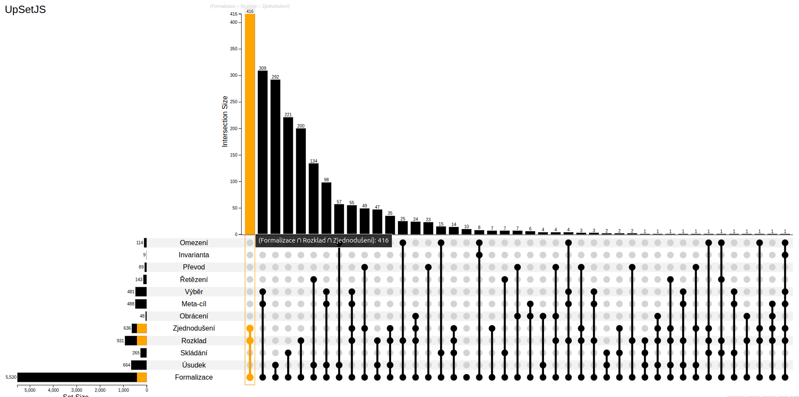

## Ukázková aplikace matematický trenažér
*s návodem jak vytvořit jednoduše pomocí promptu v AI a využitím dat z  <a href="/inputs">banky úloh</a>*

Aplikace nabízí 2 základní obrazovky
- Přehled testů - (možnost označit/filterovat oblíbené testy, volba dark modu, ukládání stavu)

- Průvodce rozborem řešení úloh - (navigace/průchod jednotlivými úlohami/kroky řešení)

Aplikace Matematický trenažér, který slouží jako průvodce rozborem řešení slovních úloh, lze vyzkoušet <a href="/math-trainer">zde</a>

<a href="/guides/math-trainer-guide">Návod na vytvoření</a> pomocí promptu v prostředí <a href="https://gemini.google.com">Gemini</a>.

Základní data, resp. jednotlivé testy, zadání úloh a postupy řešení úloh jsou použity z <a href="/inputs">banky úloh</a>. 
- zadání úloh je použíto přímo z banky úloh
- postupy řešení z banky úloh jsou předána ve strukturované podobě a AI je použita jen k transformaci ke srozumitelnějšímu textovému výstupu

## Analýza struktury matematický úloh

Každé **pravidlo** použité ve slovní úloze je klasifikováno do kategorií rozdělených na tyto vrstvy:

- [Kognitivní vrstva](/word-problems-structure#kognitivni-strategie-proc): Strategie (Proč?)
- [Funkční vrstva](/word-problems-structure#funkcni-provedeni-jak): Matematika (Jak?)
- [Doménová vrstva](/word-problems-structure#domenovy-kontext-co-kde-o-cem): Kontext (Co/Kde/O čem?)

Každý **predikát** použitý v krocích řešení slovních úloh je klasifikován do kategorií.

- [kategorizace predikátů](/word-problems-structure#cleneni-dle-predikatu)

