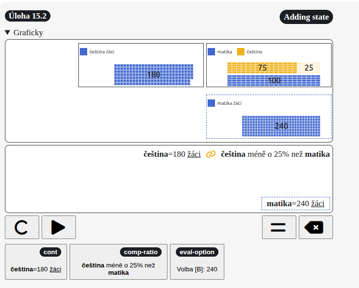
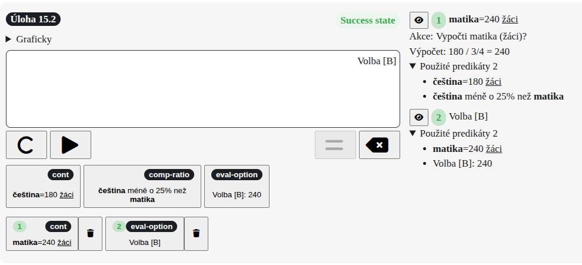
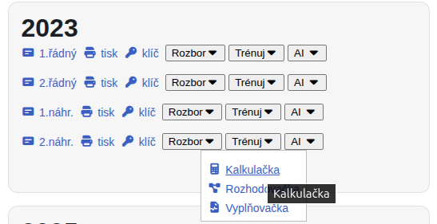
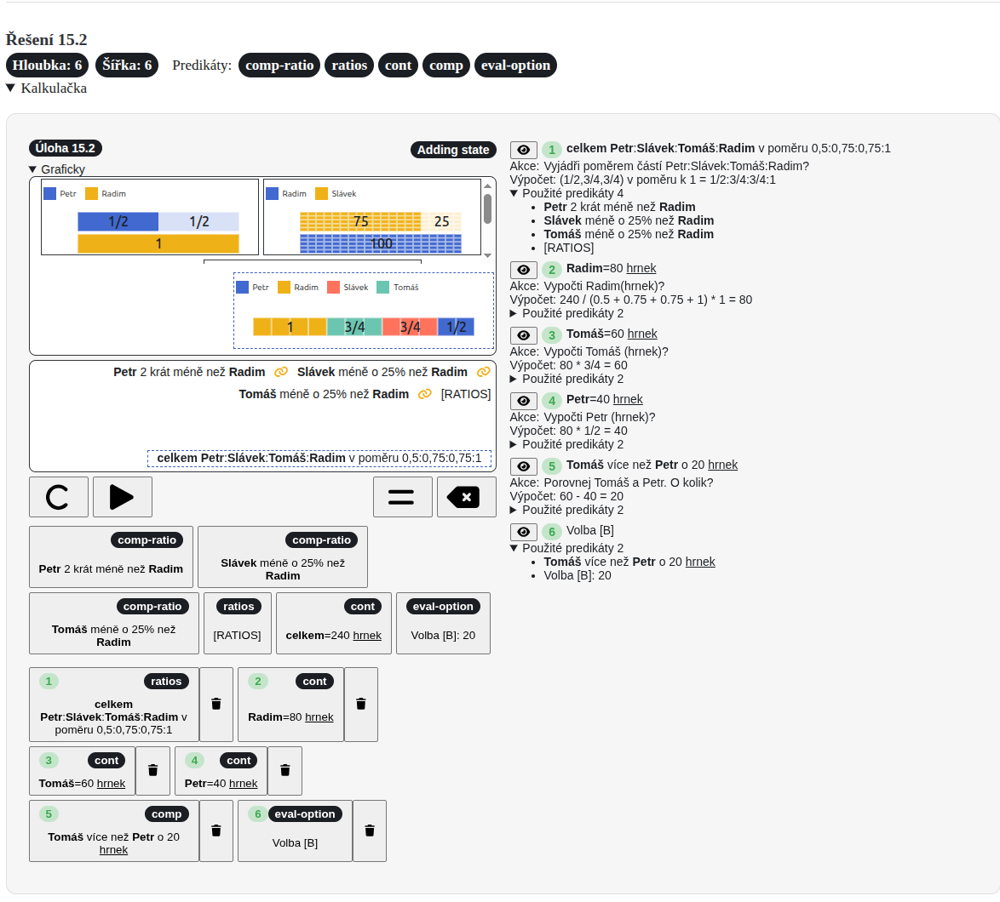
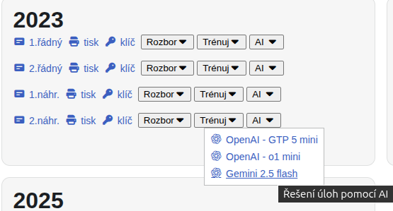

## Kalkulačka pro slovní úlohy

Experiment

  Žádné výpočty. Žádné sestavování rovnic. Delegujte aritmetiku a algebru na kalkulátor.

**Aritmetika a algebra** jsou **dva základní pilíře** matematiky. Obě disciplíny se historicky osvědčily, protože umožňují jak **praktické dovednosti** (aritmetika), tak **abstraktní myšlení, zobecnění vztahů, výpočtů a rovnic** (algebra). Bez nich by se matematika ani výuka matematiky nemohla plně rozvinou. 

Přesto aritmetika i algebra obsahuje oblasti, které lze delegovat na kalkulátor a tím **snížit "mechanické" kognitivní zatížení** při řešení konkrétní úloh při **zachování "relevatního" kognitivní zatížení** důležitého pro pochopení **matematických konceptů a principů**.

Kalkulátor obsahuje všechy tlačíka s predikáty potřebné k vyřešení úlohy (axioms). Výpočet probíhá na základě vstupů a odvození dalších predikátů se provede stiskem **tlačítka =** podobně jako u standardního kalkulátoru. 

Odvozený prodikát (mezivýpočet) se přidá do seznamu tlačítek (označen pořadovým číslem, tj. číslo kroku). V pravém panelu je historie, kde je přehled všech odvození kroků. Pokud je odvozený predikát zároveň správným konečným výsledkem, přepne se kalkulátor do stavu "Success state".

Kalkulátor lze vyzkoušet 
- pro celý test - hlavní menu Testy -> Matika 
- za jednotlivé úlohy - hlavní menu Matematika -> Slovní úlohy a dále klikněte na odkaz konkrétní slovní úlohy  

## Výsledky úloh z databanky řešené pomocí modelu gemini-2.5-flash

- Výsledky řešení úloh v češtině, matice a cizích jazycích
  - [souhrné výsledky](/ai#model-gemini-2-5-flash)
  - [podrobné výsledky](/ai-results-gemini-2.5-flash)
- Postupy řešení úloh v matematice jsou k dispozic u jednotlivých testů 