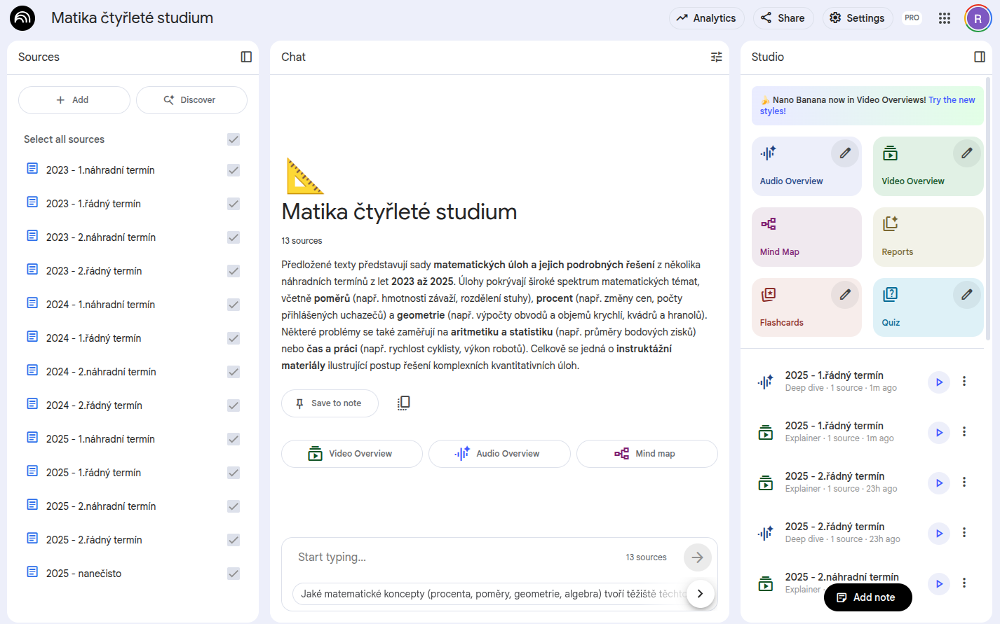
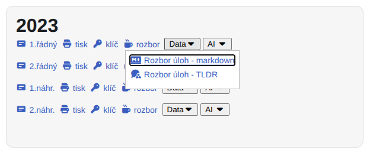
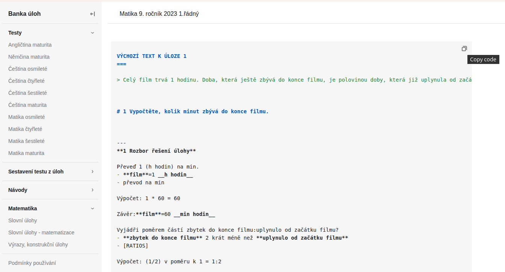
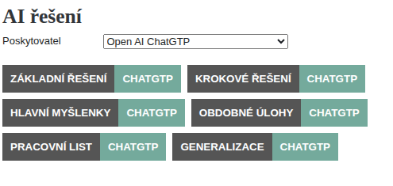
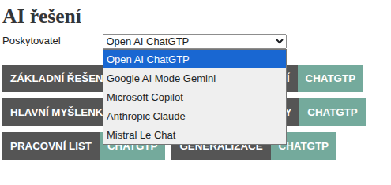
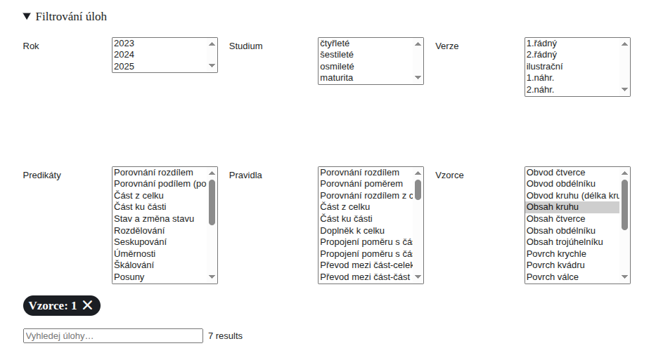
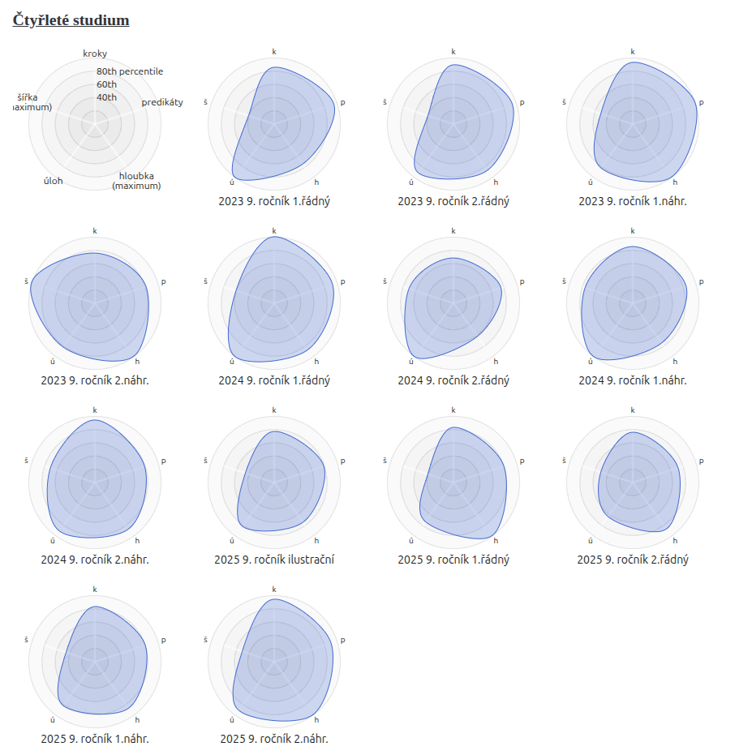
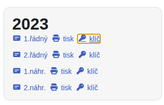
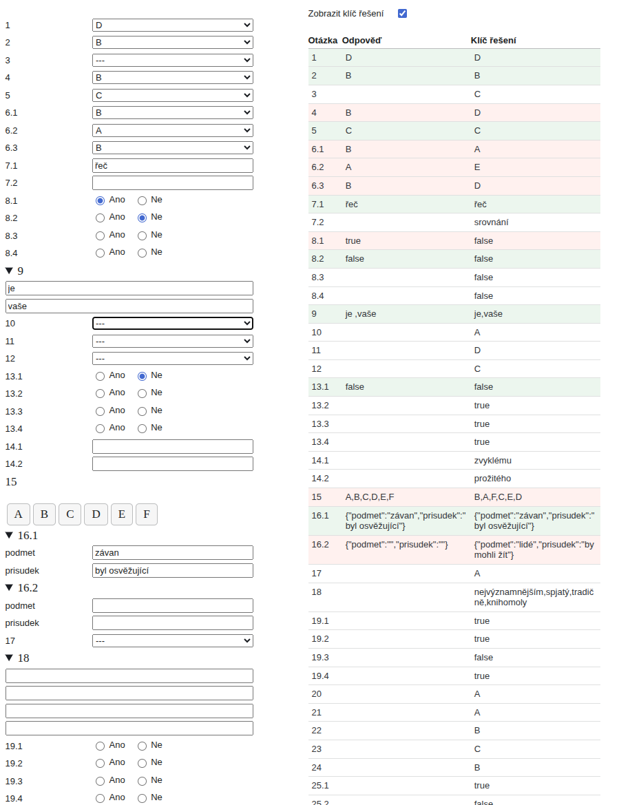

# Snadnější integrace

Postupy řešení slovních úloh nově k dispozici ve formátech
- **markdown** - heslovité řešení vhodné pro LLM modely umělé inteligence - [příklad vygenerovaných videí](/notebook-M9D-2025)
- **tldr** - dedukční strom řešení na kolaborativní interaktivní ploše - vhodné na vzdálenou výuku

[více informací](/embedding#integrace-na-urovni-dat)

## Využití v Notebook LM
K nahrání strukturovaného řešení slovních úloh si stáhněte *.md soubor nebo zkopírujete obsah pomocí Copy tlačítka. 

1. Klikněte na tlačítko Data - Rozbor úloh - markdown

2. Klikněte na **Copy** tlačítko nebo stáhněte soubor *.md.

3. Otevři [Notebook LM](https://notebooklm.google.com/)
4. Vložit jako source

  Vložení jednotlivých úloh jako samostatné zdroje v Notebook LM

1. Otevřete [slovní úlohy](/word-problems-summary).

2. Zaškrtněte požadované úlohy a použijte tlačítko **Copy**.
3. Vložit jako source

## Využití v TLDR canvasu

K zobrazení strukturovaného řešení slovních úloh si stáhněte *.tldr soubor a nahrajte do canvasu. 

1. Stáhnout soubor *.tldr - klikněte na tlačítko Data - Rozbor úloh - TLDR 

2. Otevři [tldraw.com](https://www.tldraw.com)
3. Přetáhni stažený soubor na stránku

Více informací [https://tldraw.dev/](https://tldraw.dev/).

## Podcasts

Všechny testy nově obsahují generované podcasty, kde se diskutuje řešení slovních úloh.

## Rozšíření AI tlačítek

Ke každé úloze jsou k dispozici tlačítka pro řešení úlohy. **Nově přidány** tlačítka
- **pracovní list** - vytvoří pracovní list pro jednotlivé kroky v úloze
- **generalizace úlohy** - zobecnění řešení slovní úlohy

Nové přidána možnost zvolit **poskytovatel LLM  modelu**

## Filtrování úloh

Vedle standardního filtrování dle **roku, typu studia či termínu testu**, lze navíc filtrovat úlohy až **na úroveň matematických konceptů** obsažaných v postupech řešení.

 - predikáty
 - odvozovací pravidla
 - běžné vzorce

## Zvýrazňování matematických konceptů

V postupech řešení se používají matematické koncepty - možnost zvýraznění matematického konceptu na úrovni
 - predikátů
 - odvozovacích pravidel
 - běžných vzorců

<video src="/assets/filtering.mp4" playsinline muted controls preload="metadata" style="max-width: 100%"></video>

## Vizualizace rozdílů v testech z matematiky

Na základě parameterů dedukčního stromu lze vizualizovat rozdíly v obtížnosti slovních úloh. [více informací](/word-problems-measure)

## Přidán formulář se záznamovým archem s klíčem řešení
Ke každému testu v bance úloh je k dispozici formulář ke kontrole správnosti a výpočtu bodů v testu.

