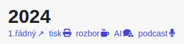
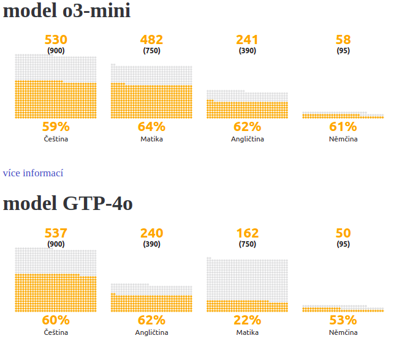
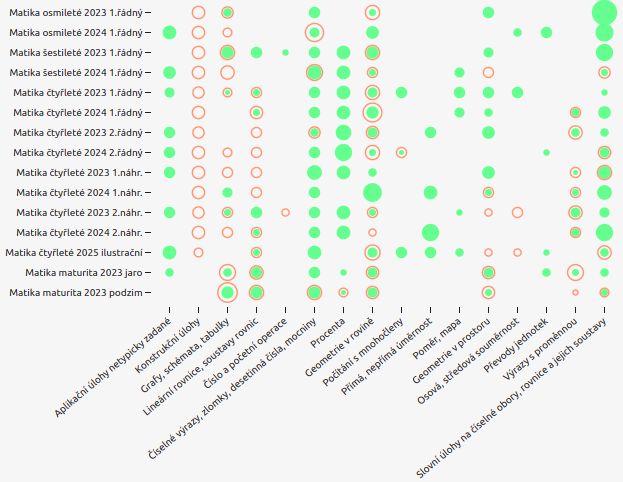

## Podcasty - řešení slovních úloh

V přehledu testů nově odkaz na podcast v angličtině, kde jsou řešeny slovní úlohy z testu.

Podcast je generován pomocí <a href="https://notebooklm.google.com/"><i class="fa-brands fa-google"></i> NotebookLM</a>

Seznam všech podcastu je k dispozici na stránce [přehledu všech slovních úloh se strukturovaným řešením](/word-problems).

## Nová AI tlačítka

Ke každé úloze je k dispozici ChatGTP tlačítko, které předá zadání úlohy do ChatGTP chatu. Pro ostatní AI nástroje lze využít Copy to Clipboard tlačítko, které zkopíruje zadání úlohy. 

Ke slovním úlohám z matematiky, kde existuje struktrurované řešení úlohy nabízíme nově 3 tlačítka.
- smart řešení - prompt na převedení heslovitého řešení do srozumitelnější podoby pro uživatele
- generování více příkladů - prompt na vygenerování 3 obdobných úloh v jiné netradiční doméně. Úloha zachovává logiku úlohy, jen mění kontext, entity a parametry úlohy.
- vizualizace řešení úlohy - prompt na vygenerování obrázku, např. infografiky znázorňující řešení úlohy

### Smart řešení slovních úloh

Je založené na myšlence, že AI úlohu neřeší, ale řešení již dostane a pouze přeformuluje heslovité řešení do srozumitelnější podoby.

  
  AI dostane kromě zadání úlohy i řešení úlohy rozpadnuté na základní jednoduché operace.
  AI následně upraví řešení tak, aby bylo co nejjasnější a nejpochopitelnější.

## Výsledky úloh z databanky řešené pomocí modelu o3-mini

AI modely dnes oproti situaci před půl rokem dosahují výrazné zlepšení v matematice, v ostatních předmětech jsou výsledky podobné. Úspěšnost v matematika vzrostla z 22% na 64%. Matematika dokonce již překonala v úspěšnosti češtinu.
 - srovnává se pouze konečný výsledek, né postup řešení
 - lze srovnávat pouze úlohy, které mají výsledek v textové (číselné) podobě, resp.nelze srovnávat např. konstrukční úlohy, kde výsledkem je geometrická konstrukce - AI nedostává žádné body

Výsledky řešení testových úloh v češtině, matice a cizích jazycích
- [o3-mini](/ai-results-o3-mini)
- [GTP-4o](/ai-results-gpt-4o)

## Strukturované řešení slovních úloh

Nově existuje [přehled všech slovních úloh se strukturovaným řešením](/word-problems).

  Žádné zavádění proměných. Žádné sestavování rovnic. Žádné složité výpočty.

Ke každé úloze lze nově k dispozici různé reprezentace dedukčního stromu

- textový strom - shora dolů kompaktní textový zápis, kořen představuje konečný výsledek
- dedukční strom - zdola nahoru - vizuální strom, který umožňuje zobrazovat i grafické prvky
- textový chat - plochý seznam kroků řešení úlohy - každý krok má strukturu otázka, vstupy a vyvozený závěr spolu s numerickým výpočtem
- chat - grafický chat - oddělení otázky a numerického výpočtu
- chat dialog - interaktivní chat - rozhodovačka po jednotlivých krocích s nutností volby z nabízených možností
- video - animace průchodu stromem