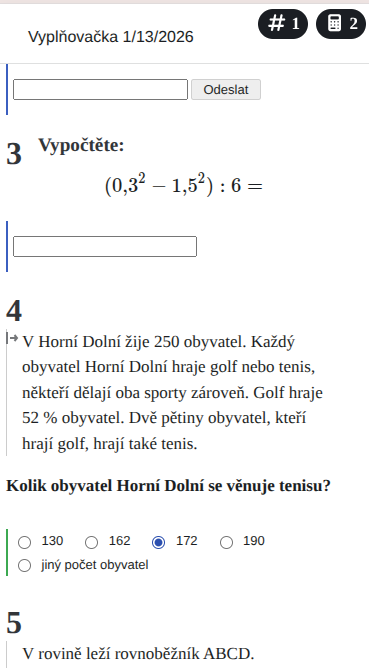
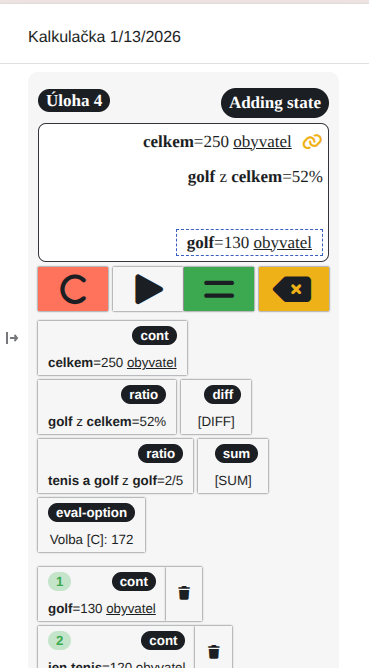
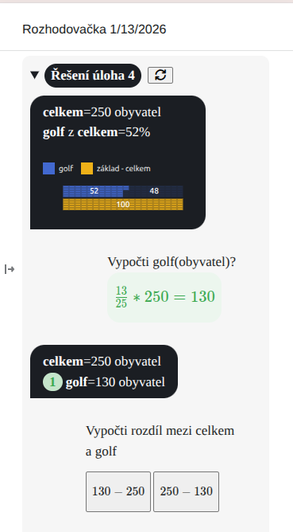
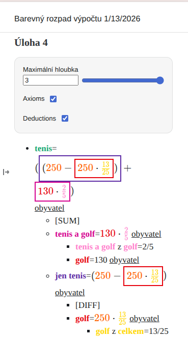

# ČT EDU úlohy - přidány trénovácí mini apps
- Vyplňovačka - trénuj řešení úloh, spočteme celkové body
- Kalkulačka - trénuj strukturované myšlení, nudné výpočty deleguj na kalkulátor
- Rozhodovačka - trénuj převod konceptů a principů na matematický výpočet
- Rozpad výpočtu - barevný rozpad výpočtu dle jednotlivých kroků

## Vyplňovačka

## Kalkulačka

## Rozhodovačka

## Rozpad výpočtu

