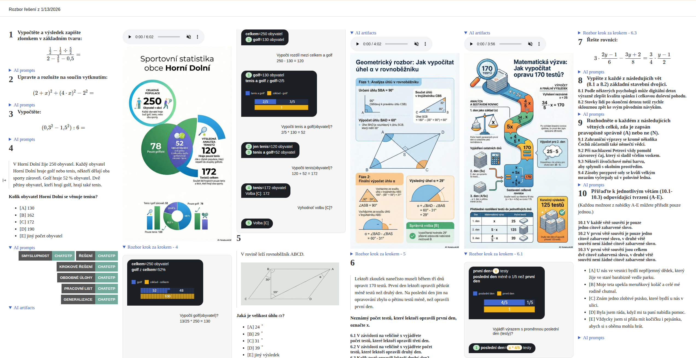

## ČT EDU jako nový zdroj dat pro banku úloh

    
Úlohy byly převzaty z kanálu ČT EDU. Neoficiální verze.

[Více informací](/app-usage)

Data banka rozšířena o [úlohy od ČT EDU](/ctedu/picker).
- rozbor, tisk, klíč řešení
- balíčky pro tisk
- balíčky (markdown formát) pro AI/automatizaci

## Automatizace generování artifacts (audio, infografiky, ...) z aplikace NotebookLM z banky úloh

Přidán [návod](/guides/notebook-lm/index), jak automaticky generovat artifacts na základě dat z banky úloh.
