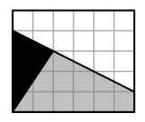
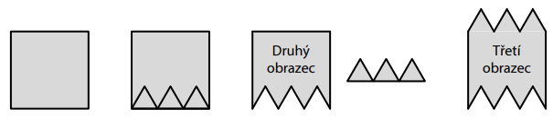
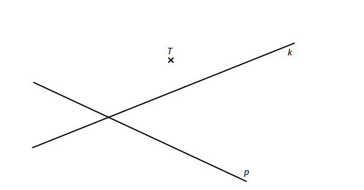
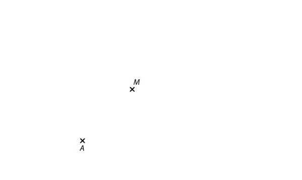
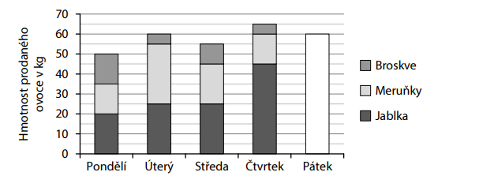
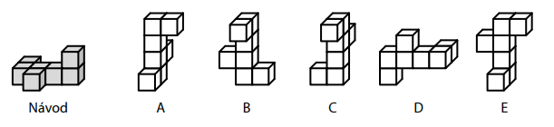
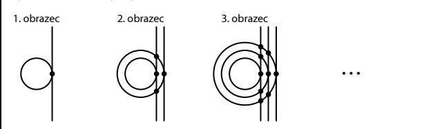

# 1 Vypočtěte: 
## 1.1 
$$
45−15∶5+42∶(10−4)= 
$$
## 1.2 
$$
50 \cdot 1 600−1 600∶40+40= 
$$
 
 
 
VÝCHOZÍ TEXT K ÚLOZE 2 
===
 Sára měla v kasičce tři korunové, tři dvoukorunové a tři pětikorunové mince.  
 Sára si z kasičky vyklepala tři mince.  
> Nejméně tak mohla získat částku 3 koruny a nejvíce 15 korun. 
> 
> (*CZVV*) 
# 2 **Určete** v celých korunách všechny částky od 3 do 15 korun, které Sára __nemohla__ získat. 
 
 
VÝCHOZÍ TEXT K ÚLOZE 3 
===
>V řeznictví stojí 1 kg masa 180 korun. 
>
> (*CZVV*) 

# 3 Vypočtěte, 
## 3.1 kolik korun zaplatíme v řeznictví za 200 g masa, 
## 3.2 kolik gramů masa koupíme v řeznictví za 54 korun. 

VÝCHOZÍ TEXT K ÚLOZE 4 
===
> Na třech linkách pro třídění lahví se testovali noví roboti pojmenovaní Arex, Bot a Cibo.  
> Každý robot pracoval stále stejným tempem. Nejpomalejší byl Cibo.  
> Bot roztřídil za každých 10 minut o polovinu více lahví než Arex.
> 
> Když pracoval každý ze tří robotů půl hodiny, roztřídili dohromady 900 lahví.  
> Když pracovali Arex a Bot každý 10 minut, roztřídili dohromady 250 lahví. 
> 
> (*CZVV*) 

# 4 Vypočtěte, 
## 4.1 kolik lahví roztřídil Cibo za půl hodiny, 
## 4.2 kolik lahví roztřídil Arex za 10 minut, 
## 4.3 za kolik minut Bot roztřídil 360 lahví. 

VÝCHOZÍ TEXT A OBRÁZEK K ÚLOZE 5 
===
> Čtvercová síť se skládá z 30 malých čtverečků  a jsou v ní zakresleny tři obrazce – bílý, šedý a černý.
> Vrcholy všech těchto obrazců leží v mřížových bodech.
> 
> Obsah bílého obrazce je 60 cm^2^.
> 
> 
>  
> (*CZVV*) 
# 5 Vypočtěte v cm^2^ 
## 5.1 obsah jednoho malého čtverečku čtvercové sítě, 
## 5.2 obsah šedého obrazce. 

VÝCHOZÍ TEXT A OBRÁZEK K ÚLOZE 6 
===
> Jednu stranu papírového čtverce rozdělíme na tři stejně dlouhé úsečky a ke každé z nich 
> narýsujeme rovnostranný trojúhelník (viz obrázek). 
> 
> Když trojúhelníky odstřihneme, vznikne druhý obrazec. 
> Když odstřižené trojúhelníky přesuneme k protější straně čtverce, vznikne třetí obrazec. 
> 
> Obvod **čtverce** a obvod **druhého obrazce** se liší o 18 cm. 
> 
> 
> 
> (*CZVV*) 
# 6 Vypočtěte v cm 
## 6.1 délku strany rovnostranného trojúhelníku, 
## 6.2 obvod čtverce, 
## 6.3 rozdíl mezi obvodem třetího obrazce a obvodem čtverce. 

[!NOTE] 
**Doporučení**: Rýsujte přímo **do záznamového archu**. 
VÝCHOZÍ TEXT A OBRÁZEK K ÚLOZE 7.1 
===
> V rovině leží bod T a přímky k, p.
> 
> 
>  
> (*CZVV*) 
## 7.1 
Na přímce p leží strana *EF* obdélníku *EFGH* a bod T leží **uvnitř** strany *EH*.  
Body T a F mají od vrcholu E stejnou vzdálenost.  
Na přímce k leží vrchol G obdélníku *EFGH*. 

**Sestrojte** vrcholy obdélníku *EFGH*, **označte** je písmeny a obdélník **narýsujte**.

[!NOTE]
**V záznamovém archu** obtáhněte vše **propisovací tužkou** (čáry i písmena). 
 
VÝCHOZÍ TEXT A OBRÁZEK K ÚLOZE 7.2 
===
> V rovině leží body A, M. 
> 
> 
> 
> (*CZVV*) 
## 7.2 
Body A, M jsou vrcholy rovnostranného trojúhelníku *AMC*.  
Body A, C jsou zároveň vrcholy trojúhelníku *ABC*.  
Bod M leží uvnitř strany *BC* trojúhelníku *ABC* a strana *BC* je dvakrát delší než strana *AC*. 

**Sestrojte** vrcholy B, C trojúhelníku *ABC*, **označte** je písmeny a trojúhelník **narýsujte.** 
Najděte všechna řešení. 

[!NOTE]
**V záznamovém archu** obtáhněte vše **propisovací tužkou** (čáry i písmena). 

VÝCHOZÍ TEXT A GRAF K ÚLOZE 8 
===
> Farmář prodával na trhu tři druhy ovoce – jablka, meruňky a broskve. Každé z nich nabízel 
> pouze v baleních po 5 kg. Graf udává, kolik kg ovoce prodal v průběhu pěti dnů.
> 
> V pátek farmář neprodal žádné meruňky, ale jablek prodal dvakrát více kg než broskví.  
> Celková hmotnost ovoce prodaného v pátek je vyznačena v grafu. 
> 
> 
> 
> Farmář prodával ovoce za následující ceny: 
> jablka … 30 korun za 1 kg, meruňky … 120 korun za 1 kg, broskve … 60 korun za 1 kg. 
> 
> (*CZVV*) 
# 8 Rozhodněte o každém z následujících tvrzení (8.1–8.3),  zda je pravdivé (A), či nikoli (N). 
 

## 8.1 Za uvedených 5 dnů dohromady prodal farmář **více než** 80 kg meruněk.  
## 8.2 Hmotnost broskví prodaných v pondělí a v pátek se lišila o 5 kg. 
## 8.3 Nejvyšší celkovou částku za prodané ovoce dostal farmář ve čtvrtek.  
 
VÝCHOZÍ TEXT K ÚLOZE 9 
===
> Ve třídě visí na nástěnce tabulka, v níž jsou uvedena všechna kladná celá čísla od 1 do 100 
> a žádná jiná.
> 
> (*CZVV*) 
# 9 Kolikrát se v tabulce vyskytuje číslice 4? 
- [A] 10krát 
- [B] 11krát 
- [C] 19krát 
- [D] 20krát 
- [E] 21krát 

VÝCHOZÍ TEXT K ÚLOZE 10 
===
> V aquaparku získávají děti v plaveckých soutěžích žetony, za které mohou koupit volné jízdy 
> na tobogánu nebo na člunu po divoké řece, avšak **pouze** podle následujících dvou pravidel: 
> - za 4 žetony se kupují 3 jízdy na tobogánu, 
> - za 15 žetonů se kupují 2 jízdy na člunu. 
> Nela za **všechny** své získané žetony koupila několik jízd na člunu a dvakrát tolik jízd 
> na tobogánu. 
> 
> (*CZVV*) 
# 10 Jaký nejmenší počet žetonů musela Nela získat? 
- [A] 114 žetonů 
- [B] 93 žetonů 
- [C] 61 žetonů 
- [D] 34 žetonů 
- [E] jiný počet žetonů 
 
VÝCHOZÍ TEXT A OBRÁZEK K ÚLOZE 11 
===
> Těleso se má podle návodu slepit ze sedmi stejných malých krychliček.
> 
> 
>  
> (*CZVV*) 
# 11 Pouze jedno z těles A–E __není__ slepeno přesně podle návodu. 
**Které?**
- [A] těleso A 
- [B] těleso B 
- [C] těleso C 
- [D] těleso D 
- [E] těleso E 
 
VÝCHOZÍ TEXT K ÚLOZE 12 
===
> Mirek a Janek využili pro své aktivity **stejně dlouhou** dobu, a to následujícím způsobem:
> 
> Mirek hrál třikrát 45 minut na počítači, čtvrt hodiny sledoval videa na mobilu a dalších 15 minut 
> chatoval s kamarádem.  
> 
> Janek si četl a pak sportoval. Sportováním strávil o 15 minut delší dobu, než věnoval četbě. 
> 
> (*CZVV*) 
# 12 Jak dlouho si Janek četl? 
- [A] 75 minut 
- [B] 85 minut 
- [C] 90 minut 
- [D] 105 minut 
- [E] více než 105 minut 
 
# 13 Přiřaďte ke každému hledanému číslu (13.1–13.3) odpovídající hodnotu (A–F). 
## 13.1 Zmenšíme-li hledané číslo 𝐾 o jednu jeho třetinu, dostaneme číslo 18. 𝐾=? 
## 13.2 Zmenšíme-li hledané číslo 𝐿 na čtvrtinu jeho hodnoty a od výsledku odečteme číslo 3, dostaneme číslo 4. 𝐿=? 
## 13.3 Zvětšíme-li hledané číslo 𝑀 třikrát, dostaneme stejné číslo, jako když polovinu čísla 𝑀 zvětšíme o 30. 𝑀=?
- [A] méně než 12 
- [B] 12 
- [C] 15 
- [D] 20 
- [E] 27 
- [F] více než 27 

VÝCHOZÍ TEXT A OBRÁZEK K ÚLOZE 14 
===
> V prvním obrazci je nakreslena jedna kružnice a jedna přímka, která má s touto kružnicí 
> právě jeden společný bod. 
> 
> V každém dalším obrazci přibude jedna kružnice a jedna přímka. Všechny kružnice mají střed 
> ve stejném bodě, ale každá nová kružnice má větší poloměr než ta předchozí. Všechny přímky 
> jsou navzájem rovnoběžné a každá nová přímka má právě jeden společný bod s novou kružnicí. 
> V každém společném bodě přímky a kružnice je puntík (viz obrázek). 
> 
> Např. ve třetím obrazci je 9 puntíků. 
> 
> 
> 
> (*CZVV*) 
# 14 Určete, 
## 14.1 kolik puntíků je v 5. obrazci, 
## 14.2 o kolik se liší počet všech puntíků v 8. obrazci a v 9. obrazci, 
## 14.3 v kolikátém obrazci je o 171 puntíků více než v předchozím obrazci. 
