# 1 Vypočtěte: 
## 1.1 
$$ 
(2 \cdot 2 000+50 \cdot 50)∶10=
$$
## 1.2 
$$
2\,010∶(3 \cdot 15−45∶3)−28∶7= 
$$
# 2 Vypočtěte, 
## 2.1 kolikrát je jeden metr kratší než jedna desetina kilometru, 
## 2.2 o kolik gramů je půlkilogramové závaží těžší než 50gramové závaží, 
## 2.3 kolik nejvíce celých 25minutových dílů seriálu (přehrávaných původní rychlostí) lze zhlédnout za 3 hodiny. 
 
 
 
VÝCHOZÍ TEXT A TABULKA K ÚLOZE 3 
===
> Každému z celých čísel od 0 do 9 přiřadíme jiný symbol a některé z těchto symbolů umístíme do tabulky.
> 
> V šedých polích tabulky je zapsán součet odpovídajících čísel v příslušném sloupci nebo řádku, dva součty chybí.
>  
> 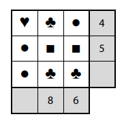 
>  
> (*CZVV*) 
# 3 Určete chybějící součet 
## 3.1 v 1. sloupci dole, 
## 3.2 ve 3. řádku vpravo. 

VÝCHOZÍ TEXT K ÚLOZE 4 
===
> Na začátku ledna dostal Adam kapesné 1 000 korun a utrácel z něj denně stejnou částku. 
> Celé kapesné tak utratil již za 20 dní. 
> 
> Bořek dostal na začátku ledna kapesné 700 korun a kupoval si z něj každý den pouze noviny, 
> a to vždy za stejnou cenu. 
> 
> Po 12 dnech od začátku ledna zbývala z kapesného oběma chlapcům stejná částka. 
> 
> (*CZVV*) 
# 4 Vypočtěte, 
## 4.1 kolik korun zbývalo Adamovi z kapesného po 12 dnech od začátku ledna, 
## 4.2 za kolik dnů od začátku ledna utratil Bořek celé své kapesné. 
 
VÝCHOZÍ TEXT A OBRÁZEK K ÚLOZE 5 
===
> Na papírové ruličce je navinuta stuha delší než 9 m. Na volném konci stuhy je bílý proužek 
> délky 6 cm, následuje červený proužek délky 6 cm a dále se tyto proužky pravidelně střídají. 
> 
> Od volného konce jsme odměřili a odstřihli část stuhy délky 170 cm na pomlázku. 
> 
> 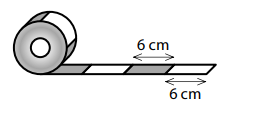
> 
> (*CZVV*) 
# 5 Určete, 
## 5.1 kolik **červených** proužků je na odstřižené části stuhy na pomlázku, 
## 5.2 kolik cm měří první necelý proužek na volném konci stuhy **navinuté na ruličce** po odstřižení části stuhy na pomlázku. 

VÝCHOZÍ TEXT A OBRÁZEK K ÚLOZE 6 
===
> Na obrázku jsou dvě části stejné čtvercové sítě.  
> Každý její čtvereček má stranu délky 1 cm a obsah 1 cm2. 
> 
> Vlevo je zakreslen šestiúhelník *ABCDEF*, jehož vrcholy leží v mřížových bodech sítě.  
> Vpravo jsou vyznačeny dva mřížové body K a L. 
>  
> 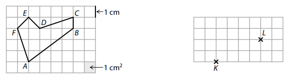
> 
> (*CZVV*) 
# 6 
## 6.1 **Určete** v cm2 obsah šestiúhelníku *ABCDEF*. 
## 6.2 Body K, L v části čtvercové sítě vpravo jsou vrcholy trojúhelníku *KLM*,  který má obsah 5 cm2. 
**Najděte** vrchol M tohoto trojúhelníku v některém z mřížových bodů a **sestrojte** trojúhelník *KLM*. 

Ze všech možných řešení zakreslete **pouze jedno**. 
[!NOTE]
**V záznamovém archu** obtáhněte vše **propisovací tužkou**. 

# 7 
[!NOTE]
**Doporučení**: Rýsujte přímo** do záznamového archu**. 

VÝCHOZÍ TEXT A OBRÁZEK K ÚLOZE 7.1 
===
> V rovině leží bod P a přímka *AQ*. 
> 
> 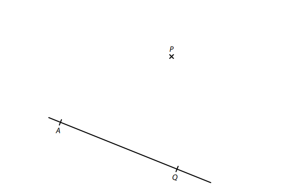
> 
> (*CZVV*) 
## 7.1 
Bod A je vrchol čtverce *ABCD*, jehož strana *AB* leží na polopřímce *AQ*.  
Bodem P prochází strana *CD* tohoto čtverce. 

**Sestrojte** vrcholy B, C, D čtverce *ABCD*, **označte** je písmeny a čtverec **narýsujte**. 

[!NOTE]
**V záznamovém archu** obtáhněte vše **propisovací tužkou** (čáry i písmena). 

VÝCHOZÍ TEXT A OBRÁZEK K ÚLOZE 7.2 
===
> V rovině leží body L, S, T. 
> 
> 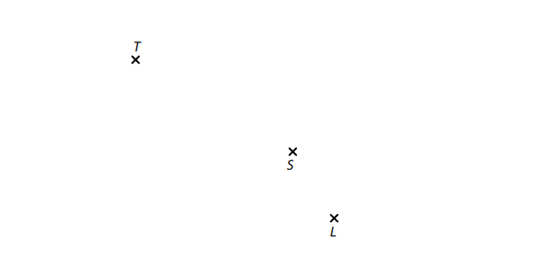
> 
> (*CZVV*) 
## 7.2 
Bod L je vrchol trojúhelníku *KLM* a bod S je střed strany *KL* tohoto trojúhelníku.  
Vrchol M leží na přímce *KT*. Strany *KL* a *KM* trojúhelníku *KLM* mají stejnou délku. 

**Sestrojte** vrcholy K, M trojúhelníku *KLM*, **označte** je písmeny a trojúhelník **narýsujte**.  

Najděte všechna řešení.

[!NOTE]
**V záznamovém archu** obtáhněte vše **propisovací tužkou** (čáry i písmena). 
 
VÝCHOZÍ TEXT A DIAGRAM K ÚLOZE 8 
===
> Každý žák, který se zúčastnil sportovního dne, si vybral pouze jednu ze čtyř aktivit. 
> 
> Kruhový diagram je rozdělen na 10 stejně velkých dílů a znázorňuje, jaká část žáků si vybrala jednotlivé aktivity. 
> 
> Fotbal si vybralo o 16 žáků více než vybíjenou. 
> 
> 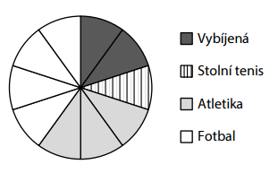
> 
> (*CZVV*) 
# 8 Rozhodněte o každém z následujících tvrzení (8.1–8.3),  zda je pravdivé (A), či nikoli (N). 
 
## 8.1 Fotbal si vybralo třikrát více žáků než stolní tenis.  
## 8.2 Atletiku si vybralo o třetinu méně žáků než fotbal. 
## 8.3 Sportovního dne se zúčastnilo celkem 80 žáků.  
 
VÝCHOZÍ TEXT K ÚLOZE 9 
===
> Katka má **stejný počet** korunových, dvoukorunových, pětikorunových i desetikorunových 
> mincí. Jiné peníze nemá. Celkem má 252 korun. 
> 
> (*CZVV*) 
# 9 Kolik mincí má Katka? 
- [A] 18 mincí 
- [B] 32 mincí 
- [C] 48 mincí 
- [D] 56 mincí 
- [E] jiný počet mincí 
 
VÝCHOZÍ TEXT A OBRÁZEK K ÚLOZE 10 
===
> Ve čtvercové síti jsou zakresleny 4 obrazce označené písmeny A, B, C, D. 
>  
> 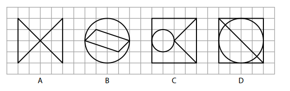
> 
> V obrazcích má každá kružnice střed v mřížovém bodě a prochází čtyřmi mřížovými body. 
> Všechny ostatní útvary mají vrcholy v mřížových bodech. 
> 
> (*CZVV*) 

# 10 Který z obrazců __není__ osově souměrný? 
- [A] obrazec A 
- [B] obrazec B 
- [C] obrazec C 
- [D] obrazec D 
- [E] Všechny obrazce A–D jsou osově souměrné. 
 
VÝCHOZÍ TEXT A OBRÁZEK K ÚLOHÁM 11–12 
===

> Záhon ve tvaru písmene L tvoří obrazec *ABCDEF*. Obrazec je rozdělen na 6 stejných čtverců, 
> mezi nimiž jsou mezery tvaru obdélníku (viz obrázek). Všechny tyto obdélníky jsou stejné. 
> 
> 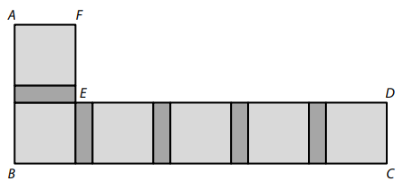
> 
> Lomená čára *DEF*, která se skládá z úseček *DE* a *EF*, má délku 550 cm.  
> Lomená čára *ABC*, která se skládá z úseček *AB* a *BC*, má délku 710 cm. 
> 
> (*CZVV*) 
# 11 Jakou délku má úsečka *EF*? 
- [A] 110 cm 
- [B] 118 cm 
- [C] 142 cm 
- [D] 160 cm 
- [E] jinou délku 
# 12 Jaký je obvod jednoho čtverce? 
- [A] 160 cm 
- [B] 280 cm 
- [C] 320 cm 
- [D] 360 cm 
- [E] jiný obvod 

VÝCHOZÍ TEXT A OBRÁZEK K ÚLOZE 13 
===
> Tomáš postavil krychli z 27 malých krychliček, z nichž některé jsou šedé a ostatní jsou bílé.  
> Krychličky poskládal do krychle jako na obrázku vlevo, přitom platí: 
> - V každém ze tří pater je stejný počet šedých krychliček. 
> - Žádné dvě šedé krychličky nejsou položeny na sobě. 
>  
> 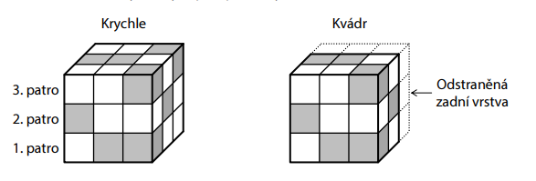
> 
> Tomáš potom z krychle odstranil zadní vrstvu malých krychliček, a vytvořil tak kvádr jako 
> na obrázku vpravo. 
> 
> (*CZVV*) 
# 13 Přiřaďte ke každé otázce (13.1–13.3) správnou odpověď (A–F). 
## 13.1 Kolik bílých krychliček obsahovala krychle (na obrázku vlevo)?  
## 13.2 Kolik bílých krychliček bylo v odstraněné zadní vrstvě krychle?  
## 13.3 Kolik šedých krychliček zůstalo v kvádru (na obrázku vpravo)? 
- [A] 5 
- [B] 6 
- [C] 8 
- [D] 9 
- [E] 12 
- [F] jiný počet 
 
VÝCHOZÍ TEXT A OBRÁZKY K ÚLOZE 14 
===
> V počítačové hře se vyměňují desky, prkna a tyče pouze podle následujících pravidel: 
> 
> Jednu desku lze vyměnit za 4 prkna. 
> 
> 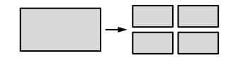
> 
> Libovolnou dvojici prken lze vyměnit za 5 tyčí.
> 
> 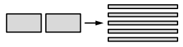
>  
> Z vyměněných dílů vytváříme ohradu: 
> Na 1 **kus** ohrady potřebujeme 3 prkna a 2 tyče.
> 
> 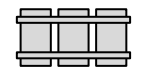
>  
> (*CZVV*)
# 14 K dispozici máme **pouze desky** a postupně je měníme za díly k ohradě. 
## 14.1 **Určete**, kolik nejméně desek potřebujeme na 3 kusy ohrady. 
## 14.2 Celkem 6 desek použijeme k vytvoření co největšího počtu kusů ohrady. 
**Určete**, které nepoužité díly nám zbudou a v jakém počtu. 
## 14.3 Máme k dispozici 19 desek. 
**Určete**, kolik nejvíce kusů ohrady můžeme vytvořit.