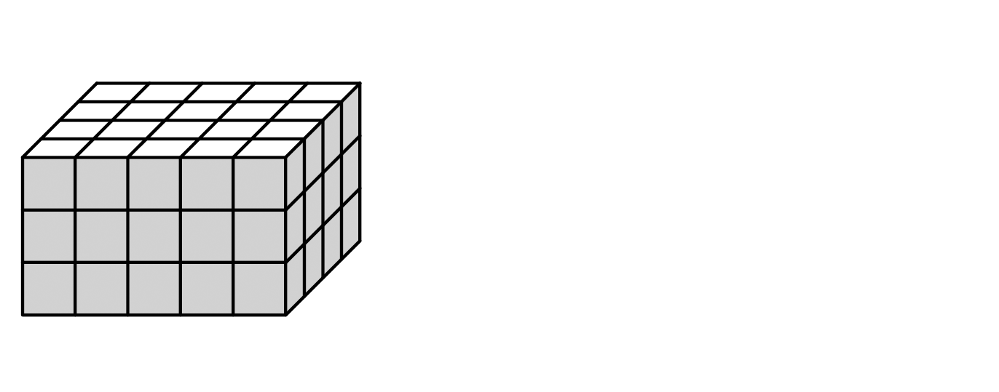
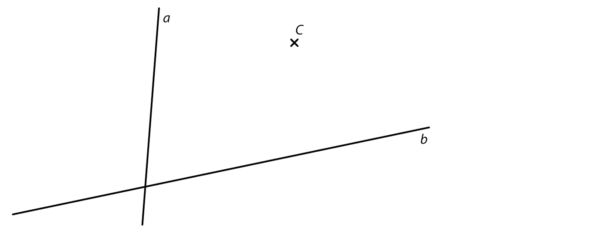
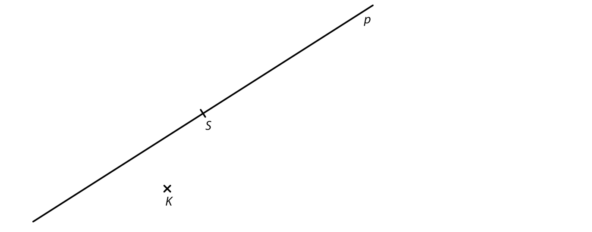
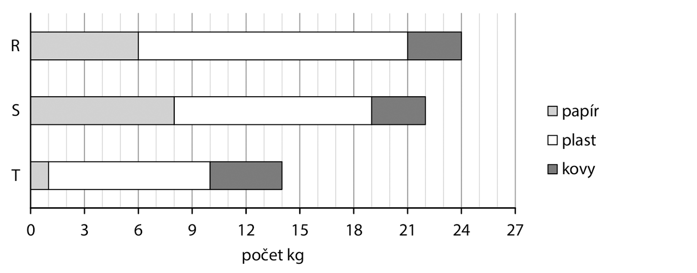
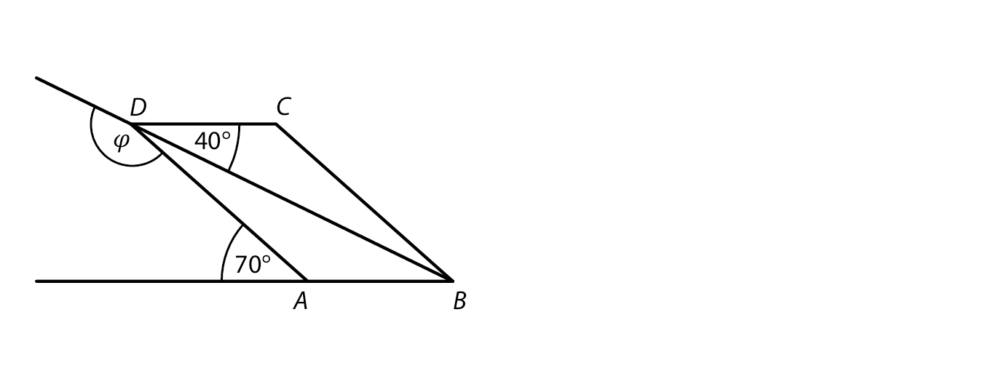
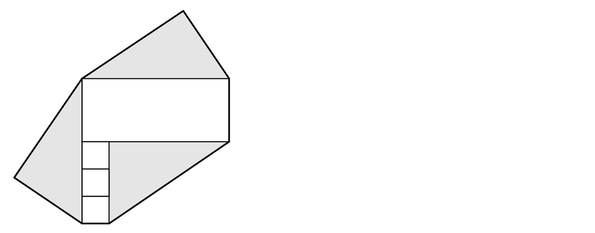
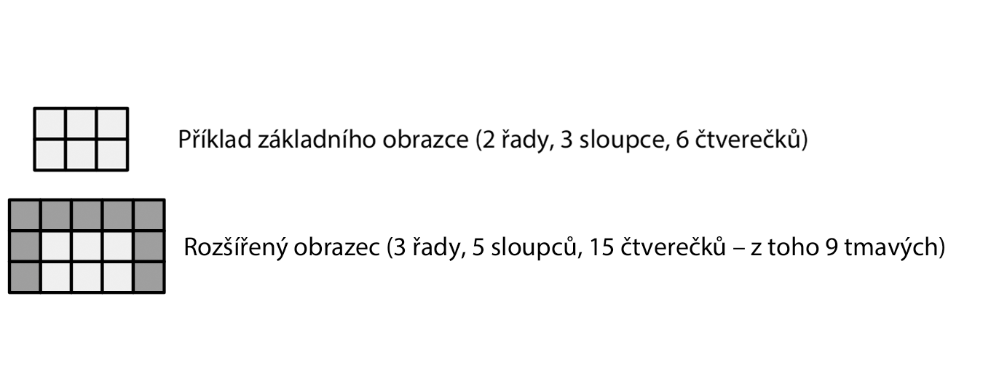

# 1 Vypočtěte, o kolik litrů se liší tři čtvrtiny z 24 litrů a třetina z 12 litrů. 
 
# 2 Vypočtěte a výsledek zapište zlomkem v základním tvaru. 
## 2.1 
 
$$
\frac{42}{5} \cdot (\frac{3}{14} - \frac{5}{21}) = 
$$

## 2.2 
 
$$
\frac{(\frac{3}{4} - \frac{1}{2}) : \frac{3}{2}}{2 \cdot \frac{5}{8} } = 
$$
 
**V záznamovém archu** uveďte v obou částech úlohy **postup řešení**. 

VÝCHOZÍ TEXT K ÚLOZE 3 
===

> V rotě je jeden kapitán a má pod sebou 4 poručíky. Každý poručík má pod sebou 3 své četaře 
> a každý četař má pod sebou 10 svých vojínů. (Další osoby v rotě nejsou.) 
> Kapitán se rozhodl svolat celou rotu k nástupu. Rozkaz k nástupu se předával tak, že 
> kapitán vydal rozkaz všem poručíkům, z nichž každý vydal tento rozkaz svým četařům 
> a každý četař jej vydal svým vojínům. Poté celá rota nastoupila.
> 
> (*CZVV*) 

# 3 Vypočtěte, 
## 3.1 kolik je v rotě **vojínů**, 
## 3.2 kolik osob v rotě vydalo rozkaz k nástupu, 
## 3.3 kolik osob v rotě dostalo rozkaz k nástupu. 

VÝCHOZÍ TEXT A TABULKA K ÚLOZE 4 
===

> Žáci mohli během sportovního dne buď plavat, nebo hrát jednu ze tří míčových her – volejbal, 
> fotbal či vybíjenou. 
> Některé údaje jsou uvedeny v tabulce. 
>  
> 
> |Sport||Počet žáků 
> |---|---|:---:|
> |míčový sport|volejbal|28|
> |míčový sport|fotbal|16|
> |míčový sport|vybíjená||
> |Plavání||30|
>
> (*CZVV*)

# 4 
## 4.1 Aritmetický průměr počtu žáků, kteří hráli jednotlivé míčové hry, byl 21. 
**Vypočtěte, kolik žáků hrálo vybíjenou.**

## 4.2 Na plavání bylo 1,5krát více chlapců než dívek. 
**Určete, jaký byl na plavání poměr počtu dívek ku počtu chlapců.**
Poměr uveďte v základním tvaru. 

VÝCHOZÍ TEXT K ÚLOZE 5 
===

> Jana koupila v papírnictví několik stejných linkovaných sešitů, několik stejných čtverečkovaných 
> sešitů a několik stejných kružítek. 
>
> (*CZVV*) 
# 5 
## 5.1 
Dva linkované sešity a dva čtverečkované sešity stojí dohromady 180 korun.  
Dva čtverečkované sešity stojí stejně jako tři linkované. 

**Vypočtěte, kolik korun stojí jeden čtverečkovaný sešit.** 
## 5.2 
K nákupu šesti kružítek chybělo Janě 160 korun, proto koupila jen čtyři kružítka 
a zbylo jí 100 korun. 

**Vypočtěte, kolik korun zaplatila za 4 kružítka.**

**V záznamovém archu** uveďte v obou částech úlohy **postup řešení**. 

VÝCHOZÍ TEXT K ÚLOZE 6 
===

> Na odměny pro tři nejlepší soutěžící byla připravena finanční částka v korunách. 
> První soutěžící získal polovinu této částky.  
> Druhý soutěžící dostal 300 korun.  
> Třetí soutěžící získal zbytek připravené částky, což bylo třikrát méně korun, než získal první soutěžící. 
>
> (*CZVV*) 
# 6 Vypočtěte, 
## 6.1 kolikrát více korun dostal druhý soutěžící než třetí soutěžící, 
## 6.2 kolik korun bylo celkem připraveno na odměny. 
 
VÝCHOZÍ TEXT A OBRÁZEK K ÚLOZE 7 
===

> Ze 60 dřevěných krychliček o hraně délky 1 cm jsme slepili kvádr s rozměry 5 cm, 4 cm a 3 cm. 
> Poté jsme celý povrch kvádru obarvili – obě stěny s největším obsahem na bílo a zbývající čtyři stěny na šedo. 
> Slepené stěny krychliček zůstaly neobarveny. 
>  
> 
> (*CZVV*) 

# 7 Určete, kolik ze všech 60 krychliček kvádru 
## 7.1 má šedě obarvené právě dvě stěny, 
## 7.2 nemá žádnou šedě obarvenou stěnu, 
## 7.3 má obarvené právě dvě stěny. 

VÝCHOZÍ TEXT A OBRÁZEK K ÚLOZE 8 
===

> V rovině leží bod C a přímky a, b. 
> 
>  
> (*CZVV*) 

# 8 
Bod C je vrchol trojúhelníku *ABC*.  
Na přímce a leží vrchol A a na přímce b vrchol B tohoto trojúhelníku.  
Strana *AC* trojúhelníku *ABC* je rovnoběžná s přímkou b.  
Strany *AB* a *AC* mají stejnou délku. 
**Sestrojte** vrcholy A, B trojúhelníku *ABC*, **označte** je písmeny a trojúhelník **narýsujte**.  
Najděte všechna řešení. 

**V záznamovém archu** obtáhněte vše **propisovací tužkou** (čáry i písmena). 

VÝCHOZÍ TEXT A OBRÁZEK K ÚLOZE 9 
===

> V rovině leží body K, S a přímka p procházející bodem S. 
> 
> 
> (*CZVV*) 

# 9 
Bod K je vrchol obdélníku *KLMN*.  
Bod S je střed strany *KL* tohoto obdélníku.  
Přímka p prochází středem S strany *KL* a středem ještě jedné strany obdélníku *KLMN*. 
**Sestrojte** vrcholy L, M, N obdélníku *KLMN*, **označte** je písmeny a obdélník **narýsujte**.  
Najděte všechna řešení.

**V záznamovém archu** obtáhněte vše **propisovací tužkou** (čáry i písmena). 
 

VÝCHOZÍ TEXT A GRAF K ÚLOZE 10 
===

> Graf udává, kolik kg odpadu vytřídily tři skautské oddíly R, S a T. 
> > 
> 
>(*CZVV*) 

# 10 Rozhodněte o každém z následujících tvrzení (10.1–10.3), zda je pravdivé (A), či nikoli (N). 
 
## 10.1 Oddíl S vytřídil o čtvrtinu více kg papíru než oddíl R. 
## 10.2 Oddíly S a T dohromady vytřídily o třetinu více kg plastu než oddíl R. 
## 10.3 Všechny tři oddíly dohromady vytřídily o polovinu méně kg kovů než papíru. 

VÝCHOZÍ TEXT A OBRÁZEK K ÚLOZE 11 
===

> V rovině leží rovnoběžník *ABCD* a polopřímky *BA* a *BD*. 
> 
> 
> (*CZVV*) 

# 11 Jaká je velikost úhlu 𝜑?  
Velikosti úhlů neměřte, ale vypočtěte. 
- [A] menší než 130° 
- [B] 130° 
- [C] 140° 
- [D] 150° 
- [E] větší než 150° 
 
VÝCHOZÍ TEXT A OBRÁZEK K ÚLOZE 12 
===

> Sedmiúhelník na obrázku se skládá ze tří shodných čtverců, jednoho obdélníku a tří shodných šedých trojúhelníků. 
> Délka strany čtverce je 1 cm.  
> Nejdelší strana sedmiúhelníku měří 5 cm. 
> 
> 
> (*CZVV*) 

# 12 Jaký je obsah sedmiúhelníku? 
- [A] 28 cm^2^ 
- [B] 31 cm^2^ 
- [C] 37 cm^2^ 
- [D] 39 cm^2^ 
- [E] jiný obsah 
 

VÝCHOZÍ TEXT K ÚLOZE 13 
===

> V kasičce je celkem 78 mincí – některé jsou dvoukorunové, další pětikorunové a zbývající desetikorunové.  
> Dvoukorunových mincí je v kasičce pětkrát více než pětikorunových.  
> Hodnota všech pětikorunových mincí v kasičce je stejná jako hodnota všech desetikorunových mincí v kasičce. 
> 
> (*CZVV*) 

# 13 Jaká je hodnota všech mincí v kasičce? 
- [A] 160 korun 
- [B] 180 korun 
- [C] 200 korun 
- [D] 220 korun 
- [E] 240 korun 
 
VÝCHOZÍ TEXT K ÚLOZE 14 
===

> Maminka koupila v cukrárně tři různé zákusky. 
> První zákusek stál 72 korun.  
> Druhý zákusek byl o čtvrtinu levnější než první.  
> Cena třetího zákusku byla třetinou celkové ceny všech tří zákusků. 
>
> (*CZVV*) 

# 14 O kolik korun byl třetí zákusek dražší než druhý? 
- [A] o méně než 12 korun 
- [B] o 12 korun 
- [C] o 15 korun 
- [D] o 18 korun 
- [E] o více než 18 korun 

# 15 Přiřaďte ke každé úloze (15.1–15.3) odpovídající výsledek (A–F). 
## 15.1 
Kniha má 1 200 stran, z nichž Róza již 60 % přečetla. 
**Kolik stran Róza dosud __nepřečetla__**? 

## 15.2 
Dětské vstupné představuje 70 % vstupného pro dospělé.  
Vstupné pro dospělé je o 210 korun vyšší než dětské vstupné. 
**Kolik korun činí __dětské__ vstupné**? 

## 15.3 
K dvoudenním volbám mohli přijít všichni dospělí obyvatelé obce.  
První den přišlo 25 % z nich, což bylo 500 obyvatel.  
Druhý den přišlo ještě 70 % ze zbývajících dospělých obyvatel obce. 
**Kolik dospělých obyvatel obce k volbám __nepřišlo__?** 

- [A] méně než 450 
- [B] 450 
- [C] 480 
- [D] 490 
- [E] 500 
- [F] více než 500 

VÝCHOZÍ TEXT A OBRÁZKY K ÚLOZE 16 
===

> Ze stejně velkých světlých a tmavých čtverečků tvoříme obrazce tvaru čtverce nebo obdélníku. 
> Základní obrazec je tvořen jednou nebo více řadami světlých čtverečků. 
>  
> Z každého základního obrazce vytvoříme rozšířený obrazec tak, že přidáme nahoru jednu 
> řadu tmavých čtverečků a pak vlevo i vpravo po jednom sloupci tmavých čtverečků. 
> 
> 
> (*CZVV*) 
# 16 
## 16.1 Ze základního obrazce, který má 5 řad,  vytvoříme rozšířený obrazec přidáním 30 tmavých čtverečků. 

**Určete počet sloupců v základním obrazci.** 

## 16.2 __Rozšířený__ obrazec má 3 řady a tvoří jej stejný počet tmavých a světlých čtverečků. 

**Určete počet sloupců v rozšířeném obrazci.** 

## 16.3 Můžeme najít mnoho rozšířených obrazců s 50 tmavými čtverečky. 
**Určete počet všech těchto rozšířených obrazců.**