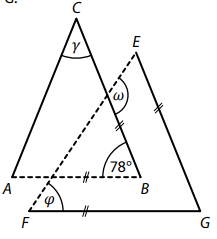
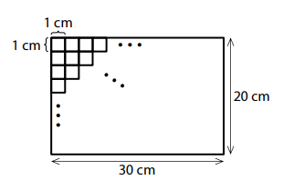
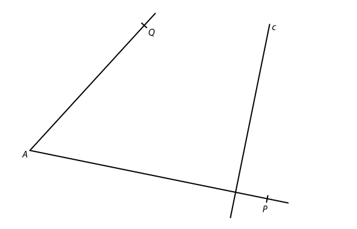
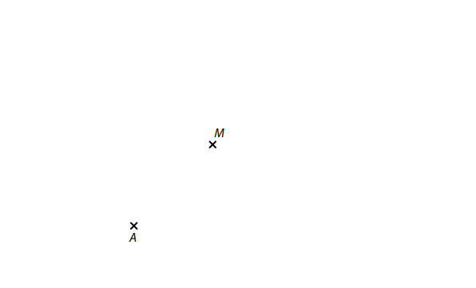
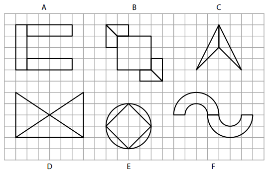
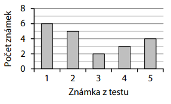
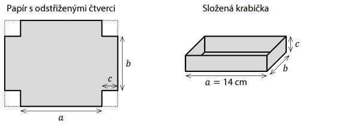
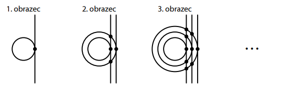

VÝCHOZÍ TEXT K ÚLOZE 1 
===

> Veslařka trénuje na trenažéru a udržuje stále stejné tempo. 
> Na displeji vidí, že za 1 minutu a 30 sekund ujela na trenažéru 350 m. 
> 
> (*CZVV*) 
# 1 Vypočtěte v metrech vzdálenost, kterou veslařka při daném tempu ujede na trenažéru za 6 minut. 
 

[!NOTE] 
**Doporučení**: Úlohu **2** řešte přímo** v záznamovém archu**. 

# 2 Vypočtěte a výsledek zapište zlomkem v základním tvaru. 
[!NOTE]
**V záznamovém archu** uveďte v obou částech úlohy **postup řešení**. 
## 2.1  
$$
3{,}6 \cdot (\frac{7}{12}−\frac{5}{9})−1=
$$ 
## 2.2 
$$
\frac{2−\frac{10}{7}}{2∶\frac{5}{7}−\frac{2}{5}}=
$$ 
# 3 Zapište všechny dvojice různých prvočísel, jejichž součet je 24. 
[!NOTE]
**V záznamovém archu** uveďte **každé řešení** (dvojici prvočísel) **na nový řádek**. 

VÝCHOZÍ TEXT K ÚLOZE 4 
===

> V aquaparku získávají děti v plaveckých soutěžích žetony, za které mohou koupit volné jízdy 
> na tobogánu nebo na člunu po divoké řece, avšak **pouze** podle následujících dvou pravidel: 
> - za 4 žetony se kupují 3 jízdy na tobogánu, 
> - za 15 žetonů se kupují 2 jízdy na člunu. 
> 
> (*CZVV*) 

# 4 
## 4.1 Petr získal 70 žetonů. Za všechny tyto žetony koupil 4 jízdy na člunu a určitý počet jízd na tobogánu. 
**Určete**, kolik jízd na tobogánu Petr koupil. 
## 4.2 Nela za **všechny** své získané žetony koupila několik jízd na člunu a dvakrát tolik jízd na tobogánu. 
**Určete** nejmenší možný počet žetonů, které musela Nela získat. 
 
 
VÝCHOZÍ TEXT A OBRÁZEK K ÚLOZE 5 
===

Na obrázku jsou dva rovnoramenné trojúhelníky *ABC* a *EFG*. Jejich základny *AB* a *EF* jsou vyznačeny čárkovaně.
Strany *AB* a *FG* jsou navzájem rovnoběžné, stejně jako strany *BC* a *EG*.

Velikosti některých úhlů jsou uvedeny v obrázku.   

(*CZVV*) 
# 5 Určete ve stupních velikost úhlu 
## 5.1 𝛾, 
## 5.2 𝜑, 
## 5.3 𝜔. 
Velikosti úhlů neměřte, ale vypočtěte (obrázek je pouze ilustrativní). 

VÝCHOZÍ TEXT A OBRÁZEK K ÚLOZE 6 
===

> Matěj měl červené, modré, zelené a žluté samolepicí čtverečky o straně délky 1 cm.  
> Všemi těmito čtverečky přesně zaplnil celý obdélník o rozměrech 20 cm a 30 cm.  
> (Nalepené čtverečky se nepřekrývají a nejsou mezi nimi žádné mezery.) 
> 
> Ze všech nalepených čtverečků je pětina čtverečků červených a ze zbývajících čtverečků je 
> třetina modrých. Zelených čtverečků je o 20 méně než žlutých. 
> 
>  
> 
> (*CZVV*) 

# 6 
## 6.1 **Vypočtěte**, kolik červených a modrých čtverečků **dohromady** Matěj nalepil. 
## 6.2 **Vyjádřete zlomkem** v základním tvaru, jakou část obdélníku zaplnily zelené čtverečky. 

VÝCHOZÍ TEXT K ÚLOZE 7 
===

> V pekárně pečou všechny bábovky podle stejného receptu.
> Podle tohoto receptu spotřebují na každých 6 bábovek 840 g cukru. 
> 
> (*CZVV*) 
# 7
[!NOTE]
**V záznamovém archu** uveďte ve všech částech úlohy **postup řešení**.

## 7.1 **Vypočtěte**, kolik gramů cukru spotřebují v pekárně na 21 bábovek. 
## 7.2 **Vypočtěte**, na kolik bábovek v pekárně spotřebují přesně 7 kg cukru. 
## 7.3 Na každou vánočku spotřebují v pekárně o 25 % méně cukru než na bábovku. Na všechny vánočky spotřebovali v pekárně tolik cukru jako na 27 bábovek. 
**Vypočtěte**, kolik vánoček v pekárně upekli. 

VÝCHOZÍ TEXT A OBRÁZEK K ÚLOZE 8 
===

> V rovině leží polopřímky *AP*, *AQ* a přímka c kolmá k polopřímce *AP*.
> 
> 
> 
> (*CZVV*)

# 8 
Bod A je vrchol rovnoběžníku *ABCD*.
Na polopřímce *AP* leží vrchol B tohoto rovnoběžníku, na polopřímce *AQ* vrchol D 
a na přímce c vrchol C. Výška na stranu *AB* rovnoběžníku *ABCD* měří 4 cm.

**Sestrojte** vrcholy B, C, D rovnoběžníku *ABCD*, **označte** je písmeny a rovnoběžník **narýsujte**. 

[!NOTE]
**V záznamovém archu** obtáhněte vše **propisovací tužkou** (čáry i písmena). 
 
VÝCHOZÍ TEXT A OBRÁZEK K ÚLOZE 9 
===

> V rovině leží body A, M. 
> 
> 
>  
> (*CZVV*) 

# 9 
Body A, M jsou vrcholy rovnostranného trojúhelníku *AMC*.  
Body A, C jsou zároveň vrcholy trojúhelníku *ABC*.  
Bod M leží uvnitř strany *BC* trojúhelníku *ABC* a strana *BC* je dvakrát delší než strana *AC*. 

**Sestrojte** vrcholy B, C trojúhelníku *ABC*, **označte** je písmeny a trojúhelník **narýsujte**.\
Najděte všechna řešení. 

[!NOTE]
V záznamovém archu obtáhněte vše propisovací tužkou (čáry i písmena). 
 
VÝCHOZÍ TEXT A OBRÁZEK K ÚLOZE 10 
===

> Ve čtvercové síti je zakresleno 6 ornamentů označených písmeny A až F.
> 
> 
>  
> Kružnice v ornamentu E má střed v mřížovém bodě a prochází čtyřmi mřížovými body. 
> Každá půlkružnice v ornamentu F má střed i krajní body v mřížových bodech.  
> Ostatní útvary ve všech ornamentech mají vrcholy v mřížových bodech. 
> 
> (*CZVV*) 
# 10 Rozhodněte o každém z následujících tvrzení (10.1–10.3), zda je pravdivé (A), či nikoli (N).
 

## 10.1 Ornament E má celkem 2 osy souměrnosti. 
## 10.2 Každý z ornamentů A, B, C a D má jen jednu osu souměrnosti. 
## 10.3 Přímek, které jsou osami souměrnosti jednotlivých ornamentů A až F, je dohromady přesně 9. 
 

VÝCHOZÍ TEXT A GRAF K ÚLOZE 11 
===
> Všichni žáci 7. A psali test z matematiky.V grafu jsou uvedeny počty jednotlivých známek, které tito žáci z testu získali. 
>  
> 
>   
> (*CZVV*) 
# 11 Jaký je aritmetický průměr získaných známek? 
- [A] 2,7 
- [B] 3,0 
- [C] 3,7 
- [D] 4,0 
- [E] jiný průměr 
 
 
 
VÝCHOZÍ TEXT K ÚLOZE 12 
===

> Žáci se na školním sportovním dni rozdělili do tří skupin A, B, C. 
> (Počet žáků ve skupinách A, B a C označíme ve stejném pořadí písmeny 𝐴, 𝐵 a 𝐶.)
> 
> Pro počty žáků v jednotlivých skupinách platí následující poměry: 
> 
> 𝐴∶𝐵=7∶9\
> 𝐵∶𝐶=4∶7
> 
> Ve skupině B je o 16 žáků více než ve skupině A. 
> 
> (*CZVV*) 
# 12 O kolik se liší počet žáků ve skupině B a ve skupině C? 
- [A] o 24 žáků 
- [B] o 48 žáků 
- [C] o 54 žáků 
- [D] o 72 žáků 
- [E] o jiný počet žáků 

VÝCHOZÍ TEXT A OBRÁZEK K ÚLOHÁM 13–14 
===

> Tvrdý papír tvaru obdélníku má obsah 198 cm2.  
> Z rohů tohoto papíru odstřihneme čtyři shodné čtverce, čímž se jeho obsah zmenší o 16 cm2. 
> 
> Potom z papíru složíme krabičku tvaru kvádru, jehož nejdelší hrana měří 14 cm (viz obrázek). 
> 
>  
> 
> Tloušťku papíru neuvažujte. 
> 
> (*CZVV*) 
# 13 Jakou délku měla delší strana papíru před odstřižením čtverců? 
- [A] 16 cm 
- [B] 18 cm 
- [C] 20 cm 
- [D] 22 cm 
- [E] jinou délku 
# 14 Jaký je objem krabičky? 
- [A] 168 cm3 
- [B] 196 cm3 
- [C] 308 cm3 
- [D] 396 cm3 
- [E] jiný objem 
 
 
VÝCHOZÍ TEXT K ÚLOZE 15 
===
> Brigádníci přesadili v zahradnictví všechny sazenice rajčat za tři dny.
> 
> Po prvním dni zbývalo k přesazení ještě 60 % všech sazenic rajčat.  
> Po druhém dni byl celkový počet přesazených sazenic rajčat o polovinu větší než po prvním dni.  
> Třetí den bylo přesazeno zbývajících 216 sazenic rajčat. 
> 
> Brigádnice Jarka přesadila za uvedené tři dny celkem 162 sazenic rajčat. 
> 
> (*CZVV*) 

# 15 Přiřaďte ke každé otázce (15.1–15.3) správnou odpověď (A–F). 
 
Kolik procent z celkového počtu sazenic rajčat… 
## 15.1 bylo přesazeno druhý den?
## 15.2 bylo přesazeno třetí den?
## 15.3 přesadila brigádnice Jarka? 
- [A] 20 % 
- [B] 25 % 
- [C] 30 % 
- [D] 35 % 
- [E] 40 % 
- [F] jiný počet procent 

VÝCHOZÍ TEXT A OBRÁZEK K ÚLOZE 16 
===

> V prvním obrazci je nakreslena jedna kružnice a jedna přímka, která má s touto kružnicí 
> právě jeden společný bod.
> 
> V každém dalším obrazci přibude jedna kružnice a jedna přímka. Všechny kružnice mají střed 
> ve stejném bodě, ale každá nová kružnice má větší poloměr než ta předchozí. Všechny přímky 
> jsou navzájem rovnoběžné a každá nová přímka má právě jeden společný bod s novou kružnicí. 
> V každém společném bodě přímky a kružnice je puntík (viz obrázek). 
> 
> Např. ve třetím obrazci je 9 puntíků. 
> 
>  
> 
> (*CZVV*) 

# 16 Určete, 
## 16.1 kolik puntíků je v 5. obrazci, 
## 16.2 o kolik se liší počet všech puntíků v 8. obrazci a v 9. obrazci, 
## 16.3 v kolikátém obrazci je o 171 puntíků více než v předchozím obrazci.