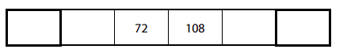
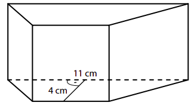
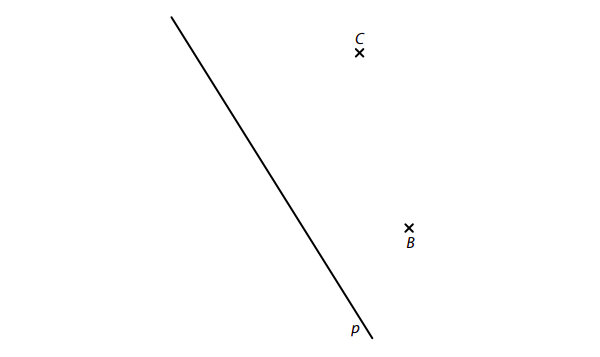
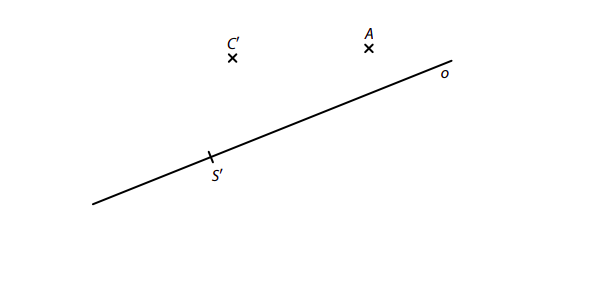
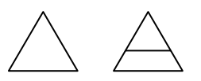
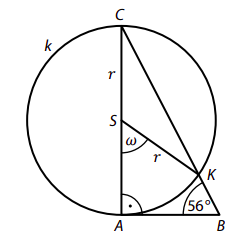
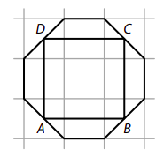
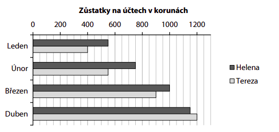
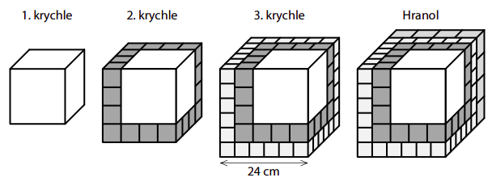

# 1 Když osminu neznámého čísla zvětšíme o 16, výsledek bude o 1 větší než polovina neznámého čísla. 
**Určete neznámé číslo.**
 
 
VÝCHOZÍ TEXT A TABULKA K ÚLOZE 2 
===

> Čísla v tabulce se řadí zleva doprava od nejmenšího po největší a každá dvě čísla v sousedních 
> polích tabulky jsou ve stejném poměru jako dvě uvedená čísla. 
> 
>  
> 
> (*CZVV*) 

# 2 Určete čísla, která patří do prvního a posledního pole tabulky.
 
 
# 3 Vypočtěte a výsledek zapište zlomkem v základním tvaru. 
[!NOTE]
**V záznamovém archu** uveďte v obou částech úlohy **postup řešení**.

## 3.1 
$$
\frac12∶\frac34−\frac34∶\frac12+\left(4−3⋅\frac43\right)∶\frac12=
$$

## 3.2 
$$ 
\frac{\frac{0{,}5}{2}−2}0{,}5\cdot(2+0{,}5)−2=
$$ 

VÝCHOZÍ TEXT K ÚLOZE 4 
===

> U vodní nádrže jsou 4 stejně výkonná čerpadla, která pracují rovnoměrně. Prázdnou nádrž by všechna 4 čerpadla společně naplnila za 6 hodin.
> 
> Ráno nebyla nádrž zcela prázdná, a všechna 4 čerpadla ji tak společně doplnila už za 4 hodiny. 
> 
> (*CZVV*) 
# 4 
## 4.1 **Vyjádřete** zlomkem v základním tvaru, jaká část objemu nádrže byla ráno naplněna vodou, než začala pracovat čerpadla. 
## 4.2 **Určete**, kolik takových čerpadel by společně naplnilo prázdnou nádrž za 8 hodin. 
## 4.3 **Určete**, za kolik hodin by jednu polovinu nádrže společně naplnila 2 taková čerpadla. 
 
VÝCHOZÍ TEXT K ÚLOZE 5 
===

> Všichni žáci třídy se rozdělili na dvě stejně početné skupiny.\
> Žáci první skupiny vytvořili dvojice a žáci druhé skupiny trojice.\
> V každé skupině však jeden žák zbyl. Tito dva žáci spolu nakonec vytvořili ještě jednu dvojici.\
> Všech dvojic tak bylo o 3 více než trojic. 
> 
> (*CZVV*) 

# 5 Určete 
## 5.1 počet všech vytvořených dvojic, 
## 5.2 počet všech žáků ve třídě. 

VÝCHOZÍ TEXT K ÚLOZE 6 
===

> Operace 𝑀 (zmenšení čísla) se provádí následujícím způsobem: V zápisu čísla se zleva doprava 
> mezi každé dvě sousední číslice zapíšou střídavě znaménka − a +, potom se provede výpočet. 
> 
> Pro operaci 𝑀 vybíráme pouze **kladná celá** čísla sestavená ze vzájemně **různých** číslic\
> (např. 6 019 nebo 12 345, nikoli 5 020). 
> 
> Např. pro pěticiferné číslo 29 087 se zmenšení 𝑀 provede následovně:\
> 𝑀(29 087)=2−9+0−8+7=−8 
>
> (*CZVV*) 
# 6 
## 6.1 **Vypočtěte** 𝑀(18 059). 
## 6.2 **Určete** největší pěticiferné číslo, jehož zmenšením 𝑀 získáme číslo 1. 
## 6.3 **Určete** nejmenší čtyřciferné číslo, jehož zmenšením 𝑀 získáme číslo −1. 
 
 
 
 
VÝCHOZÍ TEXT A OBRÁZEK K ÚLOZE 7 
===

> Podstavou kolmého čtyřbokého hranolu je rovnoramenný lichoběžník. V tomto lichoběžníku delší základna měří 11 cm a výška 4 cm.
> 
> Největší boční stěnou hranolu je obdélník o obsahu 55 cm^2^, zbývající tři boční stěny jsou shodné čtverce. 
> 
> 
> 
> (*CZVV*) 

# 7 **Vypočtěte**
## 7.1 v cm výšku hranolu, 
## 7.2 v cm obvod podstavy hranolu, 
## 7.3 v cm^2^ obsah podstavy hranolu, 
## 7.4 v cm^3^ objem hranolu. 

[!NOTE]
**V záznamovém archu** uveďte ve všech částech úlohy **postup řešení**.

VÝCHOZÍ TEXT A OBRÁZEK K ÚLOZE 8 
===

> V rovině leží body B, C a přímka p. 
> 
> 
> 
> (*CZVV*) 

# 8 
Body B, C jsou vrcholy obdélníku *ABCD*.\
Na přímce p leží střed S tohoto obdélníku.\
(Středem S procházejí osy souměrnosti obdélníku.) 
## 8.1 **Sestrojte** střed S obdélníku *ABCD* a **označte** ho písmenem. 
## 8.2 **Sestrojte** vrcholy A, D obdélníku *ABCD*, **označte** je písmeny a obdélník **narýsujte**. 

[!NOTE]
**V záznamovém archu** obtáhněte vše **propisovací tužkou** (čáry i písmena).

VÝCHOZÍ TEXT A OBRÁZEK K ÚLOZE 9 
===

> V rovině leží body A, C′ a přímka o procházející bodem S′.
> 
> 
>  
> (*CZVV*) 
# 9 
Bod A je vrchol trojúhelníku *ABC*.\
Přímka o je osou osové souměrnosti, v níž se trojúhelník *ABC* zobrazí na trojúhelník A′B′C′. Bod S′ je střed strany B′C′ trojúhelníku A′B′C′. 

## 9.1 **Sestrojte** a **označte** bod C, jehož obrazem v osové souměrnosti s osou o je bod C′. 
## 9.2 **Sestrojte** vrchol B trojúhelníku *ABC*, **označte** ho písmenem a trojúhelník *ABC* **narýsujte**. 

[!NOTE]
**V záznamovém archu** obtáhněte vše **propisovací tužkou** (čáry i písmena).
 
VÝCHOZÍ TEXT A OBRÁZEK K ÚLOZE 10 
===

> Velký rovnostranný trojúhelník, jehož obvod je 60 cm, byl rozdělen úsečkou na dva nové obrazce – lichoběžník a malý trojúhelník. Oba tyto nové obrazce mají **stejný obvod**. 
> 
> 
> 
> (*CZVV*) 

# 10 Rozhodněte o každém z následujících tvrzení (10.1–10.3), zda je pravdivé (A), či nikoli (N). 
 

## 10.1 Obvod malého trojúhelníku je 30 cm. 
## 10.2 V lichoběžníku je délka kratší základny dvojnásobkem délky ramene. 
## 10.3 V lichoběžníku jsou délky kratší a delší základny v poměru 3∶4. 
 
VÝCHOZÍ TEXT A OBRÁZEK K ÚLOZE 11 
===

> V rovině leží pravoúhlý trojúhelník *ABC*.\
> Na odvěsně *AC* leží střed S kružnice k o poloměru 𝑟.\
> Kružnice k prochází vrcholy A, C trojúhelníku *ABC* a protíná přeponu *BC* v bodě K.\
> V obrázku jsou vyznačeny velikosti některých úhlů.
>  
> 
> 
> (*CZVV*) 

# 11 Jaká je velikost úhlu 𝜔? 
Velikosti úhlů neměřte, ale vypočtěte (obrázek je pouze ilustrativní). 
- [A] 34° 
- [B] 48° 
- [C] 56° 
- [D] 68° 
- [E] více než 68° 
 
VÝCHOZÍ TEXT A OBRÁZEK K ÚLOZE 12 
===

> Ve čtvercové síti, jejíž každé pole má obsah 25 cm2, je umístěn osmiúhelník s vrcholy v mřížových bodech.\
> Středy čtyř jeho stran jsou vrcholy čtverce *ABCD* (viz obrázek).
> 
> 
> 
> (*CZVV*) 

# 12 O kolik cm^2^ se liší obsah osmiúhelníku a obsah čtverce *ABCD*? 
- [A] o 50,0 cm^2^ 
- [B] o 62,5 cm^2^ 
- [C] o 75,0 cm^2^ 
- [D] o 87,5 cm^2^ 
- [E] o 100,0 cm^2^ 

VÝCHOZÍ TEXT A GRAF K ÚLOHÁM 13–14 
===

> Helena a Tereza dostávají vždy na začátku měsíce každá na svůj účet kapesné 400 korun.\
> Jiné příjmy dívky nemají a z kapesného během měsíce část utratí.\
> V grafu jsou zaznamenány zůstatky na účtech obou dívek **na začátku měsíce po obdržení kapesného**. (Helena měla na začátku ledna část peněz našetřených z předchozího roku.) 
> 
> 
> 
> Všechny zaznamenané hodnoty jsou násobkem 50 korun.
> 
> (*CZVV*) 

# 13 Kolik korun utratila Helena za leden a únor? 
- [A] 350 korun 
- [B] 400 korun 
- [C] 450 korun 
- [D] 550 korun 
- [E] jinou částku 
# 14 Jakou část z kapesného na 3 měsíce ušetřila Tereza během ledna, února a března? 
- [A] $\frac34$
- [B] $\frac23$
- [C] $\frac58$
- [D] $\frac{5}{12}$
- [E] jinou část

# 15 Přiřaďte ke každé úloze (15.1–15.3) odpovídající výsledek (A–F). 
## 15.1 Zvětšením čísla 56 vzniklo největší dvojciferné číslo dělitelné sedmi. 
**O kolik procent bylo číslo 56 zvětšeno?**
## 15.2 
V zahradnictví mají k prodeji připraveno celkem 120 sazenic různých květin.\
Čtvrtina z těchto sazenic jsou kopretiny.\
Hvozdíků mají připravené dvě bedny po 24 sazenicích.\
Zbývající sazenice jsou astry.

**Kolik procent sazenic připravených k prodeji představují astry?**

## 15.3 
Na představení přišlo 100 dospělých diváků.\
Dětí přišlo o polovinu více než dospělých.\
Přitom mezi dětmi bylo 60 % předškoláků.\

**Kolik procent ze všech diváků tvořili předškoláci?**

- [A] 25 % 
- [B] 35 % 
- [C] 36 % 
- [D] 42 % 
- [E] 50 % 
- [F] 75 % 

VÝCHOZÍ TEXT A OBRÁZEK K ÚLOZE 16 
===

> Postupným přilepováním krychliček k první krychli vytváříme další tělesa (viz obrázek). 
> - Druhá krychle vznikla přilepením několika shodných tmavých krychliček k první krychli. 
> - Přilepením jiných navzájem shodných krychliček vznikla z druhé krychle třetí krychle. 
> - Posledním tělesem je čtyřboký hranol, který vznikl přilepením dalších navzájem shodných krychliček pouze k zadní stěně třetí krychle. 
> 
> Délka hrany třetí krychle je 24 cm. 
> 
> 
> 
> (*CZVV*) 

# 16 
## 16.1 **Určete** počet tmavých krychliček ve druhé krychli. 
## 16.2 **Vypočtěte** v cm délku hrany první krychle. 
## 16.3 Na obrázku dole je silně vyznačena uzavřená lomená čára, která na povrchu posledního tělesa kopíruje hrany krychliček.

**Určete v cm celkovou délku této lomené čáry.** 