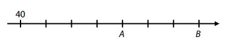
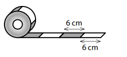
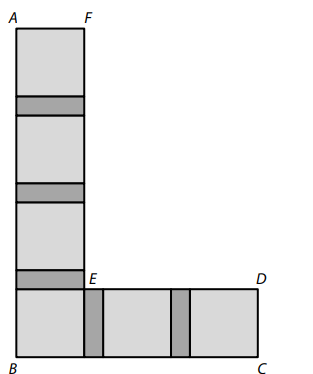
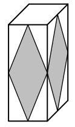
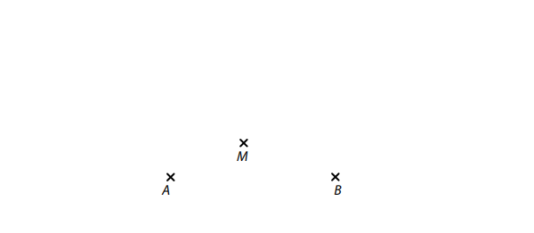
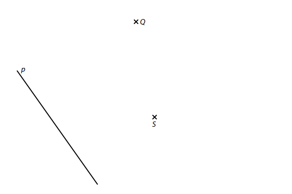
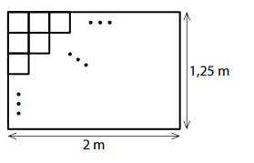
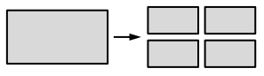
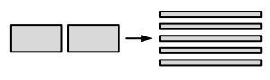
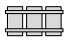

VÝCHOZÍ TEXT K ÚLOZE 1 
===

> Ve větší krabičce je 200 kusů papírových kapesníků, což je o čtvrtinu více než v menší krabičce. 
> 
> (*CZVV*) 
# 1 Vypočtěte, kolik kusů papírových kapesníků je v menší krabičce. 

[!NOTE]  
**Doporučení**: Úlohu **2** řešte přímo **v záznamovém archu**. 
# 2 Vypočtěte a výsledek zapište zlomkem v základním tvaru. 
[!NOTE]  
**V záznamovém archu** uveďte v obou částech úlohy **postup řešení**. 
## 2.1 
$$ 
5 \cdot \frac{4}{25}−{3}+3∶\frac{5}{3}= 
$$
## 2.2 
$$
\frac{3 \cdot \frac{9}{100}+1∶100}{\frac{4}{5}+\frac{2}{50}}= 
$$ 
 

VÝCHOZÍ TEXT A OBRÁZEK K ÚLOZE 3 
===

> Na číselné ose je zobrazeno 8 bodů oddělujících 7 stejných dílků.  
> V prvním z těchto bodů je číslo 40 a body A, B představují další dvě čísla.  
> Součet čísel v bodech A, B je 168. 
>  
> 
>
> (*CZVV*) 

# 3 Určete 
## 3.1 hodnotu, které odpovídá jeden dílek na číselné ose, 
## 3.2 číslo v bodě A, 
## 3.3 číslo v bodě B. 

VÝCHOZÍ TEXT A OBRÁZEK K ÚLOZE 4 
===

> Na papírové ruličce je navinuta stuha delší než 9 m. Na volném konci stuhy je bílý proužek 
> délky 6 cm, následuje červený proužek délky 6 cm a dále se tyto proužky pravidelně střídají. 
> Od volného konce jsme odměřili a odstřihli část stuhy délky 1,7 metru na pomlázku. 
>  
> 
>
> (*CZVV*) 
# 4 Určete, 
## 4.1 kolik **červených** proužků je na odstřižené části stuhy na pomlázku, 
## 4.2 kolik cm měří první necelý proužek na volném konci stuhy **navinuté na ruličce** po odstřižení části stuhy na pomlázku. 
 
VÝCHOZÍ TEXT K ÚLOZE 5 
===

> Farmář dal všechny sklizené cukety do beden. Naplnil 4 malé, 3 střední a 1 velkou bednu. 
> Ve všech malých bednách byl stejný počet cuket, v každé střední bedně bylo o 30 cuket více 
> než v malé bedně a ve velké bedně bylo 120 cuket. 
> 
> Ve skladu si farmář ponechal jednu velkou, jednu střední a jednu malou bednu s cuketami 
> a zbývajících 310 cuket z ostatních beden prodal. 
> 
> (*CZVV*) 
# 5 Určete 
## 5.1 počet cuket v jedné malé bedně, 
## 5.2 celkový počet cuket, které farmář sklidil. 

VÝCHOZÍ TEXT A OBRÁZEK K ÚLOZE 6 
===

> Záhon ve tvaru písmene L tvoří obrazec *ABCDEF*. Obrazec je rozdělen na 6 stejných čtverců, 
> mezi nimiž jsou mezery tvaru obdélníku (viz obrázek). Všechny tyto obdélníky jsou stejné. 
> 
> 
> 
> Lomená čára *DEF*, která se skládá z úseček *DE* a *EF*, má délku 550 cm.\
> Lomená čára *ABC*, která se skládá z úseček *AB* a *BC*, má délku 710 cm. 
> 
> (*CZVV*) 
# 6 Určete v cm 
## 6.1 délku úsečky *DE*, 
## 6.2 obvod jednoho čtverce, 
## 6.3 délku úsečky *AB*. 
 
VÝCHOZÍ TEXT A OBRÁZEK K ÚLOZE 7 
===
> Kvádr má podstavu o obsahu 54 cm^2^.  
> **Obsahy** tří stěn, které mají společný vrchol, jsou v poměru 6∶15∶10.  
> Nejmenší obsah z těchto tří stěn má podstava kvádru. 
>  
> 
> 
> (*CZVV*) 
# 7 **V záznamovém archu** uveďte v obou částech úlohy **postup řešení**. 
## 7.1 **Vypočtěte** v cm^2^ povrch celého kvádru. 
## 7.2 Obě podstavy kvádru jsou bílé. Na každé ze čtyř bočních stěn kvádru je šedý rovnoběžník, který má vrcholy ve středech hran kvádru (viz obrázek). 
**Vypočtěte** v cm^2^ obsah všech čtyř šedých rovnoběžníků dohromady. 

[!NOTE] 
**Doporučení** pro úlohy **8** a **9**: Rýsujte přímo **do záznamového archu**. 
VÝCHOZÍ TEXT A OBRÁZEK K ÚLOZE 8 
===

> V rovině leží body A, B, M.
> 
> 
>  
> (*CZVV*) 
# 8 
Body A, B jsou vrcholy kosočtverce *ABCD*.  
Bod M leží na některé z úhlopříček tohoto kosočtverce. 

**Sestrojte** vrcholy C, D kosočtverce *ABCD*, **označte** je písmeny a kosočtverec **narýsujte**. 
Najděte všechna řešení. 

[!NOTE]
**V záznamovém archu** obtáhněte vše **propisovací tužkou** (čáry i písmena). 
 
VÝCHOZÍ TEXT A OBRÁZEK K ÚLOZE 9 
===

> V rovině leží přímka p a body Q, S.
> 
> 
>  
> (*CZVV*) 
# 9 
Bod S je střed základny *AB* rovnoramenného trojúhelníku *ABC*.  
Základna *AB* je kolmá na přímku p a vrchol A leží na přímce p.  
Vrchol C trojúhelníku *ABC* leží na přímce *AQ*.

**Sestrojte** vrcholy trojúhelníku *ABC*, **označte** je písmeny a trojúhelník **narýsujte**. 
[!NOTE]
**V záznamovém archu** obtáhněte vše **propisovací tužkou** (čáry i písmena). 
 
VÝCHOZÍ TEXT A TABULKA K ÚLOZE 10 
===

> Vojta dostal na začátku ledna k narozeninám novou herní konzoli a společně s ní i dvě hry. 
> Obě hry začal v lednu hrát. V průběhu následujících měsíců získával další nové hry. 
> 
> Tabulka udává, kolik her získaných v tomto roce měl Vojta na konci uvedeného měsíce 
> stále ještě rozehraných a kolik her měl již dohraných. 
> 
> |Měsíc|Leden|Únor|Březen|Duben|Květen|Červen|
> |:---|:---:|:---:|:---:|:---:|:---:|:---:|
> |Počet rozehraných her|2|1|3|1|3|1|
> |Počet dohraných her  |0|2|3|5|5|7|
> 
> Např. na konci června měl Vojta rozehranou jen 1 hru, zatímco dalších 7 her získaných 
> v tomto roce již stihl do konce června dohrát. 
> 
> (*CZVV*) 
# 10 Rozhodněte o každém z následujících tvrzení (10.1–10.3),  zda je pravdivé (A), či nikoli (N). 

## 10.1 V únoru Vojta dohrál alespoň jednu z her rozehraných v lednu. 
## 10.2 V březnu Vojta rozehrál pouze dvě nové hry. 
## 10.3 V květnu Vojta dohrál stejný počet her jako v dubnu. 
 
VÝCHOZÍ TEXT K ÚLOZE 11 
===

> Na výrobu jednoho trička z recyklovaného materiálu je potřeba 5 plastových lahví.  
> Při školní sběrové akci se podařilo nasbírat 1 200 plastových lahví, z nichž bylo pro výrobu triček 15 % nepoužitelných. Ze všech použitelných lahví se vyrobila trička. 
> 
> (*CZVV*) 

# 11 Kolik triček se vyrobilo z nasbíraných lahví? 
- [A] více než 204 triček 
- [B] 204 triček 
- [C] 180 triček 
- [D] 104 triček 
- [E] méně než 104 triček 
 
VÝCHOZÍ TEXT A OBRÁZEK K ÚLOZE 12 
===

> Podlaha komory má tvar obdélníku o rozměrech 1,25 m a 2 m.  
> Celá podlaha je vydlážděna dlaždičkami tvaru čtverce o obsahu 25 cm^2^. 
> 
> 
> 
> Mezery mezi dlaždičkami neuvažujte. 
> 
> (*CZVV*) 
# 12 Kolik dlaždiček je na podlaze komory? 
- [A] 1 000 dlaždiček 
- [B] 500 dlaždiček 
- [C] 400 dlaždiček 
- [D] 100 dlaždiček 
- [E] jiný počet dlaždiček 

VÝCHOZÍ TEXT A TABULKA K ÚLOHÁM 13–14 
===

> Tři nádrže A, B, C mají stejný objem.  
> 
> K naplnění jednotlivých nádrží se používá různý počet čerpadel, která vždy pracují po celou dobu společně. Všechna čerpadla mají stejný výkon a ten se během jejich práce nemění. 
> 
> Prázdnou nádrž A zcela naplnilo 6 takových čerpadel za 40 minut, jak je uvedeno v tabulce. 
> 
> |Nádrž |A |B |C ||
> |---|:---:|:---:|:---:|:---:|
> |Počet použitých čerpadel |6 |||
> |Doba potřebná k naplnění prázdné nádrže|40 min||||
> 
> (*CZVV*) 
# 13 Prázdná nádrž B se zcela naplnila za dobu o polovinu delší než nádrž A. 
**Kolik čerpadel bylo použito k naplnění nádrže B?**
- [A] 2 čerpadla 
- [B] 3 čerpadla 
- [C] 4 čerpadla 
- [D] 9 čerpadel 
- [E] 12 čerpadel 
# 14 Prázdná nádrž C se zcela naplnila za dobu o 25 % kratší než nádrž A. 
**Kolik procent objemu nádrže C se zaplnilo během prvních 18 minut?** 
- [A] 36 % 
- [B] 54 % 
- [C] 60 % 
- [D] 72 % 
- [E] jiný počet procent 
 

VÝCHOZÍ TEXT K ÚLOZE 15 
===
> V divadelním sále je celkem 300 míst. Při večerním představení obsadili muži 108 míst, 
> ženy 120 míst a ostatní místa zůstala neobsazena. 
> 
> (*CZVV*) 
# 15 Přiřaďte ke každé otázce (15.1–15.3) správnou odpověď (A–F). 
## 15.1 Kolik procent všech míst zůstalo při večerním představení neobsazeno?
## 15.2 Všechna obsazená místa byla zaplacena. Kromě nich byla zaplacena ještě jedna šestina neobsazených míst, neboť někteří předplatitelé kvůli nemoci nepřišli. 
**Kolik procent všech míst nebylo na večerním představení zaplaceno?**
## 15.3 O kolik procent méně bylo na večerním představení mužů než žen?
- [A] 10 %
- [B] 15 % 
- [C] 18 % 
- [D] 20 % 
- [E] 24 % 
- [F] jiný počet procent 

VÝCHOZÍ TEXT A OBRÁZKY K ÚLOZE 16 
===

> V počítačové hře se vyměňují desky, prkna a tyče pouze podle následujících pravidel:
>  
> Jednu desku lze vyměnit za 4 prkna. 
>
> 
>
> Libovolnou dvojici prken lze vyměnit za 5 tyčí. 
>
> 
>
> Z vyměněných dílů vytváříme ohradu:\
> Na **1 kus** ohrady potřebujeme 3 prkna a 2 tyče.
>
>  
> 
> (*CZVV*) 
# 16 K dispozici máme **pouze desky** a postupně je měníme za díly k ohradě. 
## 16.1 **Určete**, kolik nejméně desek potřebujeme na 3 kusy ohrady. 
## 16.2 Celkem 6 desek použijeme k vytvoření co největšího počtu kusů ohrady. 
**Určete**, které nepoužité díly nám zbudou a v jakém počtu. 
## 16.3 Máme k dispozici 19 desek. 
**Určete**, kolik nejvíce kusů ohrady můžeme vytvořit.