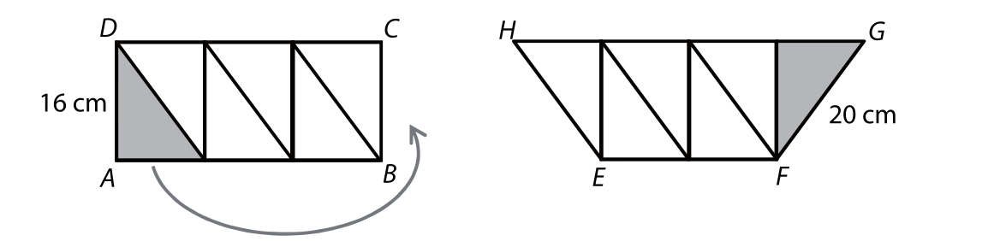
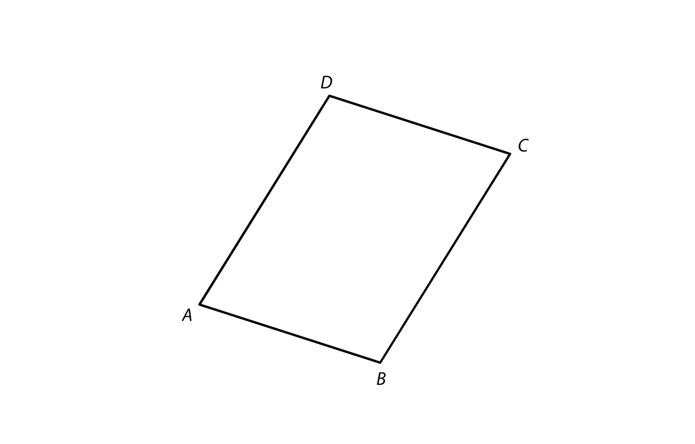
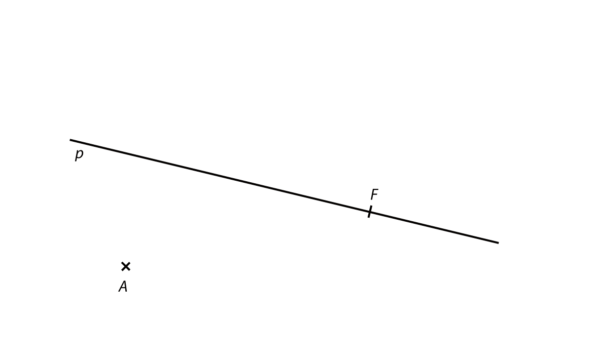
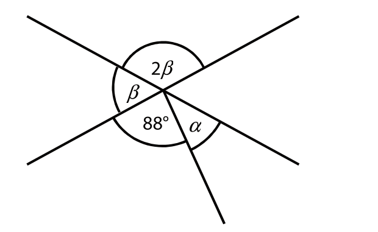
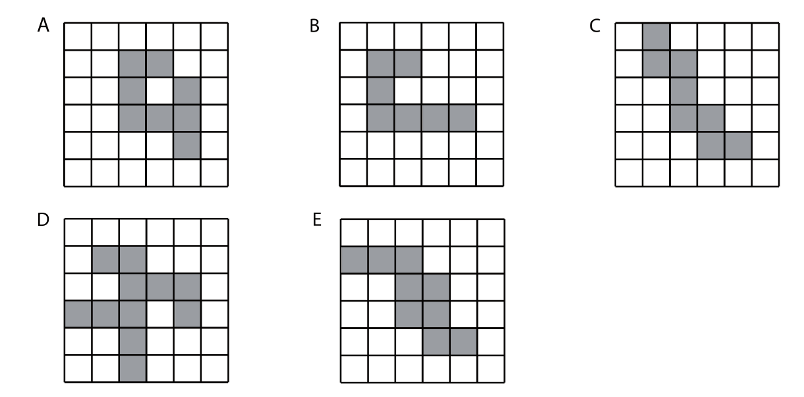
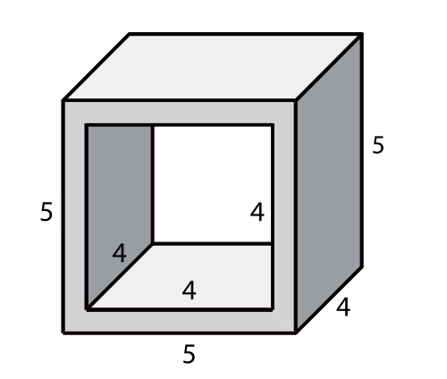

# 1. Myslím si číslo. Číslo k němu opačné je o 6 menší.
**Určete číslo, které si myslím.**

# 2. Trojúhleník má obvod 21 cm a délky jeho stran v poměru 6:5:3.
## 2.1 Určete v cm délku nejdelší strany trojúhelníku.
## 2.2 Určete, o kolik cm se liší délky dvou kratších stran trojúhelníku.

# 3. Vypočtěte a výsledek uveďte zlomkem v základním tvaru.

## 3.1
$$
2 - 2 \cdot\frac{2\cdot\frac{9}{10}}{3}=
$$

## 3.2
$$
3\cdot\frac{3}{5}-\frac{1}{5}\cdot\frac{3}{5}-\frac{3}{5}\cdot\left(-\frac{3}{5}\right)=
$$

[!NOTE]
**V záznamovém archu** uveďte v obou částech úlohy **postup řešení**.

VÝCHOZÍ TEXT K ÚLOZE 4
===

> K dispozici máme šest kartiček\
> $[3][3][1][1][1][1]$\
> Použijeme všechny kartičky k sestavení příkladu se třemi čísly, z nichž se první dvě čísla násobí a třetí číslo odečte, např.:\
> $[1][1][3][1]\cdot[1]-[3] =$\
> nebo\
> $[1]|[3][1]\cdot[3]-[1][1] =$\
> nebo\
> $[][][]\cdot[][]-[] =$\
> nebo\
> $[][]\cdot[][]-[][] =$
>
> (*CZVV*) 

# 4 Z kartiček sestavte příklad tak, abyste získali __největší__ možný výsledek.

VÝCHOZÍ TEXT K ÚLOZE 5
===

> V každé krabici je stejný počet mýdel.
> 
> Čtvrtina všech krabic obsahuje jen bílá mýdla a v každé ze zbývajících 120 krabic je vždy polovina mýdel bílých a polovina zelených. Bílých mýdel je celkem 1 200.
> 
> (*CZVV*) 

# 5 Určete:
## 5.1 počet **všech krabic** s mýdly;
## 5.2 **nejmenší počet krabic**, do nichž by se vešla všechna bílá mýdla;
## 5.3 počet **všech mýdel.**

VÝCHOZÍ TEXT A OBRÁZEK K ÚLOZE 6
===

> Obdélník *ABCD* lze rozdělit na šest shodných pravoúhlých trojúhelníků. Přemístěním jediného trojúhelníku lze vytvořit lichoběžník *EFGH*.
> 
> Strana trojúhelníku délky 16 cm je současně výškou lichoběžníku. Rameno lichoběžníku měří 20 cm. Obvod obdelníku *ABCD* je 104 cm.
> 
> 
>
> (*CZVV*) 

# 6
## 6.1 Určete, o kolik cm se liší obvod lichoběžníku *EFGH* a obvod obdélníku *ABCD*.
## 6.2 Vypočtěte v cm délku strany *AB* a obdelníku *ABCD*.
## 6.3 Vypočtěte v cm^2^ obsah lichoběžníku *EFGH*.

# 7
## 7.1 Chlapec klusal po pláži rovnoměrným tempem. Za 1 hodinu tak překonal vzdálenost 7,5 km.
Vypočtěte, kolik metrů uběhl za 2 minuty.
## 7.2 Plocha o rozloze 90 000 m^2^ je rozdělena na 36 shodných čtverců.
Určete v metrech délku strany jednoho čtverce.

VÝCHOZÍ TEXT K ÚLOZE 8
===

> V kasičce je **stejný** počet korunových, 2korunových a 5korunových mincí v celkové hodnotě 200 Kč. Jiné mince v kasičce nejsou.
>
> (*CZVV*) 

# 8
## 8.1 Určete počet všech mincí v kasičce.
## 8.2 Vypočtěte, jakou částku představují všechny 5korunové mince.

VÝCHOZÍ TEXT A OBRÁZEK K ÚLOZE 9
===
> V rovině leží rovnoběžník *ABCD*.
> 
>
> (*CZVV*) 

# 9
## 9.1 **Sestrojte** přímku *p*, která prochází středy stran *BC* a *AD* rovnoběžníku *ABCD*, a všechny strany, s nimiž je přímka *p* rovnoběžná, **označte** symbolem || pro rovnoběžky.
## 9.2 V rovnoběžníku *ABCD* **sestrojte** z vrcholu *B* výšku na stranu *AD.* Průsečík výšky a přímky *AD* **označte** *E*.
## 9.3 Ve čtyřúhelníku *BCDE* **vyznačte** všechny vnitřní úhly, které jsou pravé, a **zapište** co nejpřesněji název čtyřúhelníku.

VÝCHOZÍ TEXT A OBRÁZEK K ÚLOZE 10
===
> V rovině leží body *A,F* a přímpa *p* procházející bodem *F*.
> 
>
> (*CZVV*) 

# 10
Bod A je vrchol rovnoběžníku *ABCD*.
Přímka *p* prochází středy jeho protějších stran, bod *F* je střed strany *BC*.
Úsečka *AF* představuje jednu z výšek rovnoběžníku *ABCD*.
**Sestrojte** chybějící vrcholy *B,C,D* rovnoběžníku *ABCD* a rovnoběžník **narýsujte**.

VÝCHOZÍ TEXT K ÚLOZE 11
===

> Naši koně mají zásobu ovsa na 12 dnů.\
> Soused má o polovinu větší zásobu ovsa než my, ale dvakrát více koní.\
> Každý kůň (náš i sousedův) dostává denně stejné množství ovsa.
>
> (*CZVV*) 

# 11 Rozhodněte o každém z následujících tvrzení (11.1-11.3), zda je pravdivé (A), či nikoliv (N).

## 11.1 Sousedovy zásoby ovsa by našim koním vydržely na 24 dnů.
## 11.2 Naše zásoby ovsa by sousedovým koním vydržely na 6 dnů.
## 11.3 Sousedovy zásoby ovsa vydrží jeho koním na 9 dnů.

VÝCHOZÍ OBRÁZEK K ÚLOZE 12
===

> 
>
> (*CZVV*) 

# 12 Jaká je velikost úhlu $\alpha$?
Úhel neměřte, ale vypočtěte.
- [A] 26 $\degree$
- [B] 32 $\degree$
- [C] 36 $\degree$
- [D] 38 $\degree$
- [E] jiná velikost

VÝCHOZÍ OBRÁZEK K ÚLOZE 13
===

> 
>
> (*CZVV*) 

# 13 V jednom z pěti obrázků je možné doplnit jediný tmavý čtvereček tak, aby byl tmavý útvar souměrný podle osy souměrnosti (šikmé, svislé nebo vodorovné).

**Ve kterém obrázku je to možné?**

- [A] v obrázku A
- [B] v obrázku B
- [C] v obrázku C
- [D] v obrázku D
- [E] v obrázku E

VÝCHOZÍ TEXT A OBRÁZEK K ÚLOZE 14-15
===

> Dřevěný kvádr s rozměry 5 cm, 4 cm a 5 cm má hmotnost 50 g. V kvádru byl vytvořen skrz naskrz otvor tvaru krychle s hranou délky 4 cm.
>
> (Rozměry tělesa uvedené v obrázku jsou v cm.)
>
> 
>
> (*CZVV*) 

# 14 Jaký objem má nově vytvořené těleso?
- [A] 25 cm^3^
- [B] 30 cm^3^
- [C] 32 cm^3^
- [D] 36 cm^3^
- [E] jiný objem

# 15 O kolik gramů se snížila hmotnost kvádru po vytvoření otvoru?
- [A] o 16 g
- [B] o 20 g
- [C] o 25 g
- [D] o 32 g
- [E] o 36 g

VÝCHOZÍ TEXT A TABULKA K ÚLOZE 16
===

> Pavel za hodinu vydělal 300 Kč, Václav o třetinu více než Pavel.
> Václav odpracoval celkem 60 hodin, což je o třetinu méně hodin, než odpracoval Pavel.
> 
> | |Pavel|Václav|
> |---|:---:|:---:|
> |Výdělek za hodinu        |||
> |Počet odpracovaných hodin|||
> |Výdělek celkem           |||
>
> (*CZVV*) 

# 16 Přiřaďte ke každé otázce (16.1-16.3) správnou odpověď (A-F).
## 16.1 O kolik procent méně vydělal za hodinu Pavel než Václav?
## 16.2 O kolik procent více hodin odpracoval Pavel než Václav?
## 16.3 O kolik procent více si celkem vydělal Pavel než Václav?

- [A] o 0 %
- [B] o 12,5 %
- [C] o 25 %
- [D] o 33,3 %
- [E] o 50 %
- [F] o jiný počet procent

VÝCHOZÍ TEXT K ÚLOZE 17
===

> Obdelník budeme opakovaně zvětšovat tak, že stranu, která je v daném okamžiku kratší, prodloužíme o 3 cm a delší stranu jen o 1 cm.
> Po třetím prodloužení se vytvoří obdélník s rozměry 11 cm a 12 cm.
> Strana, která byla na počátku kratší, zůstane kratší po prvním, druhém i třetím prodloužení.
> 
> (*CZVV*) 

# 17
## 17.1 Určete rozměry původního obdélníku.
## 17.2 Určete rozměry obdélníku po pátém prodloužení.
## 17.3 Určete rozměry obdélníku po sto pátém prodloužení.

