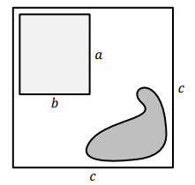
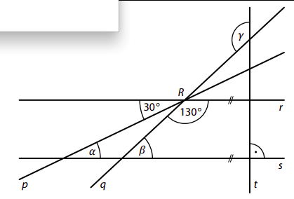
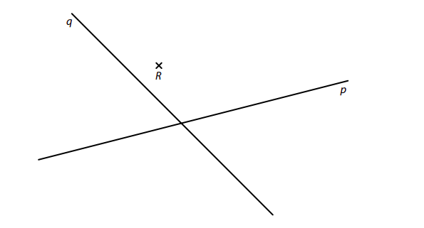
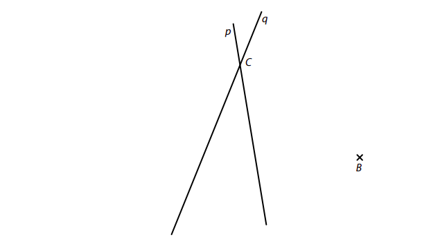
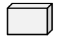
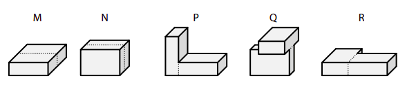
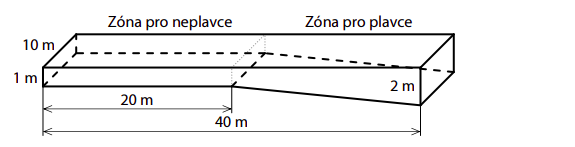
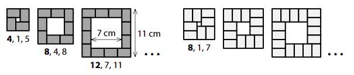

# 1 Vypočtěte, kolikrát je součet čísel 16 a 4 větší než druhá odmocnina ze součinu čísel 16 a 4. 
 
 
# 2 Vypočtěte a výsledek zapište zlomkem v základním tvaru. 
## 2.1 
$$
(-3)\cdot(\frac{3}{4}-\frac{5}{6}) 
$$
## 2.2 
$$
\frac{\frac{\sqrt{25}}{\sqrt{2\cdot2}}}{\frac{3\cdot(3^2-2\cdot2)}{\sqrt{5^2-4^2}}}= 
$$
V záznamovém archu uveďte celý postup řešení. 
# 3 
## 3.1 
Do rámečků doplňte taková čísla, aby platila rovnost: 
$$
(a+[?])^2 = a^2 + 18a +[?]
$$
 

## 3.2 
Upravte na co nejjednodušší tvar bez závorek: 
$$
2-(n+2)\cdot(-n)+(3-n)\cdot(n+1)=
$$

## 3.3 Upravte a výsledný výraz rozložte na součin pomocí vzorce: 
$$
x\cdot(18-x)+9\cdot(16-2x)=
$$

# 4 Řešte rovnici: 
## 4.1 
$$
7⋅(\frac{4}{7}-\frac{x}{10})-5\cdot(\frac{x}{25}-\frac{16}{5})=\frac{1}{10}x
$$ 
## 4.2 
$$ 
y-(y+5)\cdot0{,}1=0{,}9y+0{,}5
$$

VÝCHOZÍ TEXT A OBRÁZEK K ÚLOZE 5 
===

> Na obrázku je plánek pozemku, na kterém se nachází  dům a rybníček.\
> Pozemek má tvar čtverce s délkou strany 𝑐=30 m.
> Světle šedý obdélník představuje půdorys domu a tmavší obrazec představuje rybníček.\
> Půdorys domu má **pětkrát menší obsah**, než je celková rozloha pozemku. 
>  
> 
> 
> (*CZVV*)

# 5 
## 5.1 Délka domu 𝑎 je rovna polovině délky strany pozemku 𝑐. 
**Určete šířku domu** 𝑏. 
## 5.2 Rozloha rybníčku představuje 18 % celkové rozlohy pozemku. 
**Vypočtěte v m^2^ rozlohu volné části pozemku, na níž __není__ ani dům, ani rybníček.**
 

VÝCHOZÍ TEXT K ÚLOZE 6 
===

> Zahradní sud má tvar rotačního válce. Dno sudu má obsah 1 500 cm^2^. 
>
> (*CZVV*) 

# 6 
## 6.1 Při dešti stoupla hladina vody v sudu o 10 mm. 
**Vypočtěte, kolik litrů vody přibylo v sudu během tohoto deště.**
## 6.2 Při silném lijáku v sudu přibyly 3 litry vody. 
**Vypočtěte, o kolik mm stoupla hladina vody v sudu během tohoto silného lijáku.**
 
VÝCHOZÍ TEXT A OBRÁZEK K ÚLOZE 7 
===

>V rovině leží přímky p, q, r, které se protínají v bodě R, a přímky s, t, pro které platí: s∥r, s⊥t. 
> 
>
>
>(*CZVV*) 

# 7 Vypočtěte ve stupních velikost úhlu 
## 7.1 𝛼, 
## 7.2 𝛽, 
## 7.3 𝛾. 
Velikosti úhlů neměřte, ale vypočtěte (obrázek je pouze ilustrativní). 

VÝCHOZÍ TEXT A OBRÁZEK K ÚLOZE 8 
===

> Záhon v parku má tvar čtyřúhelníku, jehož tři strany jsou stejně dlouhé. Každá z těchto tří 
> stran je o čtvrtinu kratší, než je čtvrtá strana čtyřúhelníku.\
> Po obvodu záhonu je ve stejných rozestupech vysázeno celkem 65 rostlin, z nichž je po jedné 
> rostlině i v každém rohu záhonu. Rozestupy mezi rostlinami měří 40 cm. 
> 
> 
> 
> (*CZVV*) 

# 8 
## 8.1 **Vypočtěte** v metrech obvod záhonu. 
## 8.2 **Určete**, o kolik se liší počet rostlin na nejdelší straně záhonu od počtu rostlin na protější straně záhonu. 
## 8.3 Po obvodu záhonu se **pravidelně** střídají stejně početné skupinky červeně kvetoucích rostlin s dvojicemi bíle kvetoucích rostlin. 
**Určete nejmenší možný počet červeně kvetoucích rostlin po obvodu záhonu.**

VÝCHOZÍ TEXT A OBRÁZEK K ÚLOZE 9 
===

> V rovině leží různoběžky p, q a bod R. 
> 
> 
> 
> (*CZVV*) 

# 9 
## 9.1 **Sestrojte** osu většího úhlu, který svírají přímky p, q, a **označte** ji písmenem o. 
## 9.2 
Na přímkách p, q leží všechny čtyři vrcholy obdélníku *KLMN*.
Bod R leží uvnitř strany *MN* tohoto obdélníku. 
**Sestrojte** vrcholy obdélníku *KLMN*, **označte** je písmeny a obdélník **narýsujte**. 
**V záznamovém archu** obtáhněte celou konstrukci **propisovací tužkou** (čáry i písmena). 
 

VÝCHOZÍ TEXT A OBRÁZEK K ÚLOZE 10 
===

> V rovině leží bod B a přímky p, q, které se protínají v bodě C. 
> 
>  
> 
> (*CZVV*) 
# 10 Body B, C jsou vrcholy trojúhelníku *ABC*.  
Na přímce p leží výška vc na stranu c a na přímce q leží těžnice tc na stranu c 
tohoto trojúhelníku. 
**Sestrojte** vrchol A trojúhelníku *ABC*, **označte** ho písmenem a trojúhelník **narýsujte**. 
V záznamovém archu obtáhněte celou konstrukci propisovací tužkou (čáry i písmena). 
 
VÝCHOZÍ TEXT A OBRÁZKY K ÚLOZE 11 
===

> Základní kvádr má délky hran 1 cm, 2 cm a 3 cm.
> 
> 
> 
> Každé z následujících těles bylo slepeno ze dvou základních kvádrů.  
> Čtyřboké hranoly jsou označeny písmeny M, N a další tělesa písmeny P, Q, R. 
> 
>  
> 
> (*CZVV*) 

# 11 Rozhodněte o každém z následujících tvrzení (11.1–11.3), zda je pravdivé (A), či nikoli (N). 
## 11.1 Součet délek všech hran jednoho základního kvádru je 24 cm. 
## 11.2 Povrchy hranolů M a N se liší o 6 cm2. 
## 11.3 Všechna tři tělesa P, Q, R mají stejný povrch. 
 
 
 
VÝCHOZÍ TEXT A OBRÁZEK K ÚLOZE 12 
===

> Bazén má délku 40 metrů a šířku 10 metrů. Hloubka bazénu není všude stejná (viz obrázek). 
> V celé zóně pro neplavce je hloubka 1 m. Zóna pro plavce má šikmé dno a hloubka bazénu 
> se v ní postupně zvětší z 1 m na 2 m.
> 
> 
>  
> (*CZVV*) 

# 12 Jaký je objem bazénu? 
- [A] 500 m^3^ 
- [B] 550 m^3^ 
- [C] 600 m^3^ 
- [D] 650 m^3^ 
- [E] jiný objem 
 
VÝCHOZÍ TEXT K ÚLOZE 13 
===

> U Pelhřimova se letos pořádaly dětské tábory ve dvou termínech. Počet nabízených míst byl 
> v obou termínech stejný. Sešlo se celkem 375 přihlášek. V prvním termínu počet přihlášek 
> překročil počet nabízených míst o pětinu, ve druhém termínu o 30 %. 
> 
> (*CZVV*) 
# 13 Kolik přihlášek celkem muselo být kvůli nedostatku míst odmítnuto? 
- [A] 65 přihlášek 
- [B] 75 přihlášek 
- [C] 80 přihlášek 
- [D] 85 přihlášek 
- [E] jiný počet přihlášek 
 
VÝCHOZÍ TEXT A TABULKA K ÚLOZE 14 
===

> Test z matematiky psalo 20 žáků. Nejhorší známka byla 3. Počet jedniček a dvojek byl stejný. 
> Aritmetický průměr známek všech žáků byl 1,8.
> 
> |           | | | | | | 
> |-----------|:-:|:-:|:-:|:-:|:-:|
> |Známka     |1|2|3|4|5| 
> |Počet žáků |?| | |0|0| 
> 
> (*CZVV*) 

# 14 Kolik žáků dostalo z testu známku 1? 
- [A] 5 žáků 
- [B] 6 žáků 
- [C] 7 žáků 
- [D] 8 žáků 
- [E] 9 žáků 
 
 
 
# 15 Přiřaďte ke každé úloze (15.1–15.3) odpovídající výsledek (A–F). 
## 15.1 Při slavnostním zahájení soutěže nastoupilo na hřiště 10 družstev po 11 hráčích a všichni organizátoři soutěže. Dohromady tak nastoupilo 200 osob. 
**Kolik procent osob nastoupených na hřišti tvořili organizátoři?**
_____ 
## 15.2 Soutěže se účastnilo 20 tříčlenných družstev.  V každém z nich byl alespoň jeden muž a alespoň jedna žena. Družstev s jedním mužem bylo čtyřikrát více než družstev s jednou ženou. 
**Kolik procent soutěžících tvořily ženy?**
_____ 
## 15.3 Na atletickém přeboru soutěžil každý atlet právě v jedné ze tří disciplín. V hodu oštěpem soutěžilo 12 atletů. Skokanů bylo o 40 % méně než běžců, ale o 50 % více než oštěpařů. 
**Kolik procent všech soutěžících atletů tvořili běžci?**
_____ 
- [A] 40 % 
- [B] 45 % 
- [C] 50 % 
- [D] 55 % 
- [E] 60 % 
- [F] více než 60 % 

VÝCHOZÍ TEXT A OBRÁZEK K ÚLOZE 16 
===

> Vytváříme tmavé a světlé obrazce tvaru čtverce jako na obrázku. 
> 
> Každý takový obrazec obsahuje jeden bílý čtverec obklopený pásem z několika shodných 
> obdélníčků. Každý obdélníček má rozměry 2 cm a 3 cm. 
> 
> Obdélníčky jsou buď tmavé (na obrázku vlevo), nebo světlé (na obrázku vpravo) a jsou 
> natočeny tak, že pás z tmavých obdélníčků je vždy užší než pás ze světlých obdélníčků. 
> 
> 
> 
> Obrazec se popisuje třemi čísly. První číslo udává počet obdélníčků v obrazci, další dvě čísla 
> udávají v cm délku strany bílého čtverce v obrazci a délku strany celého obrazce. 
> 
> (*CZVV*) 

# 16 
## 16.1 Délka strany tmavého obrazce je 20 cm. 
**Určete počet obdélníčků v obrazci.**

## 16.2 Délka strany tmavého i světlého obrazce je 23 cm. 
**Určete, o kolik se liší počet obdélníčků v těchto dvou obrazcích.**

## 16.3 Tmavý i světlý obrazec mají stejný počet obdélníčků, ale délky stran bílých čtverců v těchto obrazcích se liší o 10 cm. 
**Určete počet obdélníčků v tmavém obrazci.**