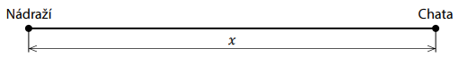
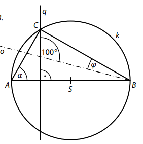
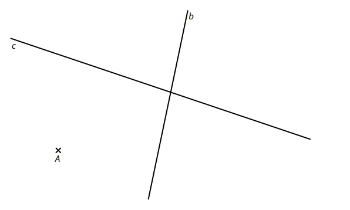
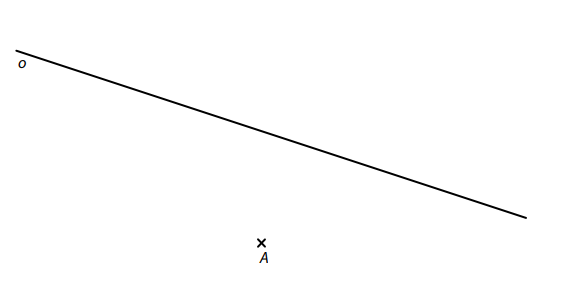
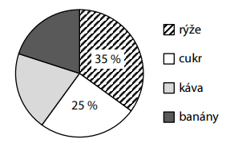
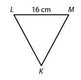
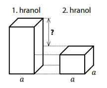
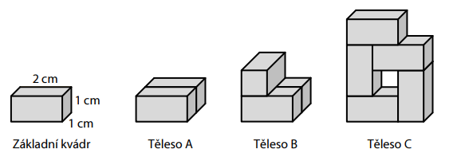

VÝCHOZÍ TEXT A OBRÁZEK K ÚLOZE 1
===

> Pro čísla A, B, C platí:
> 
> $ A = \frac{2}{9}+\frac{5}{18} $\
> $ B = \frac{2}{9}:\frac{5}{18} $\
> C je aritmetický průměr čísel A a B

# 1 Zapište zlomkem v základním tvaru číslo
## 1.1 A,
## 1.2 B,
## 1.3 C.
 
 
# 2
## 2.1 Vypočtěte
$$
(-1{,}5 - 1)\cdot(-1{,}5+1) 
$$
## 2.2 **Vypočtěte** a výsledek zapište zlomkem v základním tvaru. 
$$
\frac{\frac{25}{28}\cdot{(-\frac{2}{5})}}{\frac{6}{7}:2+1}= 
$$

[!NOTE]
**V záznamovém archu** uveďte celý **postup řešení**. 

# 3 
## 3.1 **Vypočtěte pro**  a=7:
$$
9a^2-6a+1
$$

## 3.2 **Upravte a rozložte na součin** užitím vzorce:
$$
1-2n+2n \cdot (1-8n) = 
$$

## 3.3 **Upravte** na co nejjednodušší tvar bez závorek: 
$$
(x+2) \cdot (1-x) - 2x \cdot (-\frac{1}{2}) \cdot x =
$$

[!NOTE]
**V záznamovém archu** uveďte v úloze 3.3 celý **postup řešení**.

# 4 
## 4.1 Řešte rovnici: 
$$
0{,}5-(5-x) \cdot 0{,}5 = 0{,}5 \cdot (1-9x)
$$ 
## 4.2 Řešte soustavu rovnic: 
$$
\begin{aligned}
3x-y=11\\
3x+2y=-4
\end{aligned}
$$

[!NOTE]
**V záznamovém archu** uveďte v obou částech úlohy celý **postupu řešení**.\
Zkoušku nazapisujte.

VÝCHOZÍ TEXT K ÚLOZE 5 
===

> Větší sud má o třetinu větší objem než menší sud.\
> Objem většího sudu je 360 litrů.
>
> (*CZVV*) 

# 5 Vypočtěte v litrech objem menšího sudu.
 
VÝCHOZÍ TEXT A OBRÁZEK K ÚLOZE 6 
===

> Cyklostezka začíná u nádraží a končí u chaty. Petr vyjel od nádraží po této cyklostezce, 
> ujel dvě třetiny její délky a zastavil u stánku s občerstvením. Tam zjistil, že ztratil telefon.\
> Našel ho, až když se vrátil o čtvrtinu vzdálenosti, kterou předtím ujel od nádraží ke stánku. 
> Pak pokračoval po cyklostezce až k chatě. 

>  
> 
> Délku celé cyklostezky označíme 𝑥. 
> 
> (*CZVV*) 

# 6 
## 6.1 **Vyjádřete výrazem** s proměnnou 𝑥 délku cyklostezky **mezi stánkem a chatou**. 
## 6.2 **Vyjádřete výrazem** s proměnnou 𝑥 délku cyklostezky mezi stánkem a místem, kde 
Petr našel svůj telefon. 
## 6.3 Ve chvíli, kdy našel svůj telefon, zbývalo Petrovi k chatě ještě 24 km. 
**Vypočtěte**, kolik km Petr **celkem najezdil**, než se dostal od nádraží k chatě. 
 
 
VÝCHOZÍ TEXT K ÚLOZE 7 
===

> Adam běžel 10kilometrový okruh stálým tempem a uběhl jej za 50 minut.  
> Bára běžela pouze 9kilometrový okruh rovněž stálým tempem (jiným než Adam).\
> Adam i Bára vyběhli ve stejném okamžiku  
> a po 30 minutách běhu jim oběma zbývala do cíle stejná vzdálenost. 
> 
> (*CZVV*) 

# 7 **Vypočtěte**, 
## 7.1 kolik km uběhla Bára za 30 minut, 
## 7.2 za kolik minut uběhla svůj okruh Bára. 
  
VÝCHOZÍ TEXT A OBRÁZEK K ÚLOZE 8 
===

Na obrázku je trojúhelník *ABC*. Přímka o je osou jeho vnitřního úhlu při vrcholu B.\
Přímka q prochází vrcholem C a je kolmá ke straně *AB* tohoto trojúhelníku.\
Na straně *AB* leží střed S kružnice k opsané trojúhelníku *ABC*.

Velikosti některých úhlů jsou uvedeny v obrázku. 

 
(*CZVV*) 
# 8 Vypočtěte ve stupních velikost úhlu 
## 8.1 𝜑, 
## 8.2 𝛼. 

[!NOTE]
Velikosti úhlů neměřte, ale vypočtěte (obrázek je pouze ilustrativní). 

[!NOTE]
Doporučení pro úlohy 9 a 10: Rýsujte přímo do záznamového archu. 

VÝCHOZÍ TEXT A OBRÁZEK K ÚLOZE 9 
===

> V rovině leží bod A a přímky b, c.
> 
> 
>  
> (*CZVV*) 

# 9 
Bod A je vrchol trojúhelníku *ABC*.\
Strana *AB* tohoto trojúhelníku je kolmá k přímce b a vrchol B leží na přímce b.  
Strana *BC* je o 2 cm delší než strana *AB* a vrchol C leží na přímce c. 

**Sestrojte** vrcholy B, C trojúhelníku *ABC*, **označte** je písmeny a trojúhelník **narýsujte**.\
Najděte všechna řešení. 

[!NOTE]
**V záznamovém archu** obtáhněte celou konstrukci **propisovací tužkou** (čáry i písmena). 
 
VÝCHOZÍ TEXT A OBRÁZEK K ÚLOZE 10 
===

> V rovině leží bod A a přímka o. 
> 
>  
> 
> (*CZVV*) 

# 10 
Bod A je vrchol **rovnoběžníku** *ABCD*.\
Přímka o je osou souměrnosti tohoto rovnoběžníku a leží na ní vrcholy B, D.\
Úhlopříčka *BD* rovnoběžníku *ABCD* je dvakrát delší než úhlopříčka *AC*.

**Sestrojte** vrcholy B, C, D rovnoběžníku *ABCD*, **označte** je písmeny  
a rovnoběžník **narýsujte**. 

[!NOTE]
**V záznamovém archu** obtáhněte celou konstrukci **propisovací tužkou** (čáry i písmena). 

 
VÝCHOZÍ TEXT A DIAGRAM K ÚLOZE 11 
===

> Náklad na lodi se skládá pouze ze čtyř druhů zboží – rýže, cukru, kávy a banánů.\
> Loď veze 36 tun banánů a 36 tun kávy.\
> Diagram udává, jaký podíl na celkové hmotnosti nákladu mají jednotlivé druhy zboží. 
> 
>  
> (*CZVV*) 

# 11 Rozhodněte o každém z následujících tvrzení (11.1–11.3), zda je pravdivé (A), či nikoli (N). 

## 11.1 Káva a banány tvoří dohromady dvě pětiny celkové hmotnosti nákladu. 
## 11.2 Poměr hmotnosti kávy ku hmotnosti rýže je 4∶7. 
## 11.3 Loď veze 63 tun rýže. 
  
VÝCHOZÍ TEXT K ÚLOZE 12 
===

> Na parkovišti je 15 míst vyhrazeno pro zásobování.  
> Zatímco loni tato místa představovala jednu dvacetinu celkové kapacity parkoviště,  
> letos díky rozšíření parkoviště představují tato místa pouze 4 % celkové kapacity. 
> (*CZVV*) 
# 12 O kolik parkovacích míst se díky rozšíření parkoviště zvětšila jeho celková kapacita? 
- [A] o 25 míst 
- [B] o 50 míst 
- [C] o 75 míst 
- [D] o 125 míst 
- [E] o jiný počet míst 

VÝCHOZÍ TEXT A OBRÁZEK K ÚLOZE 13 
===

> Rovnoramenný trojúhelník *KLM* se základnou *LM* délky 16 cm má obvod 50 cm. 
>
>  
>
> (*CZVV*) 

# 13 Jaký je obsah trojúhelníku *KLM*? 
- [A] 120 cm^2^ 
- [B] 136 cm^2^ 
- [C] 240 cm^2^ 
- [D] 272 cm^2^ 
- [E] jiný obsah 
 
 
VÝCHOZÍ TEXT A OBRÁZEK K ÚLOZE 14 
===

> První i druhý pravidelný čtyřboký hranol mají podstavnou hranu délky 𝑎 = 3 cm.\
> První hranol má o 72 cm^2^ větší povrch než druhý hranol.
> 
> 
>
> (*CZVV*) 

# 14 O kolik cm se liší výšky obou hranolů? 
- [A] o 8 cm 
- [B] o 6 cm 
- [C] o 5 cm 
- [D] o 4 cm 
- [E] o 3 cm 
 
 
 
VÝCHOZÍ TEXT A OBRÁZEK K ÚLOZE 15 
===

> Na podložce stojí základní kvádr o rozměrech 2 cm, 1 cm a 1 cm a další tři tělesa A, B, C, která jsme postavili z několika základních kvádrů (viz obrázek). 
> 
> 
> 
> (*CZVV*) 

# 15 Přiřaďte ke každé otázce (15.1–15.3) správnou odpověď (A–F). 
## 15.1 O kolik procent větší je objem tělesa B než objem tělesa A?
## 15.2 O kolik procent menší je objem tělesa B než objem tělesa C? 
## 15.3 Ze základního kvádru odřízneme část, která přesně zaplní otvor uvnitř tělesa C. O kolik procent se zvětší objem tělesa C zaplněním otvoru touto částí?

- [A] o 10 % 
- [B] o 25 % 
- [C] o 33 % 
- [D] o 40 % 
- [E] o 50 % 
- [F] o více než 50 % 
 
VÝCHOZÍ TEXT K ÚLOZE 16 
===

> **Po spuštění** automatu začali dva roboti Jas a Dok plnit **prázdnou** nádobu míčky a třetí robot Pat začal míčky odebírat.\
> Jas dal do nádoby v každé sekundě 1 míček,\
> Dok dal do nádoby v každé druhé sekundě 2 míčky najednou\
> a Pat v každé páté sekundě z nádoby 5 míčků najednou odebral.
> 
> (*CZVV*) 

# 16 
## 16.1 Určete **počet míčků** v nádobě na konci 14. sekundy po spuštění automatu. 
## 16.2 Určete, v kolikáté **sekundě** po spuštění počet míčků v nádobě **poprvé** překročil 30. 
## 16.3 V některých sekundách se oproti předchozí sekundě změnil počet míčků v nádobě celkem o 3.
Určete **počet míčků** v nádobě v okamžiku, kdy k této změně došlo právě po třicáté.