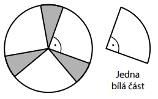
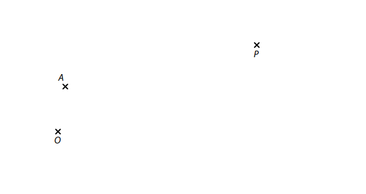
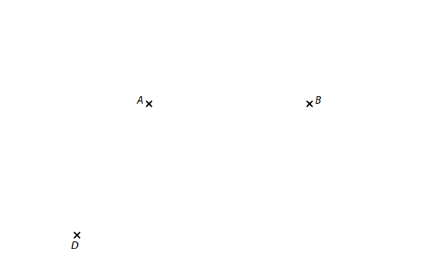
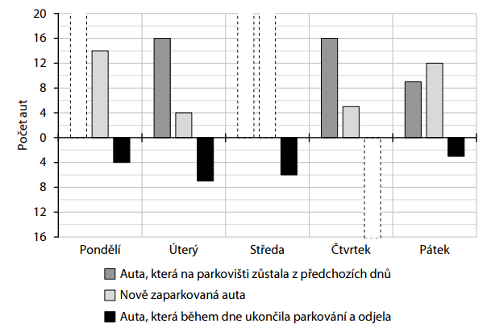
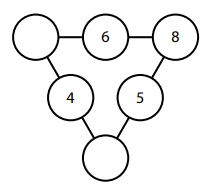
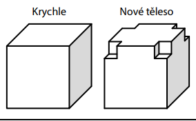
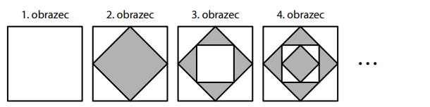

# 1 Vypočtěte, o kolik cm^2^ je plocha o obsahu 0,1 m^2^ větší než plocha o obsahu 20 cm^2^. 

# 2 Vypočtěte a výsledek zapište zlomkem v základním tvaru  nebo celým číslem: 
## 2.1  
$$
3⋅(\frac{2}{3}-\frac{7}{9})+\frac{2}{3}= 
$$

## 2.2 
$$ 
1∶\frac{6}{5}-\frac{1}{6}:5=
$$

## 2.3 
$$
\frac{1-\frac{1}{4}}{2 \cdot \frac{5}{8}-2}= 
$$
[!NOTE]
**V záznamovém archu** uveďte v úloze 2.3 celý **postup řešení**. 

# 3 
# 3 
## 3.1 **Upravte** na co nejjednodušší tvar bez závorek: 
$$
5𝑥−3𝑥 \cdot 3−3 \cdot (−2𝑥)= 
$$
## 3.2 **Upravte a rozložte na součin** vytknutím: 
$$
(𝑎−2𝑏) \cdot 𝑏−𝑏+2𝑏^2= 
$$
## 3.3 **Upravte** na co nejjednodušší tvar bez závorek: 
$$
(3𝑦+𝑦)\cdot(𝑦−1)+(1−2𝑦)\cdot(2𝑦+1)= 
$$

[!NOTE]
**V záznamovém archu** uveďte v úloze 3.3 celý **postup řešení**. 

# 4 Řešte rovnici: 
[!NOTE]
**V záznamovém archu** uveďte v obou částech úlohy celý **postup řešení** (zkoušku nezapisujte). 

## 4.1 
$$
\frac{1}{2} \cdot (3𝑥+4)+5=\frac{1}{2} \cdot (2−𝑥)
$$
## 4.2 
$$ 
\frac{6+𝑦}{5}=7−\frac{8+5𝑦}{20}
$$

VÝCHOZÍ TEXT K ÚLOZE 5 
===

> František dal do svého salátu obsahujícího 850 g rajčat celkem 255 g cukru.\
> Podle receptu však do salátu patří na každých 250 g rajčat pouze 25 g cukru. 
> 
> (*CZVV*) 
# 5 Vypočtěte, 
## 5.1 kolik gramů cukru měl dát František podle receptu do svého salátu, 
## 5.2 o kolik procent více cukru dal František do svého salátu, než měl dát podle receptu. 
 
 
 
VÝCHOZÍ TEXT K ÚLOZE 6 
===

> Na vánočním jarmarku prodávali ve stánku pouze čaj a punč.\
> Čaj prodávali za 40 korun a cena punče byla o 75 % vyšší než cena čaje. 
> 
> (*CZVV*) 

# 6 
## 6.1 **Vypočtěte** v korunách cenu jednoho punče. 
## 6.2 Počet čajů, které dnes ve stánku prodali, označíme 𝑥. 
**Vyjádřete výrazem** s proměnnou 𝑥, kolik korun dnes ve stánku utržili za **všechny** prodané **čaje**. 
## 6.3 Ve stánku dnes prodali celkem 510 nápojů a utržili za ně dohromady 29 700 korun. 
**Vypočtěte**, kolik čajů prodali dnes ve stánku. 

VÝCHOZÍ TEXT A OBRÁZEK K ÚLOZE 7 
===

> Kruh o poloměru 10 cm je rozdělen na tři shodné bílé části a tři shodné šedé části jako na obrázku.
> 
> 
>  
> (*CZVV*) 
# 7 
## 7.1 **Určete**, kolikrát je obsah jedné bílé části kruhu větší než obsah jedné šedé části. 
## 7.2 **Vypočtěte** v cm obvod jedné bílé části kruhu.  
Výsledek zaokrouhlete na desetiny centimetru. 
 
 
VÝCHOZÍ TEXT K ÚLOZE 8 
===

> Délky dvou stran trojúhelníku *ABC* jsou 𝑎=7 cm, 𝑏=30 cm.\
> Obvod trojúhelníku *ABC* v cm je vyjádřen **celým číslem**.
> 
> (*CZVV*) 
# 8 **Určete**, kolik cm musí měřit **strana** c trojúhelníku *ABC*, aby byl jeho obvod 
## 8.1 nejmenší možný, 
## 8.2 největší možný. 
 
[!NOTE]
Doporučení pro úlohy 9 a 10: Rýsujte přímo do záznamového archu. 

VÝCHOZÍ TEXT A OBRÁZEK K ÚLOZE 9 
===

> V rovině leží body A, O, P.
> 
> 
>  
> (*CZVV*) 

# 9 
Bod A je vrchol pravidelného šestiúhelníku *ABCDEF*.\
Přímka *OP* je osa strany *AB* tohoto šestiúhelníku.\ 
Na polopřímce *OP* leží střed souměrnosti S šestiúhelníku *ABCDEF*. 

**Sestrojte** vrcholy B, C, D, E, F šestiúhelníku *ABCDEF*, **označte** je písmeny  
a šestiúhelník **narýsujte**. 

[!NOTE]
**V záznamovém archu** obtáhněte celou konstrukci **propisovací tužkou** (čáry i písmena). 
 

VÝCHOZÍ TEXT A OBRÁZEK K ÚLOZE 10 
===
> V rovině leží body A, B, D. 
> 
> 
>  
> (*CZVV*) 

# 10 
Body A a B jsou vrcholy pravoúhlého trojúhelníku *ABC* s pravým úhlem při vrcholu C.\
Body B a D jsou vrcholy pravoúhlého trojúhelníku *BCD* s pravým úhlem při vrcholu C.\ 
(Vrcholy B a C jsou společnými vrcholy obou trojúhelníků.)

**Sestrojte** vrchol C, **označte** ho písmenem a **narýsujte** trojúhelníky *ABC* a *BCD*. 

[!NOTE]
**V záznamovém archu** obtáhněte celou konstrukci **propisovací tužkou** (čáry i písmena). 

VÝCHOZÍ TEXT A GRAF K ÚLOZE 11 
===

> Na parkovišti mohou auta stát jeden den nebo zůstat zaparkovaná nepřetržitě více dnů.\
> Na noc se parkoviště pro vjezd a výjezd uzavírá.\
> V grafu jsou znázorněny počty aut na parkovišti v průběhu pěti dnů, čtyři údaje však chybí. 
> 
> 
> 
> Např. **v pátek** bylo na parkovišti již před otevřením 9 aut, která tam zůstala zaparkovaná 
> z předchozích dnů, během dne pak přibylo 12 nově zaparkovaných aut. Z těchto 21 aut v pátek 3 auta ukončila parkování a odjela.
> 
> (*CZVV*) 

# 11 Rozhodněte o každém z následujících tvrzení (11.1–11.3), zda je pravdivé (A), či nikoli (N).
## 11.1 V pondělí bylo na parkovišti již před otevřením právě 10 aut.
## 11.2 Ve středu na parkovišti nově zaparkovalo 9 aut.
## 11.3 Ve čtvrtek ukončilo parkování **méně než** 12 aut.

VÝCHOZÍ TEXT A OBRÁZEK K ÚLOZE 12 
===
> V trojúhelníkovém diagramu se do prázdných kroužků doplní taková **kladná celá** čísla, aby byl **součin tří čísel** na každé straně trojúhelníku stejný. 
> 
>  
> 
> (*CZVV*) 

# 12 Jaký je součet obou čísel doplněných do prázdných kroužků diagramu? 
- [A] 11 
- [B] 14 
- [C] 19 
- [D] 22 
- [E] jiný součet 
 
VÝCHOZÍ TEXT A OBRÁZEK K ÚLOZE 13 
===
> Z krychle o hraně délky 10 cm byly vyříznuty čtyři shodné malé krychličky o hraně délky 2 cm. Vzniklo tak nové těleso (viz obrázek). 
> 
> 
> 
> (*CZVV*) 
# 13 Jaký je povrch nového tělesa? 
- [A] 552 cm^2^ 
- [B] 584 cm^2^ 
- [C] 600 cm^2^ 
- [D] 616 cm^2^ 
- [E] jiný povrch 

VÝCHOZÍ TEXT K ÚLOZE 14 
===
> Pomocí hrnku naléváme do prázdného kanystru vodu ze studánky.\
> Po nalití 28 hrnků plných vody bylo zaplněno sedm osmin objemu kanystru.\
> Když jsme přilili ještě 1 hrnek plný vody, do úplného zaplnění kanystru chybělo 1 050 ml vody.
> 
> (*CZVV*) 
# 14 Jaký je objem hrnku? 
- [A] 350 ml 
- [B] 300 ml 
- [C] 245 ml 
- [D] 210 ml 
- [E] jiný objem 
 

# 15 Přiřaďte ke každé úloze (15.1–15.3) odpovídající výsledek (A–F). 
## 15.1 Bedna s jablky váží 20 kg a je o 25 % těžší než bedna s hruškami. 
**Kolik kg váží bedna s hruškami?**
## 15.2 Z nasbíraných jahod jsme 65 % použili na výrobu džemu, 20 % na výrobu sirupu a zbývající 3 kg jsme zamrazili. 
**Kolik kg jahod jsme použili na výrobu džemu?**
## 15.3 Celková hmotnost dvou zavazadel je 42 kg. Menší zavazadlo je o 60 % lehčí než větší zavazadlo. 
**O kolik kg se liší hmotnosti obou zavazadel?**

- [A] 12 kg 
- [B] 13 kg 
- [C] 15 kg 
- [D] 16 kg 
- [E] 18 kg 
- [F] jiný počet kg 

VÝCHOZÍ TEXT A OBRÁZEK K ÚLOZE 16 
===
> První obrazec je bílý čtverec. Druhý obrazec vznikne z prvního vložením menšího šedého čtverce, jehož vrcholy leží ve středech stran bílého čtverce.
> 
> Další obrazce vznikají střídavým vkládáním stále menších bílých a šedých čtverců, jejichž vrcholy vždy leží ve středech stran čtverce vloženého v předchozím obrazci (viz obrázek).
> 
> Druhý a každý další obrazec se potom skládá z bílých a šedých dílů.\
> Např. třetí obrazec obsahuje 9 dílů – 1 bílý čtverec, 4 šedé trojúhelníky a 4 bílé trojúhelníky. 
>  
> 
> 
> (*CZVV*) 
# 16 
## 16.1 **Určete**, kolik **šedých** dílů obsahuje 10. obrazec. 
## 16.2 **Určete**, kolikátý obrazec obsahuje 89 **bílých** dílů. 
## 16.3 **Vyjádřete zlomkem**, jakou část obsahu 5. obrazce představuje obsah všech jeho šedých dílů dohromady.