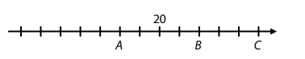
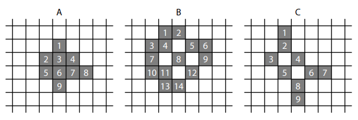
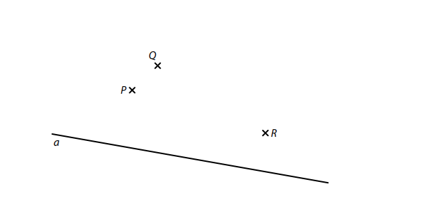
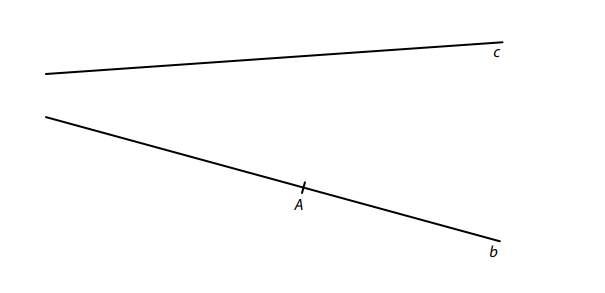
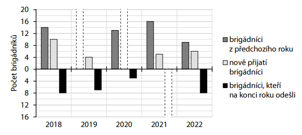
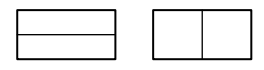
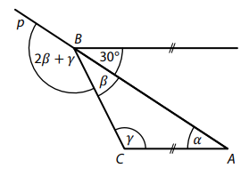
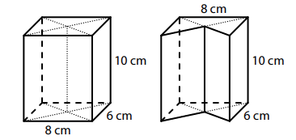
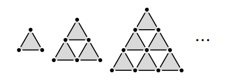

# 1 Hmotnosti dvou závaží jsou v poměru 3∶5 a liší se o 600 g. 
**Vypočtěte v gramech hmotnost lehčího závaží.**
 
VÝCHOZÍ TEXT A OBRÁZEK K ÚLOZE 2 
===

> Na číselné ose je vyznačeno 13 bodů, které oddělují 12 stejných dílků.\
> V jednom z těchto bodů je číslo 20 a body A, B, C představují tři kladná čísla.
> 
> Číslo v bodě C je součtem čísla v bodě A a čísla v bodě B. 
> 
> 
>
> (*CZVV*) 
# 2 Určete číslo v bodě
## 2.1 C, 
## 2.2 B. 

Doporučení: Úlohy 3.3, 4.3 a 5 řešte přímo v záznamovém archu. 
# 3 Vypočtěte a výsledek zapište zlomkem v základním tvaru. 
## 3.1 
$$
\frac{\frac{2}{3}-1}{\frac{8}{9}}=
$$

## 3.2 
$$ 
2\cdot\frac{1}{6}-\frac{3}{8}\cdot4=
$$

## 3.3 
$$
\frac{\frac{6}{7}-\frac{9}{14}}{\frac{8}{7}+\frac{6}{7}\div\frac{3}{2}}=
$$

**V záznamovém archu** uveďte pouze v úloze 3.3 celý **postup řešení**. 

# 4 
## 4.1 **Umocněte a zjednodušte** (výsledný výraz nesmí obsahovat závorky): 
$$
(0,3x+0,5)^2=
$$
## 4.2 **Rozložte** na součin podle vzorce: 
$$
49-(-4a)^2=
$$
## 4.3 **Zjednodušte** (výsledný výraz nesmí obsahovat závorky): 
$$
n\cdot(2n-1)-(-2n-n)\cdot(3n+2)+(1-2n)\cdot(1+2n)=
$$

**V záznamovém archu** uveďte pouze v úloze 4.3 celý **postup řešení**. 

# 5 Řešte rovnici: 
## 5.1 
$$ 
\frac{2-x}{2}+2x=2,5x-3
$$

## 5.2 
$$ 
3\cdot\frac{y+1}{2}-\frac{y}{3}=\frac{3}{2}\cdot\frac{2y-3}{3}+\frac{3}{2}
$$

V záznamovém archu uveďte v obou částech úlohy celý postup řešení (zkoušku nezapisujte).

VÝCHOZÍ TEXT K ÚLOZE 6 
===

> V pátek, v sobotu a v neděli se na mýtině vysazovaly stromy. 
> 
> V sobotu bylo vysázeno o třetinu více stromů než v pátek.\
> V neděli bylo vysázeno dokonce o 60 % více stromů než v pátek. 
> 
> (*CZVV*) 

# 6 Počet stromů vysázených v pátek označíme 𝑝. 
## 6.1 **Vyjádřete výrazem** s proměnnou 𝑝 počet stromů vysázených v sobotu. 
## 6.2 **Vyjádřete výrazem** s proměnnou 𝑝 počet stromů vysázených v neděli. 
## 6.3 V pátek bylo vysázeno o 290 stromů méně než v obou zbývajících dnech dohromady.
**Vypočtěte**, kolik stromů bylo vysázeno v pátek.

VÝCHOZÍ TEXT K ÚLOZE 7 
===

> Na parkovišti je přesně 105 parkovacích míst pro osobní auta.\
> Zaparkuje-li na parkovišti autobus, obsadí vždy 4 parkovací místa pro osobní auta.
> 
> (Parkoviště tedy zcela zaplní např. 101 osobních aut a jeden autobus.) 
> 
> (*CZVV*) 

# 7 
## 7.1 Na zcela zaplněném parkovišti je počet osobních aut stejný jako počet autobusů. 
**Vypočtěte, kolik je na parkovišti osobních aut.**
## 7.2 Na zcela zaplněném parkovišti je osobních aut o čtvrtinu více než autobusů. 
**Vypočtěte, kolik je na parkovišti autobusů.**

VÝCHOZÍ TEXT A OBRÁZEK K ÚLOZE 8 
===

> Ve čtvercové síti jsou z tmavých čtverců složeny tři útvary A, B, C.\
> Z každého útvaru vytvoříme odebráním **jediného** tmavého čtverce nový útvar, který je osově souměrný podle některé osy (svislé, vodorovné nebo šikmé). 
> 
> 
> 
> V jednotlivých útvarech jsme každý tmavý čtverec označili číslem.\
> Z útvaru A lze vytvořit osově souměrný útvar buď odebráním čtverce 2, nebo odebráním čtverce 8. 
> 
> (*CZVV*) 

# 8 Určete číslo čtverce, jehož odebráním vytvoříme osově souměrný útvar 
## 8.1 z útvaru B, 
## 8.2 z útvaru C. 
**V každé části** úlohy najděte **obě řešení**. 
  
Doporučení pro úlohy 9 a 10: Rýsujte přímo do záznamového archu. 

VÝCHOZÍ TEXT A OBRÁZEK K ÚLOZE 9 
===

> V rovině leží body P, Q, R a přímka a.
> 
> 
> 
> (*CZVV*) 

# 9 
Na přímce a leží strana *AB* čtverce *ABCD*.  
Dva ze tří bodů P, Q, R leží uvnitř dvou různých stran tohoto čtverce  
a třetí bod leží **vně** čtverce *ABCD*. 
**Sestrojte** všechny vrcholy čtverce *ABCD*, **označte** je písmeny a čtverec **narýsujte**.  
Najděte všechna řešení. 

V záznamovém archu obtáhněte celou konstrukci propisovací tužkou (čáry i písmena). 

VÝCHOZÍ TEXT A OBRÁZEK K ÚLOZE 10 
===

> V rovině leží přímky b, c a na přímce b leží bod A.
> 
> 
> 
> (*CZVV*) 

# 10 
Bod A je vrchol trojúhelníku *ABC* s pravým úhlem při vrcholu A.  
Na přímce b leží vrchol B a na přímce c leží vrchol C tohoto trojúhelníku.  
Velikost vnitřního úhlu trojúhelníku *ABC* při vrcholu C je 40°. 
**Sestrojte** vrcholy B, C trojúhelníku *ABC*, **označte** je písmeny a trojúhelník **narýsujte**.  
Najděte všechna řešení. 

V záznamovém archu obtáhněte celou konstrukci propisovací tužkou (čáry i písmena). 
 

VÝCHOZÍ TEXT A GRAF K ÚLOZE 11 
===

> Každý rok pracují v parku jednak brigádníci, kteří tam pracovali v předchozím roce, jednak nově přijatí brigádníci. Na konci každého roku někteří ze všech těchto brigádníků z parku odcházejí a další rok v něm nepracují. 
> 
> V grafu jsou znázorněny počty brigádníků v letech 2018 až 2022, tři údaje však chybí. 
> 
> 
>  
> Např. v roce 2022 pracovalo v parku 9 brigádníků, kteří tam pracovali i v roce 2021, a 6 nově přijatých brigádníků. Z těchto 15 brigádníků jich 8 na konci roku 2022 odešlo. 
> 
> (*CZVV*) 

# 11 Rozhodněte o každém z následujících tvrzení (11.1–11.3), zda je pravdivé (A), či nikoli (N). 
 

## 11.1 V roce 2019 pracovalo v parku 16 brigádníků, kteří tam pracovali i v roce 2018. 
## 11.2 V roce 2020 pracovalo v parku méně než 7 nově přijatých brigádníků. 
## 11.3 Na konci roku 2021 z parku odešlo více než 12 brigádníků. 
 
 
VÝCHOZÍ TEXT A OBRÁZEK K ÚLOZE 12 
===

> Velký obdélník lze rozdělit na dva shodné menší obdélníky nebo na dva čtverce. 
> 
> Obvod jednoho z menších obdélníků je 30 cm. 
> 
> 
> 
> (*CZVV*) 

# 12 Jaký je obvod velkého obdélníku? 
- [A] menší než 36 cm 
- [B] 36 cm 
- [C] 40 cm 
- [D] 60 cm 
- [E] větší než 60 cm 

VÝCHOZÍ TEXT A OBRÁZEK K ÚLOZE 13 
===

> Přímka p prochází vrcholy A, B trojúhelníku *ABC*, jehož vnitřní úhly mají velikosti 𝛼, 𝛽, 𝛾. 
> 
> Bodem B prochází rovnoběžka se stranou *AC*. 
> 
> 
> 
> (*CZVV*) 

# 13 Jaká je velikost úhlu 𝛾?  
Velikosti úhlů neměřte, ale vypočtěte. 
- [A] 115°
- [B] 120°
- [C] 135°
- [D] 140°
- [E] 150°

VÝCHOZÍ TEXT A OBRÁZEK K ÚLOZE 14 
===

> Kvádr s podstavou o rozměrech 6 cm a 8 cm a výškou 10 cm lze dvěma svislými úhlopříčnými řezy rozdělit na čtyři trojboké hranoly s výškou 10 cm. 
> 
> Odebráním jednoho z trojbokých hranolů vznikne z kvádru pětiboký hranol jako na obrázku vpravo. 
> 
> 
> 
> (*CZVV*) 

# 14 O kolik cm^2^ se liší povrch pětibokého hranolu a povrch původního kvádru? 
- [A] o 4 cm^2^ 
- [B] o 16 cm^2^ 
- [C] o 24 cm^2^ 
- [D] o 30 cm^2^ 
- [E] o jiný počet cm^2^ 
 
 
# 15 Přiřaďte ke každé úloze (15.1–15.3) odpovídající výsledek (A–F). 
## 15.1 Letos se na gymnázium přihlásilo 420 uchazečů, což je o 40 % více, než se jich přihlásilo loni. 
**Kolik uchazečů se na gymnázium přihlásilo loni?**
_____ 
## 15.2 On-line kurzu českého jazyka se zúčastnilo 180 žáků, což je o 25 % méně, než se jich zúčastnilo on-line kurzu matematiky. 
**Kolik žáků se zúčastnilo on-line kurzu matematiky?**
_____ 
## 15.3 Včera navštívilo plavecký bazén celkem 680 dospělých, mezi nimiž bylo mužů o 30 % méně než žen. 
**Kolik mužů včera navštívilo plavecký bazén?**
_____ 
- [A] méně než 240 
- [B] 240 
- [C] 260 
- [D] 280 
- [E] 300 
- [F] více než 300 

VÝCHOZÍ TEXT A OBRÁZEK K ÚLOZE 16 
===

> Obrazce tvaru trojúhelníku se sestavují skládáním šedých trojúhelníků do pater (viz obrázek). 
> 
> Šedé trojúhelníky mají ve vrcholech puntíky a na stranách stejně dlouhé úsečky. 
> V prvním obrazci je pouze jeden šedý trojúhelník a každý další obrazec má o jedno patro 
> šedých trojúhelníků více než předchozí obrazec. 
>  
> 
> 
> |||||
> |---|:---:|:---:|:---:|
> |Patra             |1|2|3 |
> |Šedé trojúhelníky |1|3|6 |
> |Puntíky           |3|6|10|
> |Úsečky            |3|9|18|
> 
> 
> (*CZVV*) 

# 16 
## 16.1 Určete počet **úseček** v obrazci, který má 5 pater. 
## 16.2 Počet úseček v posledním a v předposledním obrazci se liší o 96.  
Určete, o kolik se liší počet **puntíků** v posledním a předposledním obrazci. 
## 16.3 V jednom obrazci je 300 puntíků.  
Určete počet **úseček** v __následujícím__ obrazci. 
