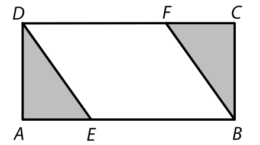
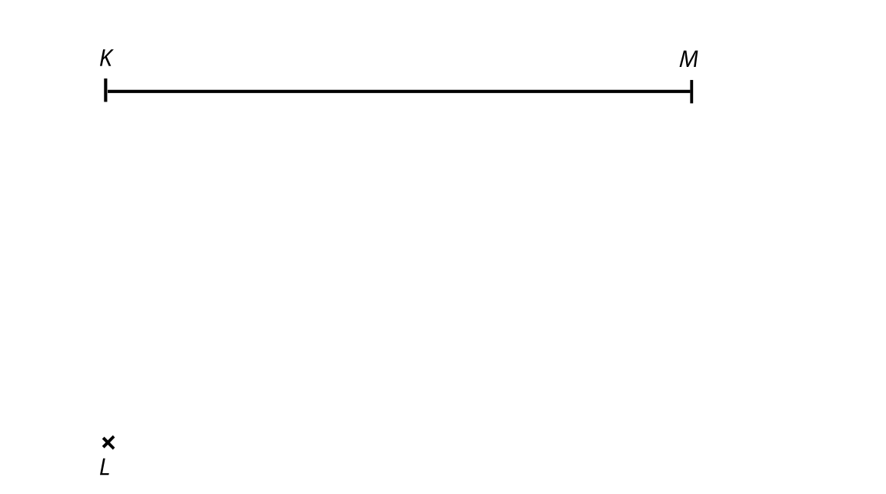
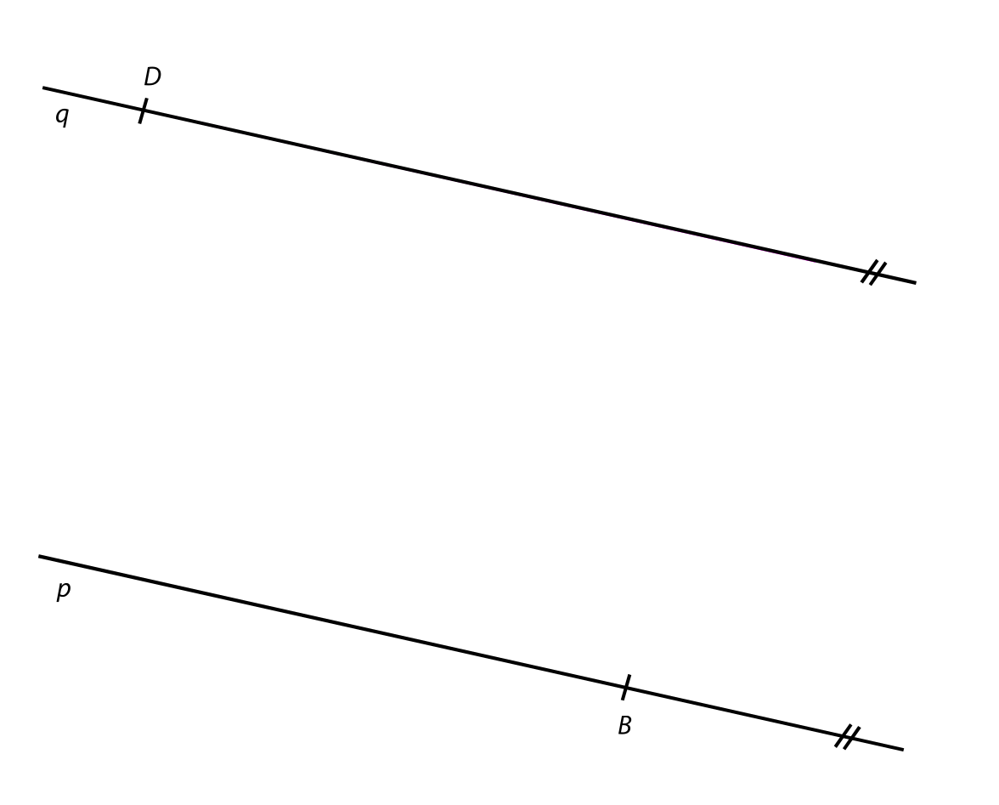
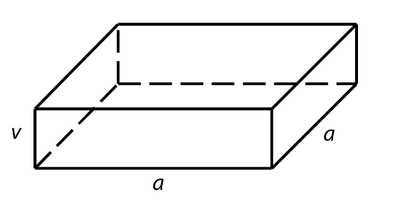
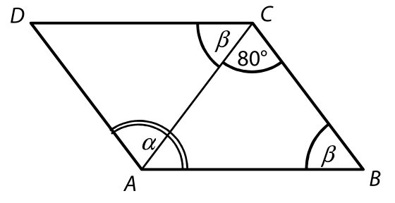
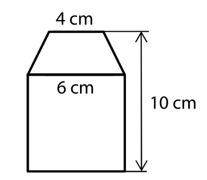
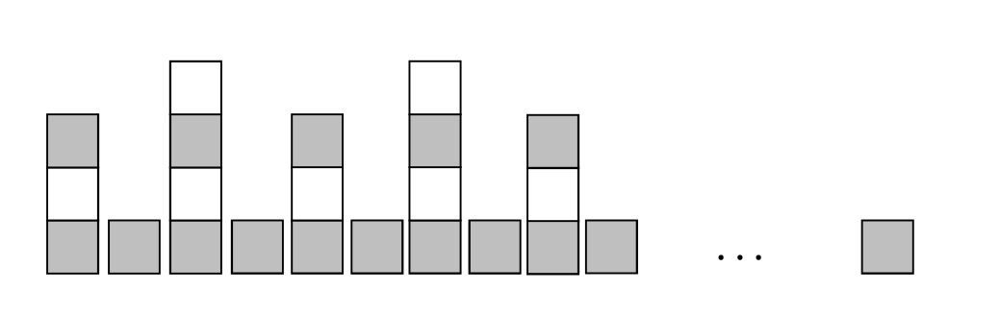

# 1 Vypočtěte, kolikrát větší je součin dvou čísel 4,5 a 3 než jejich podíl (v uvedeném pořadí). 
# 2 Vypočtěte: 
## 2.1 

$$
40−20\cdot(−6)∶4−5\cdot(4+12∶4)=
$$

## 2.2 

$$ 
\frac{0{,}3^2}{0{,}1}: 0{,}01=
$$
 
[!NOTE] 
**Doporučení**: Úlohy **3**, **4** a **5** řešte přímo **v záznamovém archu**. 

# 3 Vypočtěte a výsledek zapište zlomkem v základním tvaru. 
## 3.1 
# 
$$
\frac{7}{12}−\frac{5}{8}\cdot1{,}6=
$$
## 3.2 

$$
 \frac{2\frac{2}{3}-1\frac{3}{5}}{2\frac{2}{3}}= 
$$
 
[!NOTE]
**V záznamovém archu** uveďte v obou částech úlohy celý **postup řešení**. 
 
 
# 4 Zjednodušte: 
(Výsledný výraz nesmí obsahovat závorky.) 
## 4.1 
$$
(3a+1)^2−3a(2+5a)= 
$$
## 4.2 
$$
(1+2b)\cdot\frac{b}{2}−\frac{2−b}{b}=
$$

[!NOTE]
**V záznamovém archu** uveďte v obou částech úlohy celý **postup řešení**. 

# 5 
Řešte rovnici: 
## 5.1 
$$ 
x=2{,}5\cdot x
$$ 
## 5.2 
$$
(1−x)\cdot\frac{5}{6}=\frac{10}{9}x−\frac{1}{3}
$$

**V záznamovém archu** uveďte v obou částech úlohy celý **postup řešení**. (zkoušku nezapisujte). 

VÝCHOZÍ TEXT K ÚLOZE 6 
===

> Nela, Olga a Pavla spořily na společný dárek.\
> Olga uspořila o čtvrtinu méně než Nela. Pavla uspořila o 140 korun více než Nela. 
> 
> Všechny tři dívky dohromady uspořily třikrát více než samotná Nela. 
> 
> *(CZVV)* 

# 6 
## 6.1 Neznámý počet korun, které uspořila Nela, označte n a sestavte k úloze odpovídající rovnici s neznámou n. 
## 6.2 Vypočtěte, kolik korun uspořila Nela. 

# 7 
## 7.1 Vypočtěte, **o kolik dm^2^** se liší 50 dm^2^ a 2,4 m^2^. 
## 7.2 Vypočtěte, **kolikrát** méně je 50 kilogramů než 2,4 tuny. 
## 7.3 Vypočtěte, **kolikrát** větší je úhel 7° než úhel 0°35´. 
 
 
VÝCHOZÍ TEXT A OBRÁZEK K ÚLOZE 8 
===

> Obdélník *ABCD* je rozdělen na tři útvary – rovnoběžník a dva shodné trojúhelníky. Platí: |*AD*|=3 cm, |*DE*|=√13 cm,|*BE*|=5 cm 
>  
> 
>
> *(CZVV)* 

# 8
## 8.1 Vypočtěte v cm^2^ obsah rovnoběžníku *EBFD*. 
## 8.2 Vypočtěte v cm délku strany *AB*. 

[!NOTE]
**Doporučení**: Úlohy **9** a **10** rýsujte přímo do záznamového archu. 

VÝCHOZÍ TEXT A OBRÁZEK K ÚLOZE 9 
===

> V rovině leží bod L a úsečka *KM.* 
> 
> 
> 
> *(CZVV)* 

# 9 Na úsečce *KM* sestrojte takový bod P, aby úhly *KLP* a *PLM* byly shodné. 
Oba úhly narýsujte. 

[!NOTE]
**V záznamovém archu** obtáhněte vše **propisovací tužkou** (rovné čáry, oblouky i písmena). 
 
VÝCHOZÍ TEXT A OBRÁZEK K ÚLOZE 10 
===

> V rovině leží rovnoběžné přímky p, q. Přímka *p* prochází bodem *B,* přímka q bodem *D*.  
> 
>  
>  
> *(CZVV)* 
# 10 
Body B a D jsou vrcholy rovnoramenného lichoběžníku *ABCD.* 

Vrchol A leží na přímce *p* a vrchol C na přímce *q*.

V lichoběžníku je velikost vnitřního úhlu při vrcholu B trojnásobkem velikosti 
úhlu *ABD*, tedy platí:

|∢*ABC*|=3∙|∢*ABD*| 

**Sestrojte chybějící vrcholy** A, C **lichoběžníku** *ABCD* a **lichoběžník narýsujte**. 

[!NOTE]
**V záznamovém archu** obtáhněte vše **propisovací tužkou** (rovné čáry, oblouky i písmena). 

 
VÝCHOZÍ TEXT K ÚLOZE 11 
===

> Ve třídě je 24 žáků. Každý žák si zvolil jeden ze tří cizích jazyků: angličtinu, němčinu, nebo španělštinu. Každý čtvrtý žák si zvolil němčinu. Angličtinu si zvolilo dvakrát více žáků než španělštinu.
> 
> *(CZVV)* 

# 11 Rozhodněte o každém z následujících tvrzení (11.1–11.3), zda je pravdivé (A), či nikoli (N).

## 11.1 Němčinu i španělštinu si zvolil stejný počet žáků. 
## 11.2 Počet žáků, kteří si zvolili angličtinu, ku počtu žáků, kteří si zvolili němčinu, je 1 : 2.
## 11.3 Počty žáků, kteří si zvolili jednotlivé jazyky, jsou v poměru 1 : 2 : 2 v pořadí angličtina, němčina, španělština.  
 
 
 
VÝCHOZÍ TEXT A OBRÁZEK K ÚLOZE 12 
===

> Kvádr má čtvercovou podstavu. Obsah podstavy je 64 cm2. Výška kvádru je 4krát kratší než hrana *a.* 
>  
> 
>  
> *(CZVV)* 

# 12 Jaký je povrch kvádru? 
- [A] 128 cm^2^ 
- [B] 192 cm^2^ 
- [C] 224 cm^2^ 
- [D] 256 cm^2^ 
- [E] jiný povrch 

VÝCHOZÍ TEXT A OBRÁZEK K ÚLOZE 13  
===

> Čtyřúhelník *ABCD* je rovnoběžník. Úhel α je jeho vnitřní úhel při vrcholu A. 
>  
> 
> 
> *(CZVV)* 

# 13 Jaká je velikost úhlu α? 
Úhel α neměřte, ale vypočtěte. 
 
- [A] 125°
- [B] 128°
- [C] 130°
- [D] 135°
- [E] jiná velikost 
 
VÝCHOZÍ TEXT A OBRÁZEK K ÚLOZE 14 
===

> Obrazec je složen ze čtverce a rovnoramenného lichoběžníku, jehož základny mají délky 6 cm a 4 cm. Výška obrazce je 10 cm.
>  
>  
>  
> *(CZVV)* 

# 14 Jaký je obsah obrazce? 
- [A] 53 cm^2^ 
- [B] 54 cm^2^ 
- [C] 56 cm^2^ 
- [D] 58 cm^2^ 
- [E] jiný obsah 

# 15 Přiřaďte ke každé úloze (15.1–15.3) odpovídající výsledek (A–F). 
## 15.1 Čokoláda, která původně stála 15 korun, byla zdražena o 40 %. 
**Kolik korun stála čokoláda po zdražení?**
## 15.2 V prvním kole slalomu vypadlo 15 % všech závodníků a ve druhém kole dalších 10 závodníků. Dohromady tak vypadlo 40 % všech závodníků. 
**Jaký byl celkový počet závodníků?**
## 15.3 Prodlouží-li se plánovaná přestávka o polovinu, bude trvat 42 minut.
**Kolik minut bude trvat přestávka, prodlouží-li se jen o čtvrtinu?**

- [A] 21 
- [B] 25 
- [C] 30 
- [D] 35 
- [E] 40 
- [F] jiný výsledek 
 
VÝCHOZÍ TEXT A OBRÁZEK K ÚLOZE 16 
===

> Hradba z kostek splňuje následující pravidla:\
> I. Pravidelně se střídají věže postavené ze tří a čtyř kostek.\
> II. Každé dvě věže jsou odděleny jednou tmavou kostkou.\
> III. V každé věži jsou dvě kostky tmavé.\
> IV. Vlevo hradba začíná nižší věží a vpravo končí jednou tmavou kostkou.
>  
> 
>  
> *(CZVV)* 

# 16 
## 16.1 Vypočtěte, kolik **bílých** kostek obsahuje hradba se 12 věžemi.
## 16.2 Vypočtěte, kolik **tmavých** kostek obsahuje hradba se 12 věžemi.
## 16.3 Vypočtěte, kolik **věží** obsahuje hradba postavená ze 180 kostek.