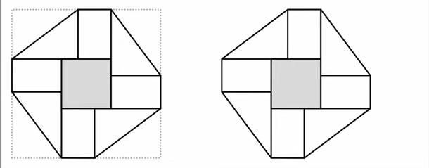
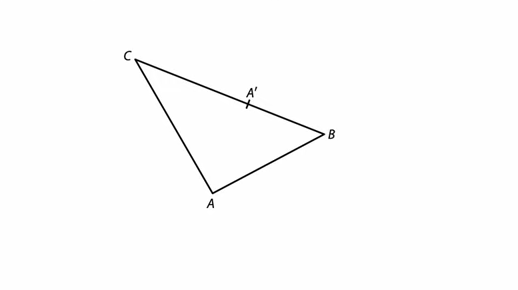
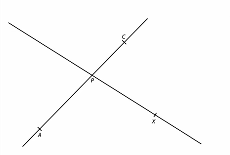
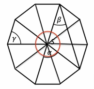
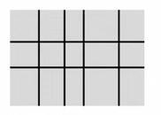
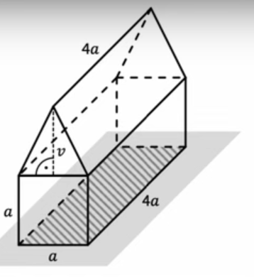
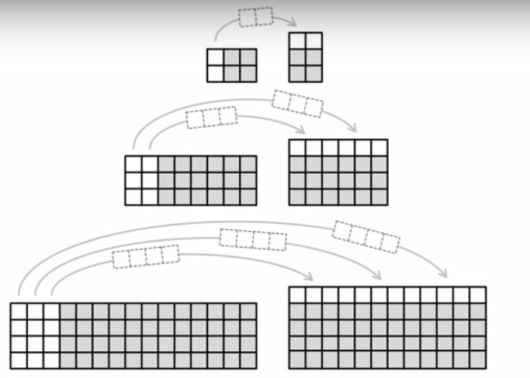

# 1 Vypočtěte, o kolik cm^2^ je plocha o obashu 0,2 m^2^ větší než plocha o obsahu 20 cm^2^.

# 2 Vypočítejte:
## 2.1
$$
(1{,}5^2 - 0{,}3^2)\div6=
$$

## 2.2
$$
\sqrt{\frac{2\cdot2^2}{3}}\cdot\sqrt{\frac32}=
$$

# 3 Vypočítejte a výsledek zapište zlomkem v základním tvaru.
**Do záznamového archu** uveďte u obou podúloh **celý postupu řešení**.

## 3.1
$$
0{,}2-0{,}2\cdot\frac{5}{12}-\left(-\frac{7}{30}\right)=
$$

## 3.2
$$
\frac{\frac{1}{4}+\frac{1}{6}}{\frac{4}{9}-\frac{5}{6}\cdot\frac{2}{15}}=
$$

# 4 

## 4.1 Zjednodušte (výsledný výraz nesmí obsahovat závorky):
$$
x^2 - (x - 2y)\cdot(x+2y)=
$$

## 4.2 Rozložte na součin podle vzorce:
$$
(5n-8)\cdot(-3n)+(4n-3)^2=
$$

## 4.3 Zjednodušte a výsledek rozložte na součin vytýkáním:
$$
7\cdot3+10\cdot({a^2}+10)-a\cdot(a+66)=
$$

# 5 Řešte soustavu rovnic.
**Do záznamového archu** uveďte u obou podúloh **celý postupu řešení**.\
Zkoušku nazapisujte.

## 5.1

$$
\frac{1}{5}y+\frac{1}{2}=2\cdot\left(y+\frac{1}{4}\right)
$$

## 5.2
$$
\begin{aligned}
3x+\frac{3}{4}y = 1\\
3,5y+3x = 6,5
\end{aligned}
$$

VÝCHOZÍ TEXT K ÚLOZE 6
===

> Zahradník sázel na záhon sazenice. Sazenice salátů zasadil o 4 více než sazenic okurek.\
> Na záhoně čtvrtinu sazenic salátů zlikvidovali slimáci a šestina sazenic okurek uschla.\
> Všechny ostatní sazenice se ujaly. Na záhoně se tak ujal stejný počet sazenic salátů a okurek.

# 6 Určete,

## 6.1 
kolik sazenic **salátů** zahradník **zasadil**,

## 6.2
kolik sazenic **okurek** se **ujalo**.

VÝCHOZÍ TEXT K ÚLOZE 7
===

> Stejné výrobky jsou po 12 kusech baleny do stejných krabic.
>
> Na váhu se položily tři krabice, z nichž dvě byly plné, ale ve třetí krabici 5 výrobků chybělo.\
> Tyto tři krabice i s výrobky vážily dohromady 2 kg.
>
> Když se z váhy odebraly obě plné krabice, display váhy ukazoval 480g.

# 7 Vypočtěte, jaká je hmotnost v gramech
## 7.1 jedné plné krabice,
## 7.2 jednoho výrobku,
## 7.3 jedné prázdné krabice.

VÝCHOZÍ TEXT A OBRÁZEK K ÚLOZE 8
===

> Z rohů čtverce se stranou délky 27 cm se nejprve odstřihnou čtyři shodné trojúhelníky a poté se vykreslí ornament.
>
> Ornament obsahuje jeden tmavý čtyřúhelník uprostřed, čtyři shodné bílé obdélníky a čtyři shodné bílé trojúhelníky, jejichž kratší strany mají délky 9 cm a 12 cm.
> 

# 8 Vypočtěte
## 8.1 v cm obvod ornamentu (zakresleného vpravo),
## 8.2 v cm^2^ celkový obsah bílých ploch ornamentu (zakresleného vpravo),

VÝCHOZÍ TEXT A OBRÁZEK K ÚLOZE 9
===
> V rovině leží trojúhelník ABC, na jehož straně BC je umístěn bod A'.
> 
> 

# 9 Bod A' je vrchol trojúhelníku A'B'C', který je obrazem trojúhelníku ABC ve středové souměrnosti se středem S.

**Sestrojte** a **označte** písmenem střed souměrnosti S.
**Sestrojte** vrcholy B' a C' trojúhleníku A'B'C', **označte** je písmeny a trojúhelník **narýsujte**.

**V záznamovém archu** obtáhněte celou konstrukci **propisovací tužkou** (čáry i písmena).

VÝCHOZÍ TEXT A OBRÁZEK K ÚLOZE 10
===
> V rovině leží přímka AC a PX, které se protínají v bodě P.
> 
> 

# 10 
Body A, C jsou vrcholy pravoúhlého lichoběžníku ABCD se základnami AB, CD a pravým úhlem při vrcholu D. Bod P je průsečík úhlopříček tohoto lichoběžníku. Vrchol D leží na přímce PX.

**Sestrojte** vrcholy B,D pravoúhlého lichoběžníku ABCD, **označte** je písmeny a lichoběžník **narýsujte**.

Najděte všechna řešení.

**V záznamovém archu** obtáhněte celou konstrukci **propisovací tužkou** (čáry i písmena).

VÝCHOZÍ TEXT A OBRÁZEK K ÚLOZE 11
===
> V náčrtku pravidelného desitiúhelníku se středem S jsou vyznačeny úhly $\alpha$, $\beta$, $\gamma$.
>
> 

# 11 Rozhodněte o každém z následujících tvrzení (11.1-11.3), zda je pravdivé (A), či nikoli (N).

Úhly neměřte, náčrtek není přesný.

## 11.1 $\alpha={72}\degree$
## 11.2 $\beta<{36}\degree$
## 11.3 $\gamma=\alpha$

VÝCHOZÍ TEXT A OBRÁZEK K ÚLOZE 12
===
> Kytice byla svázána ze tří druhů květin: růží, chryzantém a static.
>
> Růží a chryzantém dohromady je v kytici o 2 více než chryzantém a static dohromady. Počet růží ku počtu static je v poměru 5 : 4, počet static ku počtu chryzantémm v poměru 2 : 3.
>
> V tabulce je u každého druhu květin uvedena cena za jeden kus. Cena celé kytice se získá jako součet cen jednotlivých květin, z nichž byla kytice svázána.
> 
> |Druh květiny|Cena za kus|Počet kusů v kytici|
> |--------|:------:|:------:|
> |Růže       |54 korun||
> |Chryzantéma|40 korun||
> |Statice    |35 korun||

# 12 Kolik korun bude stát celá kytice? 
- [A] 1090 korun
- [B] 1252 korun
- [C] 1280 korun
- [D] 1300 korun
- [E] jinou částku

VÝCHOZÍ TEXT A OBRÁZEK K ÚLOZE 13
===
> Na čtvrtku papíru narýsujeme rovné čáry, které jsou rovnoběžné s jedním nebo s druhým okrajem čtvrty. Čáry jsou nakresleny přes celou čtvrtku a rozdělují ji na několik částí.
>
> 
>
> Např. na obrázku rozděluje 6 rovných čar čtvrtku na 15 částí.

# 13 Jaký je __nejmenší__ počet rovných čar, které rozdělí čtvrtku na 40 částí? 
- [A] 11
- [B] 12
- [C] 13
- [D] 14
- [E] větší než 14

VÝCHOZÍ TEXT A OBRÁZEK K ÚLOZE 14
===
> Dřevěný domeček se skládá ze dvou kolmých hranolů a stojí na vodorovné podložce.\
> Plocha, kterou se domeček dotýká podložky, má obsah 16 cm^2^.\
> V obrázku jsou označeny některé rozměry hranolů. Platí *v* = *a*.
>
>

# 14 Jaký je objem domečku?
- [A] 42 cm^3^
- [B] 48 cm^3^
- [C] 56 cm^3^
- [D] 64 cm^3^
- [E] jiný objem

# 15 Přiřaďte ke každé úloze (15.1-15.3) odpovídající výsledek (A-F).

## 15.1 Tři pětiny objemu nádoby jsou zaplněny vodou. Celou nádobu zaplníme po dolití dalších 14 litrů vody. (Nádoba nepřeteče.)

**Jaký je objem nádoby?**

## 15.2 Voda v v nádobě vyplňuje 55 % jejího objemu. Když z nádoby odebereme 12 litrů vody, bude zaplněna přesně čtvrtina objemu nádoby.

**Jaký je objem nádoby?**

## 15.3
V každé ze tří stejných nádob je nalito jíné množství vody.
V první nádobě vyplňuje voda 30 % jejího objemu a ve druhé nádobě 40 % objemu. Ve třetí nádobě je 19 litrů vody.
Kdybychom vodu ze všech nádob rozdělili rovnoměrně, voda by v každé nádobě vyplnila dvě pětiny jejího objemu.

**Jaký je objem jedné nádoby?**

- [A] 30 litrů
- [B] 33 litrů
- [C] 35 litrů
- [D] 38 litrů
- [E] 40 litrů
- [F] jiný objem

VÝCHOZÍ TEXT A OBRÁZEK K ÚLOZE 16
===
> 
> 
> Pro každou dvojici obdélníků sestavených ze stejného počtu čtverečků platí:
> - Vyšší z obou obdélníků má vždy o jednu řadu čtverečků více než nižší obdélník.
> - Vyšší obdélník vznikne z nižšího obdélníku přesunutím několika sloupců do horní řady.
> - Počet přesunutých sloupců je vždy o 1 menší, než je počet řad v nižším obdélníku. Tedy z obdélníku se 2 řadami se přemístí 1 sloupec, z obdélníku se 3 řadami 2 sloupce, atd.
>
# 16
## 16.1
V jedné dvojici obdélníků má nižší obdélník 21 řad. V této dvojici určete počet sloupců ve vyšším obdélníku.

## 16.2
V jiné dvojici obdélníků má vyšší obdélník 110 sloupců. V této dvojici určete počet řad v nižším obdélníku.

