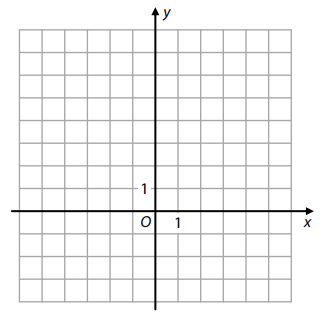
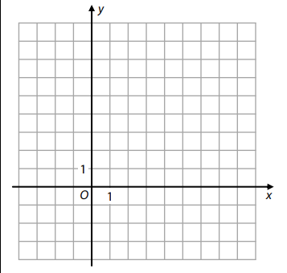
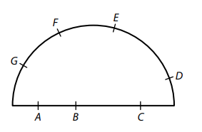
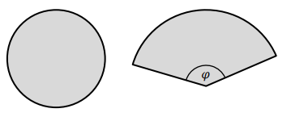
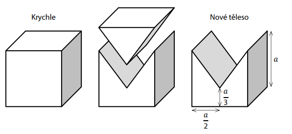
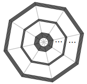

VÝCHOZÍ TEXT K ÚLOZE 1 
===

> Na trhu prodávají borůvky dva prodejci.\
> První prodejce prodává 1 litr za 150 korun. Přitom 1 litr borůvek má hmotnost 650 g.\
> Druhý prodejce borůvky váží a za 0,5 kg se zaplatí 120 korun.\
> Zákazník koupil levnější borůvky celkem za 600 korun.
>
> (*CZVV*) 
# 1 Vypočtěte, za kolik korun by zákazník koupil dražší borůvky o stejné hmotnosti. 

VÝCHOZÍ TEXT K ÚLOZE 2 
===

> Pohyb matematického kyvadla popisuje rovnice 
> 
> $$
> T=2\pi\cdot\sqrt{\frac{l}{g}},
> $$
> 
> kde T je perioda kyvu kyvadla, l je délka kyvadla a g je tíhové zrychlení.
> 
> (*CZVV*) 

# 2 Z uvedené rovnice vyjádřete délku kyvadla l. 

# 3 
Množina A obsahuje všechny celočíselné dělitele čísla 1 470. 
Množina B obsahuje všechna celá čísla z intervalu (120;320). 
**Zapište všechna čísla, která jsou prvky průniku $A \cap B$ obou množin A,B.**

# 4 Pro $a \in R \{-0,5;0,5 \}$ zjednodušte: 

$$
(1−2a)^2\div \left(\frac{1+4a^2}{1+2a}-2a \right)=
$$

[!NOTE]
**V záznamovém archu** uveďte celý **postup řešení**. 

VÝCHOZÍ TEXT K ÚLOHÁM 5–6 
===

> V našem autě lze používat dva druhy paliva – běžné nebo power. 
> 
> Průměrná spotřeba paliva na 100 km jízdy našeho auta je při používání běžného paliva 
> 6,5 litru, ale při používání power paliva se sníží na 5,8 litru.  
> 
> Jeden litr běžného paliva jsme nakupovali vždy za 34,80 korun, zatímco cena 1 litru power 
> paliva byla o 𝑥 korun vyšší než cena 1 litru běžného paliva. 
> 
> (*CZVV*) 

# 5 Naším autem jsme pravidelně jezdili trasu dlouhou 𝑑 km. 
## 5.1 
**Vyjádřete výrazem** s proměnnou 𝑑, kolik korun jsme v průměru zaplatili za běžné palivo spotřebované naším autem na této trase. 
## 5.2 
**Vyjádřete výrazem** s proměnnými 𝑥 a 𝑑, kolik korun jsme v průměru zaplatili za power palivo spotřebované naším autem na této trase. 

# 6
Za palivo spotřebované naším autem jsme na téže trase zaplatili při použití běžného paliva stejnou částku jako při použití power paliva. 

**Vypočtěte, o kolik korun byl 1 litr power paliva dražší než 1 litr běžného paliva.** 

# 7 Pro $x \in R, y \in R a z\in R$ řešte soustavu: 
$$
\begin{aligned}
x+2y+z=15\\
x−2y+z=3\\
2x+3z=9\\
\end{aligned}
$$

[!NOTE]
**V záznamovém archu** uveďte celý **postup řešení**. 

VÝCHOZÍ TEXT K ÚLOZE 8 
===

> Průměrný plat všech zaměstnanců v oddělení je 46 200 korun. 
> 
> Seniorní zaměstnanci tvoří třetinu všech zaměstnanců v oddělení a jejich průměrný plat 
> je o 6 000 korun vyšší než průměrný plat zbývajících zaměstnanců v oddělení. 
> 
> (*CZVV*) 
# 8 __Užitím rovnice nebo soustavy rovnic__ vypočtěte průměrný plat seniorních zaměstnanců.

[!NOTE]
**V záznamovém archu** uveďte celý **postup řešení** (popis neznámých, sestavení rovnice, 
resp. soustavy rovnic, řešení a odpověď).

VÝCHOZÍ TEXT A OBRÁZEK K ÚLOZE 9 
===

> Kvadratická funkce $f:y=\frac12x^2−2$ je definována pro všechna $x \in R$.
> 
> V kartézské soustavě souřadnic *Oxy* má graf lineární funkce $𝑔$ s grafem funkce $𝑓$ právě dva 
> společné body: $A [4;a_2], B [0;b_2]$. 
> 
> 
> 
> (*CZVV*) 

# 9 
## 9.1 V kartézské soustavě souřadnic *Oxy* sestrojte graf kvadratické funkce $𝑓$. 
[!NOTE]
**V záznamovém archu** obtáhněte vše **propisovací tužkou**. 
## 9.2 Sestavte předpis lineární funkce $𝑔$. 

# 10 
Je dáno $x \in R$, pro které platí: 
$$
\log_4x=5 
$$
Pro dané $x$ vypočtěte: 
## 10.1 
$$
(\log_4x)^3 =
$$
## 10.2 
$$
\log_4x^3 =
$$

VÝCHOZÍ TEXT K ÚLOZE 11 
===

> V kartézské soustavě souřadnic *Oxy* jsou dány dvě rovnoběžné přímky $p, q$.\
> Přímka $p$ je určena rovnicí $x+2y+4=0$, přímka $q$ prochází bodem $Q [1;0]$. 
> 
> (*CZVV*) 
# 11 
## 11.1 Zapište obecnou rovnici přímky q. 
## 11.2 Vypočtěte vzdálenost přímek p, q. 

VÝCHOZÍ TEXT A OBRÁZEK K ÚLOZE 12 
===

> V kartézské soustavě souřadnic *Oxy* je dán bod $A [−1;4]$.\
> Bod $B [3;𝑏_2]$ je umístěn tak, že vektor $\vec{u}=B−A$ má velikost 5.
> 
> 
>  
> (*CZVV*) 

# 12 Určete souřadnice bodu B.  
U každého bodu B, který splňuje dané podmínky, zapište obě souřadnice. 
 
# 13 V nekonečné geometrické posloupnosti $(𝑎_𝑛)^{\infty}_{n=1}$ platí: 
$$
a_3=5,
\frac{a_4}{a_2}=9
$$
## 13.1 Vypočtěte pátý člen $a_5$ posloupnosti. 
## 13.2 Určete, kolikrát větší je součet členů $a_5+a_6$ než součet členů $a_1+a_2$. 

# 14 V kosočtverci je velikost výšky ku délce strany v poměru 3∶8. 
**Vypočtěte velikost $\varphi$ ostrého vnitřního úhlu kosočtverce**.
Výsledek zaokrouhlete na celé stupně. 

[!NOTE]
**V záznamovém archu** uveďte celý **postup řešení**. 

VÝCHOZÍ TEXT K ÚLOZE 15 
===

> První hrací kostka je šestistěnná a může na ní padnout kterékoli z čísel 1 až 6, a to se stejnou pravděpodobností. Druhá kostka je osmistěnná a může na ní padnout kterékoli z čísel 1 až 8, a to se stejnou pravděpodobností.  
> 
> Při hodu oběma kostkami uvažujme následující jevy:\
> Jev X: Na obou kostkách padne liché číslo.\
> Jev Y: Součet čísel, která padnou na kostkách, je lichý.\
> Jev Z: Součet čísel, která padnou na kostkách, je sudý.
> 
> (*CZVV*) 

# 15 Rozhodněte o každém z následujících tvrzení (15.1–15.3), zda je pravdivé (A), či nikoli (N). 
## 15.1 Pravděpodobnost jevu X je 0,25. 
## 15.2 Pravděpodobnost jevu Y je stejná jako pravděpodobnost jevu X. 
## 15.3 Pravděpodobnost jevu Z je větší než pravděpodobnost jevu Y. 

VÝCHOZÍ TEXT A OBRÁZEK K ÚLOZE 16 
===

> V rovině leží půlkruh. Jeho hranice se skládá z úsečky a půlkružnice.\
> Na hranici půlkruhu je umístěno 7 různých bodů tak, že tři body A, B, C leží na úsečce 
> a zbývající čtyři body D, E, F, G leží na půlkružnici. 
> 
> 
> 
> (*CZVV*) 

# 16 Kolik různých přímek obsahuje vždy alespoň dva z uvedených 7 bodů? 
- [A] 15 přímek 
- [B] 17 přímek 
- [C] 19 přímek 
- [D] 21 přímek 
- [E] jiný počet přímek 
 
# 17 V kartézské soustavě souřadnic *Oxy* jsou dány nenulové vektory 
$$
\vec{u} =(12;−8), \vec{v} =(a^2;a). 
$$
**Pro které $a \in R$ jsou vektory $\vec{u}, \vec{v}$  navzájem kolmé?**
- [A] a=0,25
- [B] a=0,3 
- [C] a=0,6 
- [D] a=1,5 
- [E] pro žádnou z uvedených hodnot a
 
VÝCHOZÍ TEXT K ÚLOZE 18 
===

> Trojcípé šátky mají tvar rovnoramenného pravoúhlého trojúhelníku. Kratší strana menšího 
> šátku má délku 50 cm. Obsah většího šátku je o 125 % větší než obsah menšího šátku.
> 
> (*CZVV*) 
# 18 Jak dlouhá je delší strana většího šátku?  
Výsledky jsou zaokrouhleny na celé cm. 
- [A] 63 cm 
- [B] 71 cm 
- [C] 88 cm 
- [D] 106 cm 
- [E] 159 cm 

VÝCHOZÍ TEXT A OBRÁZEK K ÚLOZE 19 
===

Kruh s poloměrem $r$ má stejný obsah jako kruhová výseč se středovým úhlem $\varphi$ a poloměrem $\frac32r$. 

 
(*CZVV*) 
# 19 
Jakou velikost má úhel $\varphi$? 
- [A] $120\degree$
- [B] $160\degree$
- [C] $200\degree$
- [D] $240\degree$
- [E] jinou velikost 
 
VÝCHOZÍ TEXT K ÚLOZE 20 
===

> Vnitřní prostor nádoby má tvar rotačního válce s podstavou o průměru 12 cm a výškou 16 cm.\
> Hladina vody v nádobě je ve výšce 11 cm ode dna. Do nádoby vhodíme kovovou kuličku o poloměru 3 cm. Kulička klesne ke dnu a hladina vody v nádobě stoupne. 
> 
> (*CZVV*) 
# 20 O kolik stoupne hladina vody v nádobě po vhození kuličky? 
- [A] o 2,00 cm 
- [B] o 1,50 cm 
- [C] o 1,25 cm 
- [D] o 1,00 cm 
- [E] o 0,50 cm 
 
VÝCHOZÍ TEXT A OBRÁZEK K ÚLOZE 21 
===

> Z krychle s hranou délky 𝑎 byl dvěma šikmými řezy oddělen trojboký hranol, a vzniklo tak 
> nové těleso (viz obrázek).
> 
> 
>  
> (*CZVV*) 
# 21 Jaký je poměr povrchu krychle ku povrchu nového tělesa (v tomto pořadí)? 
- [A] 1∶1 
- [B] 9∶10 
- [C] 6∶7 
- [D] 5∶6 
- [E] 3∶5 
 
VÝCHOZÍ TEXT A OBRÁZEK K ÚLOZE 22 
===

> V husté dekorační pavučině jsou na drátěné konstrukci napnutá  
> vlákna. Každé vlákno je napnuto kolem dokola a připevněno  
> ke všem drátům konstrukce.
> 
> Nejkratší vlákno je nejblíže středu a jeho délka je 24 cm.\
> Každé další vlákno je o 4 mm delší než předchozí.\
> Poslední vlákno napnuté po obvodu pavučiny má délku 2 m.
> 
> 
> 
> (*CZVV*) 

# 22 Kolik vláken je celkem použito v dekorační pavučině? 
- [A] méně než 450 vláken 
- [B] 450 vláken 
- [C] 500 vláken 
- [D] 550 vláken 
- [E] více než 550 vláken 

VÝCHOZÍ TEXT K ÚLOZE 23 
===

> Růst počtu bakterií byl za stálých podmínek exponenciální.\
> Za každých 24 hodin vzrostl počet bakterií 64krát. 
> 
> (*CZVV*) 
# 23 Za jak dlouho vzrostl počet bakterií 4krát? 
- [A] za 1,5 hodiny 
- [B] za 4 hodiny 
- [C] za 6 hodin 
- [D] za 8 hodin 
- [E] za jinou dobu 
 
# 24 Je dána rovnice s neznámou $x \in ⟨0;2\pi⟩$: 
$$
\tg{x}=3\cdot\cotg{x}
$$ 

**Kolik řešení má daná rovnice v uvedeném intervalu?**
- [A] žádné 
- [B] jedno 
- [C] dvě 
- [D] tři 
- [E] čtyři 

# 25 Přiřaďte ke každému intervalu (25.1–25.2) rovnici (A–F), jejíž všechna řešení v oboru R patří do tohoto intervalu. 
## 25.1 (−8;−2) 
## 25.2 (2;8) 
- [A] $x^2−6x+10=0$
- [B] $\frac{(𝑥+3)(𝑥−1)}{(1−𝑥)(𝑥+5)}=0$
- [C] $𝑥^2=4𝑥$
- [D] $𝑥^2=16$
- [E] $𝑥^2+15=8𝑥$
- [F] $(𝑥−4)^2=9$