# 1 Jsou dány dva intervaly:

$$
I_1 = \left<-4;-1{,}5\right>, I_2 = \left(-\frac{3}{2};2\right)
$$

**Zapište množinu:**
$$
I_1 \cap I_2=
$$

# 2 Pro $n \in N (n \neq 0)$ upravte výraz na co nejjednodušší tvar.
Výsledný výraz nesmí obsahovat závorky
$$
\frac{n}{(-5n)^-2}=
$$
# 3 Určete, pro která $x \in R$ je hodnota následujícího výrazu rovna nule

$$
\frac{9x^2-1}{6x-2}
$$

VÝCHOZÍ TEXT K ÚLOZE 4 
===
> Zahrádkář pěstuje jahody.
> V červnu zahrádkář sklidil o 200 % více jahod než v květnu.
> V červenci sklidil o 35 % méně jahod než v červnu.
> 
> (*CZVV*) 

# 4 Vypočtěte, o kolik procent více jahod sklidil zahrádkář v červenci, než sklidil v květnu.

# 5 Řešte v oboru R:
$$
\frac{x-7}{4-x}=\frac{3-2x}{x-4}
$$

# 6 **Rozložte výraz na součin** výrazů, které nelze dále rozložit (např. na součin lineárních dvojčlenů).
$$
(4x+10) \cdot x-(2x+5)=
$$

[!NOTE]
**V záznamovém archu** uveďte celý **postup řešení**. 

# 7 Řešte v oboru R soustavu:
$$
\begin{aligned}
1+2x \ge 1-2x\\
\frac{x}{-2} \ge -4
\end{aligned}
$$

[!NOTE]
**V záznamovém archu** uveďte celý **postup řešení**.

VÝCHOZÍ TEXT K ÚLOZE 8 
===

> Logaritmická funkce $f:y=log_ax$ je definována pro všechna přípustná $x \in R$.\
> Graf funkce $f$ zakreslený v kartézské soustavě souřadnic *Oxy* prochází body $A[4; 1], B[64; b_2] a C[c_1
> ; −2]$. 
>
> (*CZVV*) 
# 8 Zapište obě souřadnice bodu
## 8.1 B,
## 8.2 C.

# 9 Všechna řešení dané goniometrické rovnice v oboru R lze zapsat ve tvaru:
$$
\frac{2\pi}{5}+k \cdot \frac{\pi}{3}, kde\ k \in Z
$$
**Vypočtěte ve stupních** hodnoty všech takových řešení dané goniometrické rovnice, která jsou **z intervalu** $(0; \pi)$.

VÝCHOZÍ TEXT K ÚLOZE 10
===

> V osudí je 8 míčků. Na každém z nich je napsáno právě jedno písmeno.
> Z písmen na těchto osmi míčcích je možné sestavit slovo UMYVADLO.
> 
> Z osudí vylosujeme čtveřici míčků.
> 
> (*CZVV*) 

# 10 Vypočtěte pravděpodobnost následujících jevů.
Výsledky zapište zlomkem v základním tvaru.
## 10.1 Mezi vylosovanými míčky bude míček s písmenem M.
## 10.2 Z písmen na vylosovaných míčcích lze sestavit slovo VODA.

VÝCHOZÍ TEXT A OBRÁZEK K ÚLOZE 11 
===

> V kartézské soustavě souřadnic *Oxy* je dána přímka procházející body $A[0; −3], B[2; 1]$.
> 
> 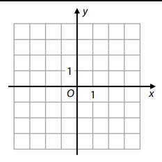
> 
> (*CZVV*) 
# 11 
## 11.1 **Doplňte** rovnici souřadnice 𝑦 v parametrickém vyjádření přímky p s parametrem 𝑡:
$$
\begin{aligned}
p:x = t,\\
y =..., t \in R
\end{aligned}
$$

## 11.2 **Sestavte** obecnou rovnici přímky q, která je kolmá k přímce p a prochází průsečíkem přímky p se souřadnicovou osou y.

VÝCHOZÍ TEXT K ÚLOZE 12 
===

> V každém 𝑛-úhelníku je součet velikostí všech vnitřních úhlů roven $(𝑛 − 2) \cdot 180\degree$.\
> Velikosti vnitřních úhlů desetiúhelníku $A_1A_2…A_{10}$ tvoří aritmetickou posloupnost $(\alpha_{n})^{10}_{n=1}$.\
> Velikost největšího vnitřního úhlu 𝛼10 je rovna devíti sedminám velikosti nejmenšího vnitřního úhlu $\alpha_1$.
>  
> (*CZVV*) 

# 12 Vypočtěte ve stupních
## 12.1 součet velikostí všech vnitřních úhlů desetiúhelníku,
## 12.2 velikost nejmenšího vnitřního úhlu $\alpha_1$ desetiúhelníku $A_1A_2…A_{10}$.

[!NOTE]
**V záznamovém archu** uveďte v úloze 12.2 celý **postup řešení**.

# 12 Určete souřadnice bodu B.  
U každého bodu B, který splňuje dané podmínky, zapište obě souřadnice. 
 

VÝCHOZÍ TEXT A OBRÁZEK K ÚLOZE 13
===

> Ve čtverci *ABCD* se stranou délky *a* leží na straně **AD** bod *K*.
V obrázku jsou uvedeny délky úseček *DK* a *BK*.
> 
> 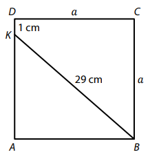
>  
> (*CZVV*) 

# 13 Určete v cm délku *a* strany čtverce.

[!NOTE]
**V záznamovém archu** uveďte celý **postup řešení**.

 
VÝCHOZÍ TEXT K ÚLOZE 14
===

> Start-up má pouze 4 zaměstnance, ale nyní přijímá další.\
> Na počátku dostane každý nový zaměstnanec stejnou nástupní mzdu.
> 
> Průměrná mzda stávajících čtyř zaměstnanců ve start-upu činí 45 000 korun.\
> Nastoupí-li jen jeden nový zaměstnanec, průměrná mzda ve start-upu se sníží o 6 %
>  
> (*CZVV*) 

# 14
## 14.1 **Určete** v korunách nástupní mzdu nového zaměstnance start-upu.
## 14.2 Start-up nakonec přijme dva nové zaměstnance. Oba nastoupí současně.

**Vypočtěte**, o kolik procent se sníží průměrná mzda ve start-upu.

[!NOTE]
**V záznamovém archu** uveďte v obou částech úlohy celý **postup řešení**.

VÝCHOZÍ TEXT A TABULKA K ÚLOZE 15
===

> Tabulka udává všechny výsledky závodníka ve střelbě ze vzduchovky na papírový terč.
> 
> ||||||
> |---|:---:|:---:|:---:|:---:|
> Počet bodů získaných za zásah| 10| 9| 8| 3|
> Četnost zásahů| 2| 4| 3| 1|
>  
> (*CZVV*) 

# 15 Rozhodněte o každém z následujících tvrzení (15.1–15.3), zda je pravdivé (A), či nikoli (N). 
## 15.1 Aritmetický průměr počtu bodů získaných za zásah je 8,3. 
## 15.2 Modus počtu bodů získaných za zásah je 4. 
## 15.3 Medián a modus počtu bodů získaných za zásah jsou stejné. 

# 16 Existuje právě jedno reálné číslo *m*, pro které platí:
$$
\frac{4^m-32}{2^{4m}}=0
$$
**Která rovnost platí pro toto číslo *m*?**
- [A] $2^{4m}=32^2$
- [B] $2^{4m}=64$
- [C] $2^{4m}=\sqrt{32}$
- [D] $2^{4m}=1$
- [E] $2^{4m}=0$

 
# 17 Pro $ x \in R$, y \in R$ je dána soustava rovnic:
$$
\begin{aligned}
x-2y = -2\\
2x-y = 5
\end{aligned}
$$
**Který z následujících grafů odpovídá grafickému řešení dané soustavy rovnic?**
- [A] 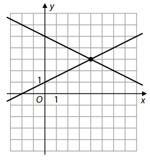
- [B] 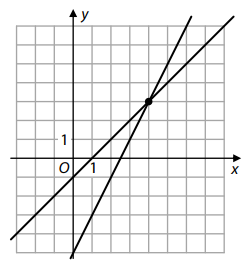
- [C] 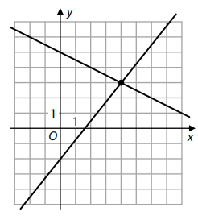
- [D] 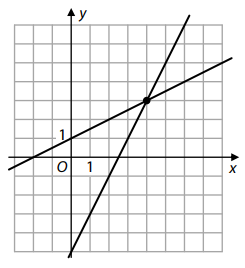
- [E] 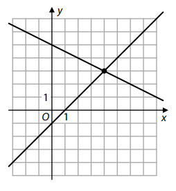
 
VÝCHOZÍ TEXT K ÚLOZE 18 
===

> V kartézské soustavě souřadnic *Oxy* jsou dány vektory $ \vec{u}=(1;-3), \vec{v}=(-6;3)$.\
> Pro vektor $\vec{w}$ platí: $\vec{w}=8 \cdot \vec{u} - 2 \cdot \vec{v}$.
> 
> (*CZVV*) 
# 18 JJaké souřadnice má vektor $\vec{w}$ ?  
- [A] $\vec{w}=(-16;6)$
- [B] $\vec{w}=(2;-3)$
- [C] $\vec{w}=(18;-30)$
- [D] $\vec{w}=(20;-24)$
- [E] $\vec{w}=(20;-30)$

VÝCHOZÍ TEXT K ÚLOZE 19 
===
> Je dána geometrická posloupnost $(a_n)^{\infty}_{n-1}$.\
> Pro součet $s_n$ prvních $n$ členů této posloupnosti platí:
> 
> $s_n = (-2)^n-1$
> 
> Např. součet $s_5 = a_1 + a_2 + a_3 + a_4 + a_5$ prvních 5 členů dané posloupnosti je −33.
>  
> (*CZVV*) 
# 19 Jaký je pátý člen $a_5$ dané geometrické posloupnosti?
- [A] -48
- [B] -17
- [C] 17
- [D] 48
- [E] jiná hodnota
 
VÝCHOZÍ TEXT A OBRÁZEK K ÚLOZE 20
===

> Funkce $f$ je pro všechny přípustné hodnoty $x \in R$ dána předpisem: 
> 
> $ f:y=\frac{2x-1}{x+1}$
>
> 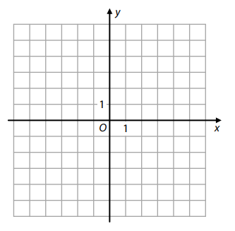
>
> (*CZVV*) 

# 20 Které z následujících tvrzení je __nepravdivé__?
- [A] $f(2) = −f(0)$
- [B] Středem souměrnosti grafu funkce $f$ je bod S[−1; 2].
- [C] Graf funkce $g:y=2$ nemá s grafem funkce $f$ žádný společný bod.
- [D] Funkce $f$ je v intervalu $(−\infty; −1)$ rostoucí.
- [E] Funkce $f$ je v intervalu $(−1; +\infty)$ klesající.
 
VÝCHOZÍ TEXT A OBRÁZEK K ÚLOZE 21 
===

> Velký čtverec byl dvěma úsečkami rozdělen na čtyři shodné menší čtverce. Do tří ze čtyř menších čtverců byl vepsán
šedý čtvrtkruh, jehož poloměrem je strana menšího čtverce(viz obrázek).
> 
> 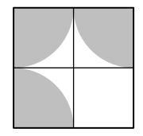
>  
> (*CZVV*) 
# 21 Kolik procent obsahu velkého čtverce tvoří obsah všech šedých ploch?
Výsledek je zaokrouhlen na desetiny procenta.
- [A] 53,6 %
- [B] 56,3 %
- [C] 58,9 %
- [D] 61,5 %
- [E] 65,6 % 
 
VÝCHOZÍ TEXT A OBRÁZEK K ÚLOZE 22 
===

> Papírová nádobka má tvar rotačního válce s podstavou o poloměru 3,5 cm.\
> Rozvinutý plášť tohoto válce lze rozdělit na 7 čtverců.
> 
> 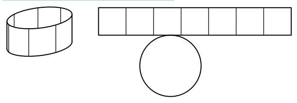
> 
> (*CZVV*) 

# 22 Jaký je objem nádobky?
Výsledek je zaokrouhlen na celé cm^3^
- [A] 108 cm^3^
- [B] 121 cm^3^
- [C] 146 cm^3^
- [D] 379 cm^3^
- [E] více než 379 cm^3^

VÝCHOZÍ TEXT A OBRÁZEK K ÚLOZE 23 
===
> Na výrobu rohového sloupku byly použity dva stejné dřevěné trámky tvaru kvádru.\
> Podstava trámku má rozměry 17 cm a 8 cm, výška trámku je 300 cm.
> 
> Jeden z trámků se šikmo seřízl tak, aby se k ploše řezu mohl přiložit druhý trámek celou plochou své větší boční stěny, viz obrázek.
> 
> Sestavený rohový sloupek má tvar kolmého šestibokého hranolu.
> 
> 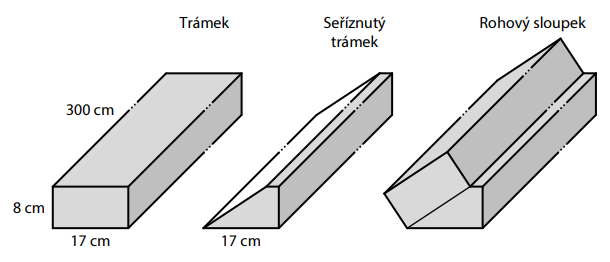
> 
> (*CZVV*) 
# 23 Jaký je objem celého rohového sloupku?
- [A] méně než 62 000 cm^3^
- [B] 62 900 cm^3^
- [C] 63 600 cm^3^
- [D] 65 300 cm^3^
- [E] více než 66 000 cm^3^ 

VÝCHOZÍ TEXT A OBRÁZEK K ÚLOZE 24
===
> V krychli *ABCDEFGH* jsou body *S* a *T* středy hran *AB* a *BC*.
> 
> 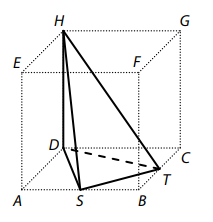
> 
> (*CZVV*) 
# 24 Jakou část objemu krychle tvoří objem jehlanu *STDH*?
- [A] $\frac{3}{8}$
- [B] $\frac{1}{4}$
- [C] $\frac{1}{6}$
- [D] $\frac{1}{8}$
- [E] $\frac{1}{9}$

VÝCHOZÍ TEXT A OBRÁZEK K ÚLOZE 25
===
> Z pevninského přístavu P plují lodě přímo na severovýchod na ostrov do přístavu O.\
> Směrem na západ od přístavu P leží pevninský přístav R.
> 
> Z přístavu R se loď dostane do přístavu O po 24 km plavby přímo na východoseverovýchod.
> 
> Z přístavu O se mohou výletníci vydat na člunu přímo na západ a doplují do přístavu S na výběžku malého ostrůvku. Směrem na jih od přístavu S leží přístav P.
>  
> 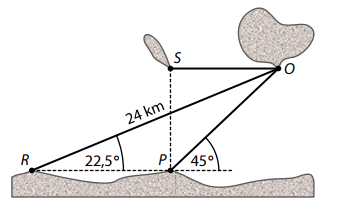
> 
> (*CZVV*) 

# 25 Přiřaďte ke každé dvojici přístavů (25.1–25.2) jejich přímou vzdálenost(A–F) zaokrouhlenou na desetiny km.
## 25.1 P,R
## 25.2 P, S
- [A] 8,3 km
- [B] 9,2 km
- [C] 9,9 km
- [D] 12,2 km
- [E] 13,0 km
- [F] jiná vzdálenost