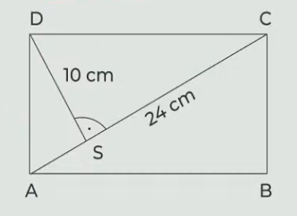

# 1 Kolikrát je čtyřnásobek čísla 7 menší než číslo 140?

# 2 
$$
\sqrt{1^2-0{,}8^2} =
$$

# 3 Doplňte na vynechaná místa čísla tak, aby platila rovnost:
## 3.1
$$
0{,}45 m^2 = 20 cm^2 + {\_\_\_}cm^2
$$

## 3.2
$$
0{,}8 dm^3 + {\_\_\_}cm^3 = 2 litry
$$

## 3.3
$$
{\_\_\_} \cdot 30 minut = 10 \cdot 0{,}75 hodiny
$$

# 4 Řešte rovnici
$$
\frac{x - 3}{2} - \frac{2x+1}{3} = x - 2
$$

# 5
> Tajuplný ostrov má kruhový tvar. Když trosečník obejde ostov čtyřikrát dokola po jeho obvodu, ujde 1 256 metrů.

**Kolik metrů trosečník ujde, když půjde z kraje ostrova přímo do jeho středu?**
- [A] méně než 28 metrů
- [B] 28 metrů
- [C] 50 metrů
- [D] 60 metrů
- [E] více než 60 metrů

# 6
> Na obrázku je zobrazen obdelník ABCD. Platí AC = 24 cm; SD = 10 cm
> 

**Jaký je obsah obdélníku ABCD?**
- [A] 120 cm^2^
- [B] 160 cm^2^
- [C] 200 cm^2^
- [D] 240 cm^2^
- [E] jiný výsledek

# 7 Přiřaďte ke každé úloze (7.1-7.3) odpovídající výsledek (A-F).
## 7.1 Na letním táboře bylo 160 dětí, z nichž bylo 120 dětí ubytováno ve stanech, ostatní v chatkách.
**Kolik procent dětí nebylo ubytováno ve stanech?**
## 7.2 Lukáš měl 112 samolepek. Petr měl o čtvrtinu více než Lukaš.
**O kolik procent měl Lukáš méně samolepek než Petr?**
## 7.3 Celková cena týdenního tábor činila 2 400 Kč. Cena dopravy tvořila pětina z ceny tábora, ubytování stálo 1080 Kč. Zbylou část ceny tvořilo stravování.
**Kolik procent z ceny tábora tvořila cena stravování?**
- [A] 20 %
- [B] 25 %
- [C] 30 %
- [D] 33 %
- [E] 35 %
- [E] jiný počet procent

# 8 Která z těchto vět neobsahuje pravopisnou chybu?
- [A] Nedávné objevy prokázaly, že první vinnice vznikly sedm tisíc let před naším letopočtem.
- [B] Víno dnes k lidstvu neodmyslitelně patří a v průběhu tisíciletí prošlo jeho pěstování i ošetřování zajímavým vývojem.
- [C] Bájnému perskému králi, velikému milovníkovi hroznového vína, se jednou dostal na stůl skyslý hrozen.
- [D] Bílé víno bylo až na vyjímky vždy populárnější než víno červené.

# 9 Přiřaďte k jednotlivým větám (9.1-9.3) odpovídající tvrzení (A-E).
Žádnou možnost z nabídky A-E nelze přiřadit víckrát než jednou.
## 9.1 Krásné ráno vám přeje váš moderátor.
## 9.2 Karel nechtěl příjít o svoji nejlepší kamarádku z Brna.
## 9.3 Už se ti povedlo vybrat v obchodě ta sluchátka?
- [A] Ve větě se nevyskytuje žádný přívlastek.
- [B] Ve větě se vyskytují dva přívlastky shodné, ale žádný neshodný.
- [C] Ve větě se vyskytuje jak přívlastek neshodný, tak přívlastek shodný.
- [D] Ve větě se vyskytuje pouze přívlastek shodný.
- [E] Ve větě se vyskytuje pouze přívlastek neshodný.

# 10 Na každé vynechané místo (*****) v ustálených slovních spojeních doplňte příslušné slovo.
## 10.1 V první lavici se podle mě nejlépe opisuje. Ne nadarmo se říká: pod ***** je největší tma.
## 10.2 Musím myslet na to, abych měl na Vánoce dost peněz. Inu, kdo *****, má za tři.

