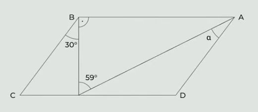

# 1 Vypočtěte a výsledek zapište zlomkem v základním tvaru: 
$$
\frac{\frac{1}{2}-\frac{1}{2}\div\frac{5}{2}}{2 - \frac{3}{5} - 0{,}5}=
$$

# 2 Upravte a rozložte na součin vytknutím:
$$
(2+x)^2+(4\cdot x)^2-2^2=
$$

# 3 Vypočtěte:
$$
(0{,}3^2 - 1{,}5^2):6 =
$$

# 4
> V Horní Dolní žije 250 obyvatel. Každý obyvatel Horní Dolní hraje golf nebo tenis, někteří dělají oba sporty zároveň. Golf hraje 52 % obyvatel. Dvě pětiny obyvatel, kteří hrají golf, hrají také tenis.

**Kolik obyvatel Horní Dolní se věnuje tenisu?**
- [A] 130
- [B] 162
- [C] 172
- [D] 190
- [E] jiný počet obyvatel

# 5
> V rovině leží rovnoběžník ABCD.
>
> 

**Jaká je velikost úhlu $\alpha$?**
- [A] 24 $\degree$
- [B] 29 $\degree$
- [C] 31 $\degree$
- [D] 39 $\degree$
- [E] jiný výsledek

# 6 
> Lektoři zkoušek nanečisto museli během tří dnů opravit 170 testů. První den lektoři opravili pětkrát méně testů než druhý den. Na poslední den jim na opravování zbylo o pětinu testů méně, než opravili první den.

**Neznámý počet testů, které lektoři opravili první den, označte x.**

## 6.1 V závislosti na veličině x vyjádřete počet testů, které lektoři opravili třetí den.
## 6.2 V závislosti na veličině x vyjádřete počet testů, které lektoři opravili druhý den.
## 6.3 Kolik testů opravili lektoři druhý den?

# 7 Řešte rovnici:
$$
3\cdot\frac{2y-1}{6} - \frac{3y+2}{8} = \frac{3}{4}\cdot\frac{y-1}{2}
$$

# 8 Vypište z každé z následujícíh vět (8.1 a 8.2) základní stavební dvojici.
## 8.1 Podle některých psychologů může digitální detox výrazně zlepšit kvalitu spánku i celkovou duševní pohodu.
## 8.2 Stovky lidí po skončení detoxu totiž rychle sklouznou zpět ke svým původním návykům.

# 9 Rozhodněte o každém z následujících větných celků, zda je zapsán pravopisně správně (A) nebo ne (N).
## 9.1 Zahraniční výpravy se kromě několika Čechů zůčastnili také němečtí vědci.
## 9.2 Při nachlazení Petrovi vždy pomohl zázvorový čaj, který si sladil včelím voskem.
## 9.3 Někteří živočichové mění barvu, aby splynuli s okolním prostředím.
## 9.4 Zásoby posypové soly se kvůli velkým mrazům vyčerpaly už v polovině ledna.

# 10 Přiřaďte k jednotlivým větám (10.1-10.3) odpovídající tvrzení (A-E).

(Každou možnost z nabídky A-E můžete přiřadit pouze jednou.)

## 10.1 V každé větě souvětí je pouze jedno citově zabarvené slovo.
## 10.2 V první větě souvětí je pouze jedno citově zabarvené slovo, v druhé větě souvětí není žádné citově zabarvené slovo.
## 10.3 V první větě souvětí jsou celkem dvě citově zabarvená slova, v druhé větě souvětí není žádné citově zabarvené slovo.
- [A] U nás ve vesnici bydlí nepříjemný dědek, který žije ve staré barabizně vedle parku.
- [B] Moje teta upekla meruňkový koláč a celé mé rodině chutnal.
- [C] Znám jedno zlobivé psisko, které bydlí u nás v ulici.
- [D] Byla jsem ráda, když mi ta paní nabídla pomoc.
- [E] Vždycky jsem si přála mít kočičku i pejsánka, abych si s oběma mohla hrát.
