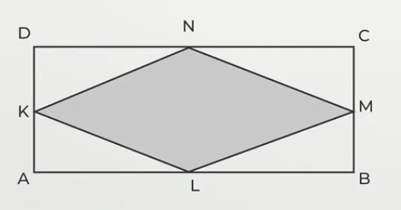
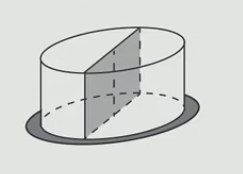
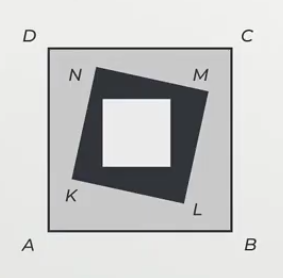
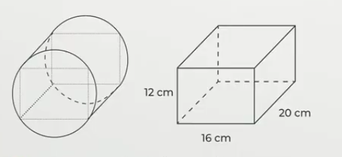
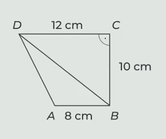

# 1 Obdélník s obsahem 7,2 dm^2^ jsme beze zbytku rozstříhali na 20 shodných čtverců.
**Urči v cm obvod jednoho ze vzniklých čtverců.**

# 2 Do obdélníku ABCD je vepsán kosočtverec KLMN. Dále platí |KM|=24 cm a obsah trojúhelníku ALK=30 cm^2^.

> 

**Vypočtěte:**

## 2.1 v cm velikost úsečky AD,
## 2.2 v cm obvod kosočtverce KLMN.

# 3 Dort tvaru rotačního válce leží na kruhovém tácu. (Průměr podstavy dortu je větší než výška dortu, ale menší než průměř tácu.) Dort jsme rozdělili svislým řezem na dvě stejné poloviny.

> 

**Vypočtěte:**

## 3.1 Tác má tvar kruhu o průměru d a obsahu $ \pi \cdot144 cm^2$ 
**Vypočtěte v cm průměr d tácu.**
## 3.2 Plocha řezu dortu má obsah 200 cm^2^ a tvoří ji obdelník, který lze rozdělit na dva čtverce. 
**Vypočtěte v cm^3^ objem celého dortu.** Výsledek zaokrouhlete na desítky cm^3^

# 4 Bílý čtverec má obvod 12 cm, černá plocha uvnitř čtverce KLMN má obsah 27 cm^2^ a šedá plocha uvnitř čtverce ABCD má obsah 64 cm^2^.

> 

**Vypočtěte v cm:**

## 4.1 délku strany LM,
## 4.2 obvod čtverce ABCD

# 5
> Rotační válec má výšku 20 cm. Odstraněním čtyř částí vytvoříme z tohoto válce kvádr s rozměry 16 cm, 12 cm a 20 cm. Všechny hrany kvádru leží na povrchu válce.
> 

**Vypočtěte:**

## 5.1 v cm pololměr podstavy válce,
## 5.2 v cm^3^ objem válce. 
Výsledek zaokrouhlete na stovky cm^3^

# 6

> Pravoúhlý lichoběžník ABCD se základnami AB, CD má pravý úhel při vrcholu C. Některé rozměry lichoběžníku jsou uvedeny v obrázku.
> 

**Vypočtěte v cm^2^:**

## 6.1 obsah trojúhelníku ABD,
## 6.2 obsah lichoběžníku ABCD.

# 7 Napište:
## 7.1 Spisovné podstatné jméno, které je v 1. pádě čísla jednotného __dvouslabičné__, je příbuzné se slovem CHODIT a skloňuje se podle vzoru RŮŽE.
## 7.2 Spisovné podstatné jméno, které je v 1. pádě čísla jednotného __dvouslabičné__, je příbuzné se slovem ŘEČ a skloňuje se podle vzoru PÁN.
## 7.3 Spisovné podstatné jméno, které je v 1. pádě čísla jednotného __tříslabičné__, je příbuzné se slovem MLČET a skloňuje se podle vzoru ŽENA.

# 8 Na vynechaná místa (*) ve výchozím textu je třeba doplnit s/z tak, aby text byl pravopisně správně. Ve které z následujících možností jsou s/z uvedena v odpovídajícím pořadí?
- [A] z-s-s
- [B] z-z-z
- [C] s-z-z
- [D] s-s-z

# 9 **Najděte ve výchozím textu čtyři slova, která jsou zapsána s pravopisnou chybou, a napište je __pravopisně správně__**.

> Oba Petrovi bratři jsou zkušení motocykloví závodníci, kteří během léta tráví téměř každý víkend na závodech. Petr je obvykle doprovází. Jednou s sebou vzal i svého nejlepšího kamaráda Radka, který byl zvědavý na průběh závodu.
> 
> Kolem závodní dráhy se tísnili davy příznivců tohoto poměrně riskantního sportu. Všichni s napětím čekali na start. Náhle uslyšeli výstřel z pistole a ve zlomku vteřiny už viděli jen oblaka prachu. Vtom Radek zpozoroval, že se z bezpečnostní zátarasy dostala malá holčička. Sebevědomně si vykračovala po dráze směrem k prudké zatáčce. Radek se ani chvíli nerozmýšlel, přeskočil zábranu a odnesl výletnici zpět otcovy bezpečné náruče. Za svůj obětavý čin si vysloužil všeobecné uznání.
> 
> Den se nakonec vydařil. Kromě toho, že Radkova záchranná akce byla úspěšná, Petr byl pyšný na svého mladšího bratra, který obhájil výtězství.