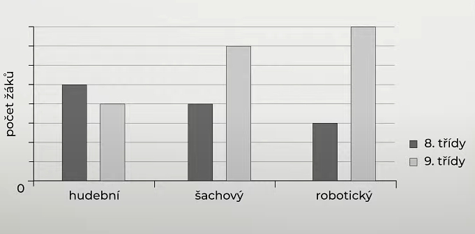
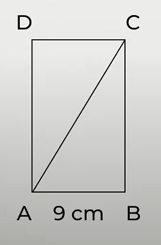
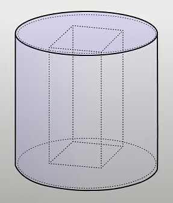

# 1 O kolik je větší druhá mocnina čísla 8 než druhá odmocnina čísla 256?

# 2 **Upravte a rozložte na součin** užitím vzorce:
$$
16\cdot(a-1)+8a\cdot2-1=
$$

# 3 **Řešte** soustavu rovnic:

$$
\begin{aligned}
x+3y=5\\
-2x-y=5
\end{aligned}
$$

# 4
> Několi čerpadel napouští bazén. Čerpadla vždy pracují zároveň a všechna mají stejný výkon. Pokud bude pracovat 8 čerpadel, napustí bazén přesně za 36 hodin.
## 4.1 **Vypočtěte**, kolik čerpadel musí pracovat, aby se bazén naplnil za 24 hodin.
## 4.2 **Kolik procent** objemu bazénu naplní 16 čerpadel za 9 hodin.
## 4.3 Třetina bazénu se naplnila večerním deštěm. Zbytek bazénu začalo v 8:00 napouštěte 24 čerpadel. **Vypočtěte, v kolik hodin byl bazén zcela napuštěn.**

# 5
> Pouze pro žáky 8. a 9. tříd byly otevřeny tři kroužky – hudební, šachový a robotický.
> Každý žák může být jen v jednom z těchto tří kroužků.
> Graf znázorňuje počty žáků v jednotlivých kroužcích. Celkový počet žáků 9. tříd je o 14 vyšší než celkový počet žáků 8. tříd.
> 
> 

**Určete:**
## 5.1 o kolik se liší počty žáků 8. a 9. tříd v šachovém kroužku,
## 5.2 o kolik procent více žáků 8. tříd než žáků 9. tříd navštěvuje hudební kroužek,
## 5.3 poměr žáků 8. a 9. tříd v robotickém kroužku.

# 6
> V obdelníku ABCD má kratší strana délku 9 cm. Obsah obdélníku ABCD je 108 cm^2^. 
> 

**O kolik cm se liší délka úhlopříčky a delší strany obdélníku ABCD?**
- [A] 1 cm
- [B] 2 cm
- [C] 3 cm
- [D] 4 cm
- [E] o více než 4 cm

# 7
> Ze skleněného válce s poloměrem r=1 dm a výškou 10 cm jsme vyřízli část skla ve tvaru pravidelného čtyřbokého hranolu s obvodem podstavy 20 cm. Takto vzniklo nové těleso s otvorem.
> 

**Jaký je objem nového tělesa s otvorem?**
- [A] 2 890 cm^3^
- [B] 3 000 cm^3^
- [C] 3 150 cm^3^
- [D] 3 280 cm^3^
- [E] jiný objem

# 8 Přiřaďte ke každému z uvedených souvětí (8.1–8.3) větné schéma (A–E), které tomuto souvětí odpovídá.
## 8.1 Dny se prodlužují a noci se zkracují, protože byl zimní slunovrat.
## 8.2 Ačkoliv jsem se vůbec neučil, písemku jsem napsal dobře a dostal jsem jedničku.
## 8.3 O víkendu jsem koukal na nový seriál, ve kterém hraje moje oblíbená herečka, ale nelíbil se mi.

- [A] VV - VV -VH
- [B] VV - VH -VH
- [C] VV - VH -VV
- [D] VH - VH -VV
- [E] VH - VV -VH

# 9
> Prázdniny jsou prostě super. Během léta jsem odjel ke své babičce do Čáslavi, kde jsem měl konečně čas odpočinout si od školy. Ve volných chvílích jsem si zlepšoval vědomosti z matematiky a četl knížky, na které během roku nebývá prostor. Nejvíc mě ale bavilo večerní povídání, při němž mi babička vyprávěla o radostech ze svého dětství.

**Vypište z výchozího textu tři podstatná jména, která se skloňují podle vzoru kost.**

# 10 Rozhodněte o každém z následujících souvětí, zda je zapsáno pravopisně správně (A) nebo ne (N).
## 10.1 Učitele příjemně překvapilo, že si děti poradily se zadanými úlohami úplně samy.
## 10.2 Fotbalové týmy nastoupily k zápasu, který byl klíčový zejména pro francouzské hráče.
## 10.3 Svými častými připomínkami mi tak stěžoval práci, že jsem požádal o přeřazení na jinou pozici.
## 10.4 K vyřešení tohoto složitého případu značně přispěli výslechy dvou svědků, kteří se přihlásili na poslední chvíli.

