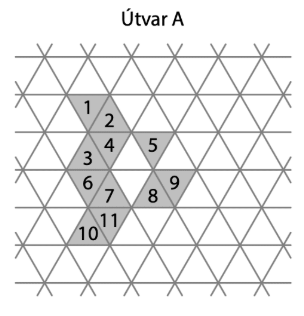
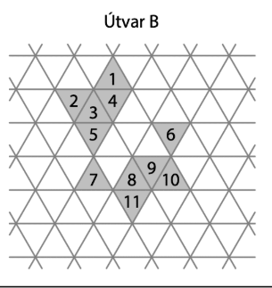
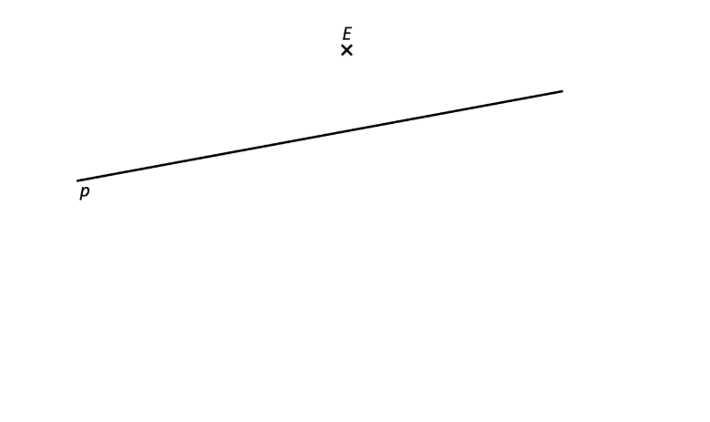
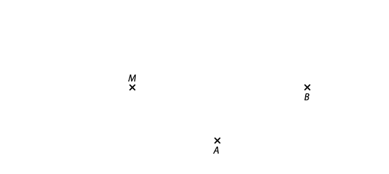
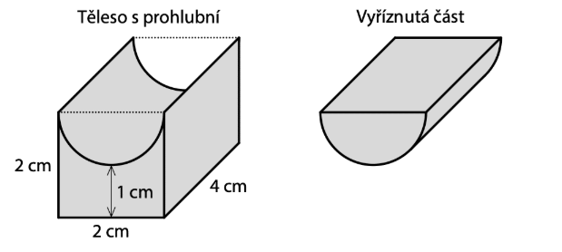

# 1 Vypočtěte druhou mocninu součtu prvního, druhého a třetího nejmenšího prvočísla.

# 2 Vypočtěte:
## 2.1
$$
-5\cdot5+(-12)^2-13^2=
$$
## 2.2
$$
\sqrt{1-0{,}8^2}:6=
$$

# 3 Vypočtěte a výsledek zapište zlomkem v základním tvaru: 
## 3.1 
$$
-\frac{5}{24}+\frac{5}{24}\cdot\frac{7}{3}=
$$
## 3.2
$$
\frac{(\frac{125}{21}\cdot\frac{7}{25}-9):4}{11}=
$$

# 4
## 4.1 **Upravte a rozložte na součin** vytknutím:
$$
3y\cdot(x+3y)-y=
$$
## 4.2 **Upravte a rozložte na součin** užitím vzorce:
$$
n\cdot(9n-1)+n-4=
$$
## 4.3 **Upravte** na co nejjednodušší tvar bez závorek:
$$
4\cdot(2x\cdot x-x)-3+(2x+1)(3-4x)=
$$

# 5 V záznamovém archu uveďte v obou částech úlohy celý postup řešení (zkoušku nezapisujte).
## 5.1 **Řešte** rovnici:
$$
3\cdot(4-\frac{3}{4}x)+x=1-\frac{5}{4}x
$$
## 5.2 **Řešte** soustavu rovnic:
$$
\begin{aligned}
2x-y=7\\
x-2y=11
\end{aligned}
$$

VÝCHOZÍ TEXT K ÚLOZE 6
===
> Klára si v řemeslné pekárně koupila několik tukových rohlíků a několik celozrnných housek.\
> Dvě celozrnné housky stojí o 6 korun více než tři tukové rohlíky.

# 6 Cenu jedné celozrnné housky v korunách označíme *h*.
## 6.1 **Vyjádřete výrazem** s proměnnou *h*, kolik korun stojí **tři** tukové rohlíky.
## 6.2 **Vyjádřete výrazem** s proměnnou *h*, kolik korun stojí **jeden** tukový rohlík.
## 6.3 Klára zaplatila za 6 tukových rohlíků a 6 celozrnných housek celkem 78 korun.
**Vypočtěte**, kolik korun stojí jedna celozrnná **houska**.

VÝCHOZÍ TEXT K ÚLOZE 7
===
> Naši zakázku vyrábí několik automatů.\
> Automaty vždy pracují společně stalým a navzájem stejným tempem.
> 
> Kdyby pracovalo 12 automatů, vyrobí naši zakázku přesně za 60 hodin.

# 7
## 7.1 **Vypočtěte**, za kolik hodin vyrobí naši zakázku 20 automatů.
## 7.2 **Vyjádřete zlomkem** v základním tvaru, jakou část naší zakázky vyrobí 5 automatů za 24 hodin.
## 7.3 Čtvrtinu naší zakázky vyrobilo 15 automatů, zbytek zakázky dokončilo 18 automatů.
**Vypočtěte**, kolik hodin trvala výroba celé naší zakázky.

VÝCHOZÍ TEXT A OBRÁZKY K ÚLOZE 8
===
> Trojúhelníková síť se skládá z rovnostranných trojúhelníků. V této síti jsou z tmavých trojúhelníků složeny tři útvary A, B, C.
> 
> V každém útvaru buď přesuneme, nebo odebereme vždy **pouze jeden** tmavý trojúhelník tak, aby vznikl osově souměrný nebo středově souměrný útvar.
> 
> V jednotlivých útvarech jsme každý tmavý trojúhelník označili číslem.
> 
> Např. z útvaru A vznikne osově souměrný útvar odebráním trojúhelníku 9.
>
> 
> 
> 

# 8 Určete číslo trojúhelníku, jehož
## 8.1 odebráním vznikne z útvaru B **osově** souměrný útvar,
## 8.2 přesunutím vznikne z útvaru C **středově** souměrný útvar.
Najděte všechna řešení.

VÝCHOZÍ TEXT A OBRÁZEK K ÚLOZE 9
===
> V rovině leží bod E a přímka *p*.
> 
> 
# 9 
Bod E je vrchol pravidelného šestiúhelníku ABCDEF.
Na přímce p leží vrcholy D,F tohoto šestiúhelníku.

**Sestrojte** vrcholy A,B,C,D,F pravidelného šestiúhelníku ABCDEF, **označte** je písmeny a šestiúhelník **narýsujte**.

VÝCHOZÍ TEXT A OBRÁZEK K ÚLOZE 10
===
> V rovině leží body A,B,M.
> 
> 

# 10
Úsečka AB je strana rovnoběžníku ABCD.
Na přímce BM leží vrchol D tohoto rovnoběžníku.
Úhlopříčka AC rovnoběžníku ABCD má délku 6 cm.

## 10.1 **Sestrojte** střed S rovnoběžníku ABCD a **označte** ho písmenem.
## 10.2 **Sestrojte** vrcholy C, D rovnoběžníku ABCD, **označte** je písmeny a rovnoběžník **narýsujte**.
Najděte všechna řešení.

VÝCHOZÍ TEXT A OBRÁZEK K ÚLOZE 11
===
> Graf udává délky tréninkových tras tří cyklistů během dvou víkendových dní.\
> Za celý víkend ujel Adam o 45 km méně než Ben.
> 
> 
> (Všechny díly zobrazené na svislé ose jsou stejné.)

# 11 Rozhodněte o každém z následujících tvrzení (11.1–11.3), zda je pravdivé (A), či nikoli (N).
## 11.1 Vzdálenosti, které za celý víkend ujeli Adam, Ben a Cyril (v tomto pořadí), jsou v poměru 3:4:5.
## 11.2 V neděli ujel Cyril o 40 % delší trasu než Adam.
## 11.3 Ben ujel v sobotu méně než 100 km.

VÝCHOZÍ TEXT A OBRÁZEK K ÚLOZE 12
===
> V kvádru o rozměrech 2 cm, 4 cm a 2 cm byla vytvořena prohlubeň vyříznutím poloviny válce s podstavou o poloměru 1 cm (viz obrázek).
> 
> 

# 12 Jaký je objem tělesa s prohlubní?
Ve výpočtu je použita zaokrouhlená hodnota čísla π=3,14.
- [A] 3,44 cm^3^
- [B] 9,72 cm^3^
- [C] 10,72 cm^3^
- [D] 12,56 cm^3^
- [E] jiný objem

VÝCHOZÍ TEXT A OBRÁZEK K ÚLOZE 13
===
> V pravoúhlém trojúhleníku ABC má odvěsna AC délku 16 cm a přepona AB délku 20 cm.
> 
> 

# 13 Jaký je obsah trojúhelníku ABC?
- [A] 96 cm^2^
- [B] 104 cm^2^
- [C] 112 cm^2^
- [D] 120 cm^2^
- [E] více než 120 cm^2^

VÝCHOZÍ TEXT A OBRÁZEK K ÚLOZE 14
===
> Je dán kosočtverec ABCD se středem S. Bod X je střed strany BC tohoto kosočtverce. Velikost úhlu CSX je 20 $\degree$.
> 
> 

# 14 Jaká je velikost $\varphi$ úhlu ABD?
Velikost úhlů neměřte, ale výpočtěte (obrázek je pouze ilustrativní).
- [A] méně než 40 $\degree$
- [B] 40 $\degree$
- [C] 50 $\degree$
- [D] 60 $\degree$
- [E] 70 $\degree$

# 15 Přiřaďte ke každé úloze (15.1–15.3) odpovídající výsledek (A–F).
## 15.1 Stejné sýry se prodávají v menších baleních po dvou sýrech a ve větších baleních po třech sýrech. Menší balení stojí 100 korun, větší balení 123 korun.
**O kolik procent je jeden sýr ve větším balení levnější než jeden sýr v menším balení?**
## 15.2 V půjčovně se za půjčení každé lodě platí jednotná cena za každý den. Sportovní klub vybral peníze na půjčení 10 lodí na 5 dní. Z vybraných peněz klub dosud utratil jen část, a to za půjčení 2 lodí na 4 dny.
**Kolik procent vybraných peněz klub dosud utratil?**
## 15.3 Vítek šetří na nákup lyží. Našetřené peníze mu nyní vystačí buď na 92 % ceny loňského modelu lyží nebo na 80 % ceny letošního modelu lyží. Loňský model lyží stojí 10 tisíc korun.
**O kolik procent je letošní model lyží dražší než loňský?**
- [A] méně než 15 %
- [B] 15 %
- [C] 16 %
- [D] 18 %
- [E] 19 %
- [F] více než 19 %

VÝCHOZÍ TEXT A OBRÁZEK K ÚLOZE 16
===
> Na začátku promítání je na plátně zobrazen šedý pravoúhlý trojúhleník ABC (viz obrázek).\
> Dále se na plátně v každém kroku objeví nový větší pravoúhlý trojúhelník s vrcholem A a přeponou ležící na polopřímce AB a je vždy o 2 cm delší než v předchozím trojúhelníku.\
> V 1. kroku se tak objeví trojúhleník AB~1~C~1~, ve 2. kroku trojúhleník AB~2~C~2~ atd.\
> Poměr délek obou odvěsen bude ve všech trojúhelnících stejný.\
> 

# 16 Určete,
## 16.1 v kolikátém kroku se objeví trojúhleník, v němž se délky obou odvěsen liší o 14 cm,
## 16.2 kolik cm měří kratší odvěsna B~60~C~60~ trojúhelníku AB~60~C~60~, který se objeví v 60. kroku,
## 16.3 v kolikátém kroku se objeví trojúhelník, jehož kratší odvěsna bude **naposledy** měřit méně než 300 cm.
