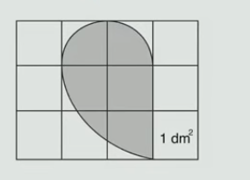
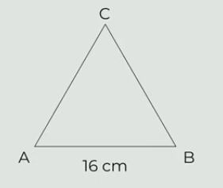

# 1 Vypočtěte jednu sedminu ze součtu všech prvočísel menších než číslo 20.

# 2 Určete pomocí vzorce nejjednodušší výraz, kterým je třeba vynásobit výraz $5a + 2\cdot3$, abychom získali výraz $25a^2 - 36$.

# 3 Řešte soustavu rovnic: 
$$
\begin{aligned}
3\cdot(x+2)=6y\\
-2y+8=-4x
\end{aligned}
$$

# 4
> Na obrázku je obdelník rozdělený na 12 shodných čtverců.\
> Obsah jednoho čtverce je 1 dm^2^. V tomto obdélníku je zakreslený šedý obrazec.
> 
> 

**Jaký je obsah šedého obrazce?**
- [A] 157 cm^2^
- [B] 314 cm^2^
- [C] 471 cm^2^
- [D] 628 cm^2^
- [E] jiný obsah

# 5
> Na obrázku je rovnoramenný trojúhleník ABC se základnou AB o délce 16 cm.\
> Obsah trojúhelníku ABC je 120 cm^2^.
> 
> 

Jaký je součet délek ramen |AC| a |AB|?

- [A] méně než 32 cm
- [B] 33 cm
- [C] 34 cm
- [D] 35 cm
- [E] více než 35 cm

# 6
> Cena tenisek v obchodě byla na jaře o 25 % vyšší než v létě. Na podzim byly tenisky zdraženy o polovinu oproti letní ceně.

**Vypočtěte**, o kolik procent byla podzimní cena tenisek vyšší než cena tenisek na jaře?

# 7
> Milí žáci,
> Ve dnech 9. a 12. dubna 2026 *** přijímací zkoušky na střední školy.
> Po jejich absolvování ..... výsledky do 30 dnů poštou.

**Doplňte:**

## 7.1 Na první vynechané místo (***) ve výchozím textu patří sloveso **konat se** ve spisovném tvaru 3. osoby, čísla množného, způsobu oznamovacího, času přítomného, rodu trpného. Napište tento tvar.

## 7.2 Na druhé vynechané místo (.....) ve výchozím textu patří sloveso **obdržet** ve spisovném tvaru 2. osoby, čísla množného, způsobu oznamovacího, času přítomného, rodu činného. Napište tento tvar.

# 8
> podpatek
> nadhoz
> předkolo
> 
> podhůří
> nadporučík
> předměstí
> 
> podatelna
> nástavec
> předskočan
> 
> podkova
> nádivka
> předehra

Vypište z výchozího textu 3 slova, z nichž každé obsahuje kořen složený ze čtyř hlásek.

# 9
> **Věta č. 1**: Zástupci radnice Prahy 1 přišli 16. ledna vzdát hold k pomníku Jana Palacha a Jana Zajíce u Národního muzea na horní straně Václavského náměstí.
> 
> **Věta č. 2**: Mohutná zimní bouře, která se přehnala přes Severní Ameriku, v neděli zasáhla intenzivním sněžením i nejlidnatější region Kanady.

Které z následujících tvrzení o větách z výchozího textu je pravdivé?

- [A] Obě tyto věty jsou zapsány pravopisně správně.
- [B] Každá z těchto vět obsahuje pravopisnou chybu.
- [C] Věta č. 1 je zapsána pravopisně správně, věta č. 2 obsahuje pravopisnou chybu.
- [D] Věta č. 1 obsahuje pravopisnou chybu, věta č. 2 je zapsána pravopisně správně.