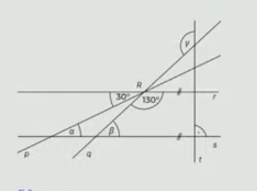
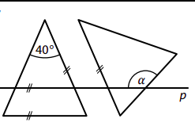

# 1 Na táboře bylo 80 dětí, 5 vedoucích a 4 instruktoři.
Vedoucí si všechny děti rozdělili do stejně početných oddílů.  Každý vedoucí měl na starost jeden oddíl.

**Kolik procent všech dětí měl na starost jeden vedoucí?**
- [A] 20 % 
- [B] 25 % 
- [C] 33 % 
- [D] 40 % 
- [E] 45 % 
- [F] 50 % 

# 2 Při slavnostním zahájení soutěže nastoupilo na hřiště 10 družstev po 11 hráčích a všichni organizátoři soutěže. Dohromady tak nastoupilo 200 osob. 

**Kolik procent osob nastoupených na hřišti tvořili organizátoři?**
- [A] 40 % 
- [B] 45 % 
- [C] 50 % 
- [D] 55 % 
- [E] 60 % 
- [F] více než 60 % 

# 3 Vypočtěte a výsledek zapište zlomkem v základním tvaru. 

$$ 
\left(\frac{11}{5}-\frac{11}{6}\right):\left(-\frac{1}{3}\right)=
$$

# 4 Do rámečků doplňte taková čísla, aby platila rovnost: 
$$
(a+[{\_\_}])^2 = a^2 + 18a +[{\_\_}]
$$

# 5
>V rovině leží přímky p, q, r, které se protínají v bodě R, a přímky s, t, pro které platí: s∥r, s⊥t. 
> 
> 
>
>(*CZVV*) 

**Vypočtěte ve stupních velikost úhlu**
## 5.1 𝛼, 
## 5.2 𝛽, 
## 5.3 𝛾. 

# 6 
> Rodný dům slavného spisovatele je otevřen pouze v letní sezoně od května do září.
> 
> Na pokladně zaznamenávají počet prodaných vstupenek dětským a dospělým návštěvníkům.  
> 
> V grafu je uvedena návštěvnost v jedné sezoně. 
>
> 
>
> (*CZVV*) 

Rozhodněte o každém z následujících tvrzení (6.1–6.3), zda je pravdivé (A), či nikoli (N). 
 
## 6.1 V **prvních třech** měsících sezony bylo mezi návštěvníky rodného domu třikrát více dospělých než dětí. 
## 6.2 Za **celou** sezonu bylo dospělých návštěvníků rodného domu průměrně 80 za měsíc. 
## 6.3 Za celou sezonu tvořily děti 40 % **všech** návštěvníků rodného domu.  

# 7 
> V zahradě se pěstuje 6 druhů rostlin. Diagram udává, jakou část osázené plochy zahrady 
> zabírají jednotlivé druhy rostlin. V každé části zahrady se pěstuje pouze jeden druh rostlin. 
> Magnolie zabírají plochu o rozloze 20 m2. 
> 
>  
> 
> V některých výsečích diagramu je uvedena velikost úhlu, který příslušnou výseč vymezuje. 
> 
> (*CZVV*) 

Rozhodněte o každém z následujících tvrzení (7.1–7.3), zda je pravdivé (A), či nikoli (N). 
 

## 7.1 Jabloně zabírají o 15 m^2^ větší plochu, než zabírají magnolie. 
## 7.2 Levandule a bazalka dohromady zabírají 1,5krát větší plochu než hortenzie. 
## 7.3 Růže zabírají plochu menší než 30 m^2^. 

# 8
> V rovině leží dva **shodné rovnoramenné** trojúhelníky a přímka p rovnoběžná se základnou jednoho z nich.
> Druhý trojúhelník má právě jedno rameno rovnoběžné s ramenem prvního trojúhelníku.
>  
> 
>  
> (*CZVV*) 

**Jaká je velikost úhlu 𝛼?**
Velikosti úhlů neměřte, ale vypočtěte (obrázek je pouze ilustrativní). 
- [A] $160\degree$
- [B] $140\degree$ 
- [C] $130\degree$ 
- [D] $110\degree$ 
- [E] jiná velikost 

# 9
> Po ***** stranách ulice se válely odpadky. Soused nahlas nadával, protože už od rána jen uklízel. Naši pomoc, ••••• opakovaně, ale odmítl.

**Napište:**

## 9.1 Napište náležitý spisovný tvar slova *oba*, který patří na první vynechané místo (*****) ve výchozím textu.
## 9.2 Napište náležitý spisovný tvar slova *nabízený*, který patří na druhé vynechané místo (•••••) ve výchozím textu.

# 10
> Video poté sledovali účastníci experimentu: měli za úkol počítat, kolikrát si mezi 
> sebou přihrají míč hráči v bílých tričkách. Následně se vědci ptali na to, ***** si při 
> počítání přihrávek někdo všiml něčeho zvláštního. Zjistili, že přes 40 % dotazovaných 
> gorilu vůbec nezaregistrovalo. Nejde o to, že by na ni zapomněli. Oni ji skutečně 
> neviděli: ***** se totiž naše pozornost soustředí na jednu konkrétní věc, náš mozek 
> další vjemy, které nepokládá za důležité, zcela ignoruje. Tomuto fenoménu se říká...
> 
> (*Vzhledem k povaze jedné z úloh není zdroj výchozího textu uveden.*)

**Na každé ze dvou vynechaných míst (*****) ve výchozím textu je nutné doplnit jedno slovo. Kdy budou oba příslušné větné celky smysluplné a gramaticky správné?**

- [A] když na každé z vynechaných míst doplníme slovo *zda*
- [B] když na každé z vynechaných míst doplníme slovo *pokud*
- [C] když na první vynechané místo doplníme slovo *zda* a na druhé vynechané místo 
doplníme slovo *pokud*
- [D] když na první vynechané místo doplníme slovo *pokud* a na druhé vynechané 
místo doplníme slovo *zda*

# 11
> Bezpečně projet úsek s několika zrádnými jezi se mu podařilo především díky výborným 
> instruktorům. Byl rád, že se tohoto vodáckého výcviku zúčastnil.

**Které z následujících tvrzení je pravdivé?**

- [A] Výchozí text je zapsán pravopisně správně.
- [B] Výchozí text obsahuje pravopisnou chybu: místo *jezi* má být *jezy*.
- [C] Výchozí text obsahuje pravopisnou chybu: místo *především* má být *přede vším*.
- [D] Výchozí text obsahuje pravopisnou chybu: místo *zúčastnil* má být *zůčastnil*.

# 12 Ve které z následujících možností je významový vztah mezi slovy nejpodobnější vztahu mezi slovy ZVONOVINA – ZVON?
(Slova *zvonovina* a *zvon* posuzujte ve významu, v němž jsou užita ve výchozím textu. Správná je pouze možnost, v níž pořadí slov odpovídá pořadí *zvonovina* – *zvon*.)
- [A] sníh – iglú
- [B] sopka – láva
- [C] poleva – čokoláda
- [D] zmrzlina – kornout

