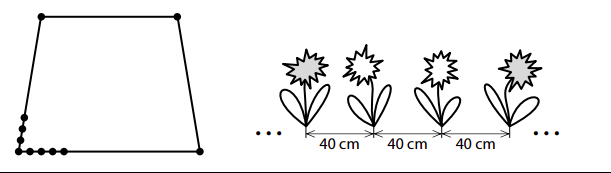

# 1

> Záhon v parku má tvar čtyřúhelníku, jehož tři strany jsou stejně dlouhé. Každá z těchto tří 
> stran je o čtvrtinu kratší, než je čtvrtá strana čtyřúhelníku.\
> Po obvodu záhonu je ve stejných rozestupech vysázeno celkem 65 rostlin, z nichž je po jedné 
> rostlině i v každém rohu záhonu. Rozestupy mezi rostlinami měří 40 cm. 
> 
> 

## 1.1 **Vypočtěte** v metrech obvod záhonu. 
## 1.2 **Určete**, o kolik se liší počet rostlin na nejdelší straně záhonu od počtu rostlin na protější straně záhonu. 
## 1.3 Po obvodu záhonu se **pravidelně** střídají stejně početné skupinky červeně kvetoucích rostlin s dvojicemi bíle kvetoucích rostlin. 
**Určete nejmenší možný počet červeně kvetoucích rostlin po obvodu záhonu.**

# 2
> Velký pravoúhlý lichoběžník, jehož rozměry jsou uvedeny na obrázku vlevo,  
> jsme jednou úsečkou rozdělili na menší lichoběžník a rovnoběžník (obrázek vpravo).
> 
> Oba tyto nové útvary (menší lichoběžník a rovnoběžník) mají stejný obvod. 
> 
> 

**Vypočtěte v cm obvod rovnoběžníku.**

# 3 

> Na táboře bylo 80 dětí, 5 vedoucích a 4 instruktoři. 

Na táboře bylo mladších dětí o jednu třetinu méně než starších dětí. 

**O kolik procent bylo starších dětí více než mladších?**

- [A] 20 % 
- [B] 25 % 
- [C] 33 % 
- [D] 40 % 
- [E] 45 % 
- [F] 50 % 

# 4 
> Farmář prodával saláty za jednotnou cenu za kus a v průběhu tří dnů všechny saláty prodal. 
> 
> První den prodal třetinu všech salátů, druhý den prodal o třetinu méně salátů než první den a třetí den prodal zbytek salátů. 

## 4.1 Za všechny prodané saláty utržil farmář celkem 5 400 korun.
**Vypočtěte**, kolik korun utržil farmář za saláty prodané druhý den.

## 4.2 Počet všech salátů, které farmář prodal, označíme 𝑥.
**Vyjádřete výrazem** s proměnnou 𝑥, kolik salátů prodal farmář druhý den.

## 4.3 Třetí den prodal farmář 120 salátů.
**Určete** počet **všech** salátů, které farmář prodal.

# 5 

> Mirek a Zuzka odříkávali čísla následujícím způsobem:\ 
> Mirek postupně odříkával všechna po sobě jdoucí přirozená čísla od 1 do 1 000. Za každým 
> druhým číslem udělal krátkou pauzu, během níž Zuzka řekla součet posledních dvou čísel, 
> které vyslovil Mirek. 
> 
> Na začátku tedy zazněla čísla:/
> 1, 2, **3**, 3, 4,**7**, 5, 6, **11**, … 
> 
> (Tučně zapsaná čísla vyslovila Zuzka, ostatní čísla Mirek.) 

## 5.1 Určete číslo, které zaznělo mezi čísly 24 a 25. 
## 5.2 Jako 90. v pořadí bylo vysloveno číslo 𝐶, které později zaznělo ještě jednou. 
**Určete číslo, které bylo vysloveno bezprostředně předtím, než podruhé 
zaznělo číslo** 𝐶. 
## 5.3 Určete největší číslo, které mezi prvními 150 vyslovenými čísly zaznělo dvakrát.

# 6
> Matně se rozpomínal, že včera vypěnil. Cože to bylo? Ach ano, večer se 
> přece v hospodě rozčiloval KVŮLI STAVBĚ dálničního obchvatu, o **níž** se zrovna ten den 
> dozvěděl. Ten obchvat ale městská rada přece nemůže prosadit… Nebo…?
> 
> (*D. Adams, Stopařův průvodce Galaxií, upraveno*)

**Napište druh příslovečného určení, kterým je ve VÝCHOZÍM TEXTU větný člen *kvůli stavbě*.**

# 7
> Vzpomínkou na smutné časy je nedávno odlitý zvon se symbolickým názvem, **jenž** 
> své bratry proměněné ve zbraně připomíná jak jménem, tak svou hmotností 9 801 kg. Zvon #9801 byl z velké části financován veřejnou sbírkou, jejíž organizace se ujali členové 
> spolku příznivců zvonařství. Jeho výroba byla pro zvonaře z rakouské firmy Grassmayr skutečnou výzvou.
> 
> (*www.9801.cz; www.denikn.cz, upraveno*)

**Které z následujících tvrzení o zájmenu tučně vyznačeném ve výchozím textu je pravdivé?**

- [A] Z gramatického hlediska toto zájmeno odkazuje pouze ke slovu *zvon*, z hlediska 
smyslu sdělení však odkazuje jak ke slovu *zvon*, tak ke slovu *název.*
- [B] Z gramatického hlediska toto zájmeno odkazuje pouze ke slovu *název*, z hlediska 
smyslu sdělení však odkazuje jak ke slovu *zvon*, tak ke slovu *název.*
- [C] Z gramatického hlediska může toto zájmeno odkazovat jak ke slovu *zvon*, tak ke 
slovu *název*, z hlediska smyslu sdělení je však zřejmé, že odkazuje ke slovu *zvon.*
- [D] Z gramatického hlediska může toto zájmeno odkazovat jak ke slovu *zvon*, tak ke 
slovu *název*, z hlediska smyslu sdělení je však zřejmé, že odkazuje ke slovu *název.*

# 8 Ve kterém z následujících větných celků není správně zapsána interpunkce?
- [A] Raději jděte babičce naproti, už dlouho u nás nebyla.
- [B] Pozvánku jsem nedostala včas, a proto jsem nemohla přijít.
- [C] Roční pojištění celého domu bylo o 10 000 Kč dražší, než jsme čekali.
- [D] Nedávno zrekonstruovaný palác, který pochází z 16. století včera vyhořel.

# 9
> pravěký \
> bezprostředně \
> nadpozemský \
> nedochvilný\
> pochopitelně \
> mnohočetný \
> obdobně \
> bohudík\
> domorodý \
> dotazník \
> předpokládaný \
> nejvybranější

**Vypište z výchozího textu tři slova, z nichž každé obsahuje dva kořeny.**

(Za chybu je považováno jak neuvedení hledaného slova, tak zapsání jakéhokoli slova, které neodpovídá zadání.)

# 10 
> Pokud zavítáte do jižních Čech, nesmíte vynechat návštěvu Písku. V tomto malebném 
> městě se nachází nejstarší dochovaný kamený most na našem území (někdy zvaný 
> Jelení) a další významné pamětihodnosti. Součástí historického centra je také __písecká sladovna__.
> Stojí na břehu řeky Otavy a vybudována byla v 19. století. Skoro 100 let zde 
> byla výrobna sladu pro pivovary, v současné době tento bývalý průmyslový objekt slouží 
> jako kulturní středisko.
> 
> Rozlehlá čtyřpatrová budova nabízí rozličné výstavy, které vám pomocí kreativních 
> her sprostředkují spoustu zážitků. Jedna ze stálých expozic má název *Mraveniště*. Jde 
> o obří dřevěný labyrint, který je plný skrýší a přibližuje nelehký život v mravenčí kolonii. 
> Na výstavě pojmenované *Království včel a bylin* zase prozkoumáte včelý město. Na dalším 
> místě se ponoříte do dechberoucího světa animace, jinde objevíte kouzlo ilustrovaných 
> knih. Návštěvu tohoto kulturního střediska si zajisté náramě užijete.
> 
> (*www.sladovna.cz, upraveno*)

**Najděte ve výchozím textu čtyři slova, která jsou v něm zapsána s pravopisnou chybou, a napište je __pravopisně správně__.**

(Slova zapište bezchybně; ohebná slova zapište ve stejném tvaru, v němž jsou užita v textu. Podtržené výrazy jsou zapsány správně. Za chybu je považováno jak neuvedení hledaného slova, tak zapsání jakéhokoli slova, které neodpovídá zadání.)
