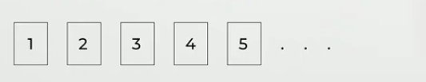
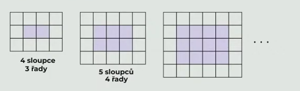

# 1 Vypočtěte, kolik procent je 1 080 minut z 24 hodin.

# 2

> Na každé z 8 kartiček bylo zapsáno jedno číslo od 1 do 8. Žádná dvojice kartiček neobsahovala stejné číslo.
> 
> Adam si vzal třikrát více kartiček než Pavel. Součet čísel na Adamových kartičkách byl o 20 větší než součet čísel na Pavlových kartičkách.
>
> 

**Určete, která čísla byla na Pavlových kartičkách.**

Najděte všechna řešení.

Nezapisujte čísla na Adamových kartičkách.

# 3
> Obdélníková mozaika z bílých a šedých čtverců se tvoří podle následujících pravidel: 
> - Počet sloupců v obdélníku je o 1 větší než počet řad. 
> - Šedý obdélník obklopují bílé čtverce pouze v jedné vrstvě. 
>  
> (*CZVV*) 

Vypočtěte, 

## 3.1 kolik šedých čtverců je v mozaice, která obsahuje celkem 12 řad, 
## 3.2 kolik šedých čtverců je v mozaice, která má 70 bílých čtverců, 
## 3.3 kolik bílých čtverců je v mozaice, která má celkem 380 čtverců (šedých i bílých). 

# 4 

> Při spuštění programu je obrazovka monitoru prázdná. Při každém pípnutí se situace na obrazovce mění: 
> 
> Při prvním, třetím a každém **lichém** pípnutí se objeví 2 nové **plus** (+).\
> Při druhém, čtvrtém a každém **sudém** pípnutí se objeví 2 nové **krát** (×).\
> Při **každém třetím pípnutí** se navíc spojí jedno plus (+) a jedno krát (×) a místo nich pak vidíme pouze jednu **hvězdičku** (*).
> 
> Na obrazovce tak mohou být tři různé symboly: „čárka“, „pomlčka“ a „plus“. 
>  
> **Symboly na obrazovce**
> 
> - při 1. pípnutí (2 symboly): + +
> - při 2. pípnutí (4 symboly): + + × ×
> - při 3. pípnutí (5 symbolů): + + × * +
> - při 4. pípnutí (7 symbolů): + + × * + × × (3× +, 3× × a 1× *)
> - …
> - při 7. pípnutí (12 symbolů): + + × * + × × * × + + ×
> - atd.

Určete, jaký je na obrazovce počet:
## 4.1 symbolů „plus“ (+) při 11. pípnutí,
## 4.2 všech symbolů při 90. pípnutí,
## 4.3 symbolů „krát“ (×) právě ve chvíli, kdy se objevil 9. symbol „hvězdičky“ (*).

# 5
> Světově __proslulí__ vědci se nedávno sešli, aby probrali __další__ postup při hledání nového léku.

**Určete pád a vzor přídavných jmen, která jsou ve výchozím textu podtržena.**

Pád zapište číslicí, vzor zapište celým slovem (nepoužívejte zkratky).

# 6 Ve které z následujících možností jsou významové vztahy mezi slovy nejpodobnější vztahům v trojici slov housle-struny-kontrabas?

Slova ve správném řešení musejí být uvedena v pořadí odpovídajícím trojici slov housle-struny-kontrabas.

- [A] savec-ocas-pes
- [B] růže-trny-květina
- [C] pokrm-nudle-jídlo
- [D] auto-motor-vrtulník

# 7 Rozhodněte o každé z následujících možností, zda je napsána pravopisně správně (A), nebo ne (N).

## 7.1 Poutavé celodenní výlety po zapadlých hradech a tvrzích mě i mé spolužáky nesmírně zaujali.
## 7.2 Minulou neděli jsme navštívili zámek se starobylou kaplí, která je opředena děsivými legendami.
## 7.3 Podle kastelánovi rady jsme po prohlídce hradu zavítali na dobové trhy, které se konaly v blízké vsi.
## 7.4 Na těžkých litinových pánvích se nad ohněm opékaly voňavé klobásy spolu s křehkým skopovým masem.

# 8 Přiřaďte k jednotlivým větám (8.1–8.4) odpovídající tvrzení (A–F).

## 8.1 Porušení slibu dívku hluboce ranilo.
## 8.2 Závěrečná skladba dojala všechny diváky.
## 8.3 Seznam obsahoval zajímavé knihy o přírodě.
## 8.4 Gymnasta denně trénoval v tělocvičně sestavu.

- [A] Tato věta obsahuje předmět a dva přívlastky shodné.
- [B] Tato věta obsahuje předmět a dvě příslovečná určení.
- [C] Tato věta obsahuje předmět a dva přívlastky neshodné.
- [D] Tato věta obsahuje předmět, přívlastek shodný a příslovečné určení.
- [E] Tato věta obsahuje předmět, přívlastek neshodný a příslovečné určení.
- [F] Tato věta obsahuje předmět, přívlastek shodný a přívlastek neshodný.