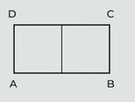

# 1 Vypočtěte, kolikrát menší je úhel $0\degree 12'$ než úhel $6\degree 24'$.

# 2 Vypočítejte a výsledek zapiště zlomkem v základním tvaru.
$$
\frac{\frac{5}{4}-\frac{5}{3}}{(-12)^2\div72} =
$$

# 3 Řešte rovnici:
$$
\frac{x-3}{4} - \frac{x-3}{3} = \frac{1}{6}x
$$

# 4 

> V lese bylo třikrát více divočáků než zajíců. Během lovecké sezóny myslivci zastřelili 15 divočáků a 12 zajíců. Po lovecké sezóně bylo v lese šestkrát více divočáků než zajíců.
>
> Neznámý počet divočáků, kteří byli v lese před lovnou sezónou, označte x.

## 4.1 V závislosti na veličině x vyjádřete počet zajíců po ukončení lovecké sezóny.
## 4.2 Určete počet divočáků, kteří v lese byli po ukončení lovecké sezóny.

# 5

> Beáta si udělala výlet do cukrárny v sousedním městě, která je od jejího domova vzdálená 32 km. Vyjela v 9:30 a zpátky domů se vrátila ve 14:21. Cestou domů pospíchala, a tak jela dvakrát rychleji než cestou do cukrárny. Beáta se v cukrárně zdržela přesně 90 minut.

**Rozhodněte o každém z následujících tvrzení (5.1–5.3), zda je pravdivé (A), či nikoli (N).**

## 5.1 Beáta do cukrárny přijela dříve než v 11:30.
## 5.2 Cestu z cukrárny Beáta zvládla za 1 hodinu a 7 minut.
## 5.3 Beátina průměrná rychlost na cestě z cukrárny byla nižší než 16 km/h.

# 6
> Obdélník ABCD je rozdělen na dva stejné čtverce. Obvod obdélníku ABCD je 72 cm.
>
> 

**Jaký je obsah jednoho ze dvou stejných čtverců?**

- [A] 81 cm^2^
- [B] 100 cm^2^
- [C] 121 cm^2^
- [D] 144 cm^2^
- [E] jiný výsledek

# 7 
> Byl to člověk upřím\* laskavý, nikdy nem\*l sklony k podezřívání a nikdy se m\* zbytečně nevyptával.

Na vynechaná místa (*) ve výchozím textu je třeba doplnit ě/ně tak, aby text byl pravopisně správně.

**Ve které z následujících možností jsou ě/é uvedena v odpovídajícím pořadí?**

- [A] ě-ě-ně
- [B] ně-ně-ně
- [C] ě-ně-ně
- [D] ně-ě-ě

# 8

**Splňte zadané úkoly.**

## 8.1 Napište spisovné přídavné jméno, které je v 1. pádě čísla jednotného dvouslabičné, je příbuzné se slovem BĚH a skloňuje se podle vzoru MLADÝ.
## 8.2 Napište spisovné podstatné jméno, které je v 1. pádě čísla jednotného dvouslabičné, je příbuzné se slovem STRACH a skloňuje se podle vzoru HRAD.

# 9
> Ve škole probíhal projektový den zaměřený na zdravou výživu. V jedné z učeben žáci připravovaly jednoduché svačiny podle předem danných receptů. Učitelé dohlíželi na hygienu a bezpečnost. Během přípravy si žáci všímali rozdílů mezi jednotlivími druhy pečiva. Některé děti si připravily sendvič se šunkou a zeleninou, jiné zvolily ovocný salát. Jedna skupina dokonce přinesla domácí pečivo, které upekla den předem. Po ochutnávce následovala krátká prezentace o významu vitamínu C, kde se oběvila chyba ve slově pomněnka, které bylo v textu použito jako název bylinky.
>
> (fiktivní text)

**Najděte ve výchozím textu čtyři slova, která jsou zapsána s pravopisnou chybou, a napište je __pravopisně správně.__**

# 10

**Na každé vynechané místo (\*\*\*\*\*) v českých ustálených slovních spojeních doplňte příslušné slovo.**

## 10.1 Na výlet si nevzala pevné boty ani pláštěnku, a jakmile jsme vyšli, spustil se déšť, Barča uklouzla a zlomila si nohu. Inu, \*\*\*\*\* nechodí po horách, ale po lidech.
## 10.2 Když se po našem průšvihu maminka rozčílila, raději jsme mlčeli. Kdo seje \*\*\*\*\*, sklízí bouři.
