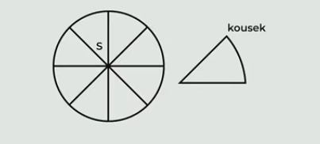
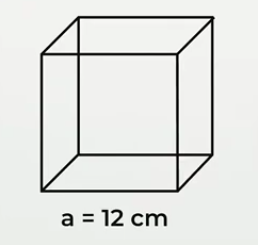
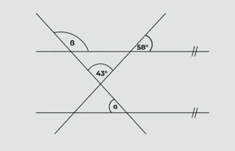

# 1 
> Obdélník má délku 15 cm a obsah 1,05 dm^2^.

**Vypočtěte, o kolik cm se liší délka a šířka obdélníku.**

# 2
**Umocněte a zjednodušte.**
Výsledný výraz nesmí obsahovat závorky.

$$
\left(2y-\frac{1}{4}\right)^2 =
$$

# 3
> V kině zaplatíme za 3 lístky do 2D sálu celkem x korun, stejně jako za 2 lístky do 3D sálu.

**Splňte zadané úkoly.**

## 3.1 **Vyjádřete výrazem** s proměnnou x, kolik korun zaplatíme za 1 lístek do 2D sálu.
## 3.2** Vyjádřete výrazem** s proměnnou x, kolik korun zaplatíme za 5 lístků do 3D sálu.
## 3.3 V kině jsme za 4 lístky do 2D sálu a 3 lístky do 3D sálu zaplatili celkem 510 korun. 

**Vypočtěte**, kolik korun jsme zaplatili za jeden lístek do 2D sálu.

# 4
> Pizza tvaru kruhu se středem S a průměrem 20 cm byla rozkrájena na 8 shodných kousků podobně jako na ilustračním obrázku
> 
> 

**Jaký je obvod jednoho takto vzniklého kousku pizzy?**
Výsledek je zaokrouhlen na celé cm.

- [A] 14 cm
- [B] 28 cm
- [C] 32 cm
- [D] 45 cm
- [E] jiný obvod

# 5
> Na obrázku je krychle s hranou a = 12 cm. Dvěma svislými řezy krychli rozřežeme na tři shodné kvádry.
>
> 

**Jaký bude povrch jednoho ze tří shodných kvádrů?**

- [A] 3,6 dm^2^
- [B] 4 dm^2^
- [C] 4,5 dm^2^
- [D] 4,8 dm^2^
- [E] jiný výsledek

# 6 
> 

**Jaká je velikost rozdílu úhlů: $\beta-\alpha=$**

- [A] 22 $\degree$
- [B] 25 $\degree$
- [C] 28 $\degree$
- [D] 32 $\degree$
- [E] jiný výsledek

# 7
> Jedno balení luxusní kávy stojí 400 Kč a je o čtvrtinu dražší než jedno balení standardní kávy.

**Vypočtěte kolik korun stojí dvě balení standardní kávy?**

# 8 Přiřaďte k jednotlivým trojicím slov (8.1–8.4) odpovídající tvrzení (A–F).

## 8.1 klaun – nabrousit – zaujatý
## 8.2 houpačka – využít – troufalý
## 8.3 doučování – sloužit – neuznalý
## 8.4 europoslanec – zauzlit – toaletní

- [A] Pouze jedno slovo, konkrétně to první, obsahuje dvojhlásku.
- [B] Pouze jedno slovo, konkrétně to druhé, obsahuje dvojhlásku.
- [C] Pouze jedno slovo, konkrétně to třetí, obsahuje dvojhlásku.
- [D] Celkem dvě slova, konkrétně první a druhé, obsahují dvojhlásku.
- [E] Celkem dvě slova, konkrétně první a třetí, obsahují dvojhlásku.
- [F] Celkem dvě slova, konkrétně druhé a třetí, obsahují dvojhlásku.

# 9 Přiřaďte k jednotlivým souvětím (9.1–9.3) odpovídající tvrzení (A–E).

## 9.1 Slibte nám, že nás co nejdřív zbavíte těch škůdců.
## 9.2 Vyčisti ten koberec, hlavně z něj nějak dostaň tu skvrnu.
## 9.3 Všechny dokumenty důkladně kontroluj, za chyby draze zaplatíš.

- [A] V souvětí je dokonavé pouze první sloveso, užito je v rozkazovacím způsobu.
- [B] V souvětí je dokonavé pouze druhé sloveso, užito je v oznamovacím způsobu.
- [C] V souvětí jsou obě slovesa dokonavá, obě jsou užita v rozkazovacím způsobu.
- [D] V souvětí jsou obě slovesa dokonavá, obě jsou užita v oznamovacím způsobu.
- [E] V souvětí jsou obě slovesa dokonavá, v rozkazovacím způsobu je užito pouze to první.

# 10 Která z následujících vět __není__ zapsána pravopisně správně?

- [A] Odbyla mě dost nesmyslnou výmluvou.
- [B] Nidky se mi nelíbilo jeho vyzívavé chování. 
- [C] Adam si stále ještě nezvykl na změnu bydliště.
- [D] Sára barvitě líčila problémy se ztraceným mobilem.