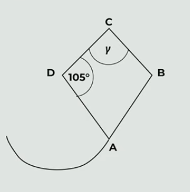

# 1 Vypočtěte, kolikrát je součet čísel 20 a 5 větší než druhá odmocnina ze součinu čísel 20 a 5.

# 2 Vypočítejte a výsledek zapiště zlomkem v základním tvaru.
$$
\frac{\frac{\sqrt{36}}{\sqrt{6 \cdot 6}}}{\frac{5 \cdot (5^2-4 \cdot 5)}{\sqrt{13^2-12^2}}}=
$$

# 3
Na vynechaná místa doplňte taková čísla, aby platila rovnost.
$$
(b-\_\_\_)^2 = b^2-10ab + \_\_\_
$$

# 4
> Zahradní bazén má tvar kvádru. Jeho dno má rozměry 4m x 2,5m.
Splňte zadané úkoly.

## 4.1 Po dešti stoupla hladina vody v bazénu o 2 cm. **Vypočítejte**, kolik litrů vody přibylo v bazénu během **tohoto deště**.
## 4.2 Během dalšího deště přibylo v bazénu 300 litrů vody. **Vypočítejte**, o kolik milimetrů stoupla hladina vody v bazénu během **tohoto deště**.

# 5
> Papírový drak se skládá z rovnoramenného trojúhelníku DBC a rovnostranného trojúhelníku ABD.
>
> 

**Jaká je velikost úhlu $\gamma$?**

- [A] 75 $\degree$
- [B] 82 $\degree$
- [C] 85 $\degree$
- [D] 90 $\degree$
- [E] jiná velikost úhlu

# 6 Přiřaďte ke každé podúloze (6.1–6.3) odpovídající výsledek (A–F).

## 6.1 Paní Králová si půjčila 18 000 Kč na jeden rok. Po roce vrácí věřiteli celou vypůjčenou částku a k ní navíc úrok ve výši 12 % z vypůjčené částky.
**Kolik korun celkem paní Králová vrátí?**

## 6.2 Pan Vacek vložil na spořící účet částku 800 000 Kč s roční úrokovou sazbou 3 %. Z úroku je odečtena daň ve výši 15 %. 
**Kolik korun získá pan Vacek navíc za jeden rok po zdanění?**

## 6.3 Notebook původně stál 25 000 Kč. Nejprve byl zlevněn o 15 % a následně opět zdražen o 10 % ze snížené ceny. 
**Jaká byla výsledná cena notebooku po zlevnění a zdražení?**

- [A] 19 800 Kč
- [B] 20 160 Kč
- [C] 20 250 Kč
- [D] 20 400 Kč
- [E] 21 500 Kč
- [F] jiný výsledek
# 7
## 7.1 Napište spisovné **podstatné jméno**, které je v **1. pádě čísla jednotného dvouslabičné**, je příbuzné se slovem **KRAJ** a skloňuje se podle vzoru **STROJ**.
## 7.2 Napište spisovné **přídavné jméno**, které je v **1. pádě čísla jednotného dvouslabičné**, je příbuzné se slovem **STÍN** a skloňuje se podle vzoru **MLADÝ**.

# 8 Přiřaďte k jednotlivým tvrzením (8.1–8.4) příslušnou dvojici slov (A–F), která patří na vynechané místo (*) v tvrzení.
## 8.1 Mezi slovy pták a křídlo je stejný významový vztah jako mezi slovy \*\*\*\*\*.
## 8.2 Mezi slovy noha a chůze je stejný významový vztah jako mezi slovy \*\*\*\*\*.
## 8.3 Mezi slovy houska a pečivo je stejný významový vztah jako mezi slovy \*\*\*\*\*.
## 8.4 Mezi slovy pšenice a mouka je stejný významový vztah jako mezi slovy \*\*\*\*\*.

- [A] vlak a auto
- [B] nůž a krájení
- [C] dům a střecha
- [D] dřevo a truhlář
- [E] hedvábí a šátek
- [F] sochař a umělec

# 9 Seřaďte jednotlivé části textu (A–E) za sebou tak, aby byla dodržena textová návaznost.

- [A] Chvíli na boudu hleděla, pak si klekla, dlaně zabořené do písku. V dálce šumělo moře a vlny si pohrávaly s mušlemi. Konečně se mohla nadechnout.
- [B] Sotva vlak zmizel za obzorem, začala běžet. Bylo to poprvé, co se vydala touhle cestou sama, bez doprovodu, a nehodlala ztrácet ani minutu.
- [C] Nakonec běh úplně vzdala a rychlou chůzí vykročila směrem k dřevěné boudě, kde kdysi dávno trávili prázdniny. Každý krok jí připadal těžší než ten předchozí.
- [D] Po chvíli měla pocit, že ji nohy už neunesou, ale běžela pořád dál, zastavit se neodvažovala. Ne teď, když zbývalo tak málo. Zpomalila, když se dostala na úzkou pěšinku lemovanou kapradím.
- [E] Vzpomněla si na poslední slova babičky, pronesená skoro šeptem. „Neboj se hledat, i když tě to bude bolet.“ Byla to její vnitřní mapa. A teď to místo našla.

# 10
> Ve __sbírce__ pohádek, kterou ilustroval známý __malíř__, jsme objevili kouzelný příběh o statečné víle.

**Určete pád a vzor podstatných jmen, která jsou ve výchozím textu podtržena.**

Pád zapište číslicí, vzor zapište celým slovem.
Chybějící dílčí odpověď nebo zápis jakéhokoli slova, které nevyhovuje zadání úlohy, jsou považovány za chybu.