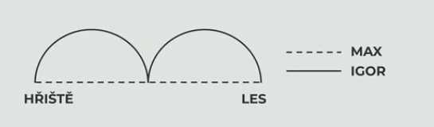
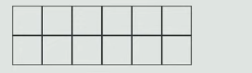

# 1 Vypočtěte, kolik procent z $10\degree$  je $0\degree 18'$ ?

# 2 List papíru ve tvaru obdélníku o rozměrech 80 cm a 208 cm chceme beze zbytku rozstříhat na stejné čtverce co největších rozměrů.

**Vypočtěte v cm obvod jednoho takto vzniklého čtverce.**

# 3

> Max šel z hřiště do lesa přímou cestou dlouhou 200 metrů. Igor šel z hřiště do lesa jinou cestou, která měl tvar dvou půlkružnic.
> 
> 

**Vypočítejte:**

## 3.1 O kolik **metrů** méně ušel Max oproti Igorovi?
## 3.2 Kolik **sekund** trvala cesta Igorovi, jestliže šel průměrnou rychlostí 120 metrů za minutu.

# 4

> Obdélník je rozdělen pěti svislými úsečkami a jednou vodorovnou úsečkou na 12 shodných čtverců. Každý z malých čtverců má obsah 81 cm^2^.
> 
> 

**Splňte zadané úkoly.**

## 4.1 Vypočtěte v cm velikost delší strany obdélníku.
## 4.2 Vyjádřete v základním tvaru poměr obvodů čtverce a obdélníku.

# 5
> Do mističky jsme nasypali bílé a černé kuličky. Černých bylo o 6 více než bílých. Potom jsme z mističky odebrali třetinu bílých a třetinu černých kuliček, a tím v mističce ubylo 12 kuliček.

**Vypočtěte, kolik bílých kuliček zůstalo v mističce.**

- [A] 7
- [B] 10
- [C] 13
- [D] 14
- [E] jiný počet

# 6
> Na sportovním táboře je 180 dětí, které trénují fotbal nebo tenis. Každé dítě se věnuje alespoň jednomu z těchto sportů a některé děti dělají oba sporty zároveň. Fotbal trénuje třetina všech dětí. Polovina dětí, které trénují fotbal, zároveň trénuje tenis.

**Kolik dětí na sportovním táboře trénuje tenis?**

- [A] 30 dětí
- [B] 60 dětí
- [C] 120 dětí
- [D] 150 dětí
- [E] jiný počet dětí

# 7
> Ve stánku se včera prodalo 540 modrých a bílých růží, mezi nimiž bylo modrých o 20 % méně než bílých.

**Jaký byl rozdíl mezi počtem modrých a bílých prodaných růží?.**

- [A] 60
- [B] 84
- [C] 108
- [D] 132
- [E] jiný počet

# 8
> Národní přírodní památka Panská skála, často označovaná jako Kamenné varhany, se nachází nedaleko obce Prácheň na severu Čech. Tvoří ji čedičové sloupy, které vznikly ochlazováním lávy před miliony let. Lokalita je chráněna především pro svůj neobvyklý geologický vzhled a je oblíbeným cílem turistů. Přístup k památce je možný po značených cestách a návštěvníci jsou vyzýváni, aby se pohybovali pouze po nich a nepoškozovali skalní útvary.
> 
> (fiktivní text)

**Rozhodněte o každém z následujících tvrzení, zda jednoznačně vyplývá z výchozího textu (A), nebo ne (N).**

## 8.1 Panská skála vznikla sopečnou činností.
## 8.2 Návštěvníci Panské skály se pohybují pouze po značených cestách.
## 8.3 Ochrana Panské skály souvisí s jejím geologickým významem.
## 8.4 Návštěvníci jsou povinni dodržovat určitá pravidla chování.

# 9 Přiřaďte k jednotlivým větám (9.1–9.4) možnost (A–F), v níž je v odpovídajícím pořadí správně určen první a druhý větný člen zvýrazněný v dané větě.

## 9.1 **Z** krbových **kamen** se vyvalil oblak černého **dýmu**.
## 9.2 Kamarádi **z dětství** se setkali na **koncertě** rockové kapely.
## 9.3 Pandemie **koronaviru** změnila **plánování** letních dovolených.
## 9.4 Na konferenci jsme diskutovali **o důsledcích** globálního **oteplování**.

- [A] předmět – přívlastek neshodný
- [B] přívlastek neshodný – předmět
- [C] předmět – příslovečné určení místa
- [D] příslovečné určení místa – předmět
- [E] přívlastek neshodný – příslovečné určení místa
- [F] příslovečné určení místa – přívlastek neshodný

# 10
> Eda se učí hrát na housle, ale \*\*\*\*\*. Nezahraje jediný čistý tón, neumí ani držet smyčec.

**Ve které z následujících možností je uvedeno české ustálené slovní spojení, jež vystihuje situaci ve výchozím textu, a patří tedy na vynechané místo (\*\*\*\*\*) v textu?**

- [A] jde mu to jako drže opici
- [B] jde mu to jako pytli blech
- [C] jde mu to jako psovi pastva
- [D] jde mu to jako vyorané myši