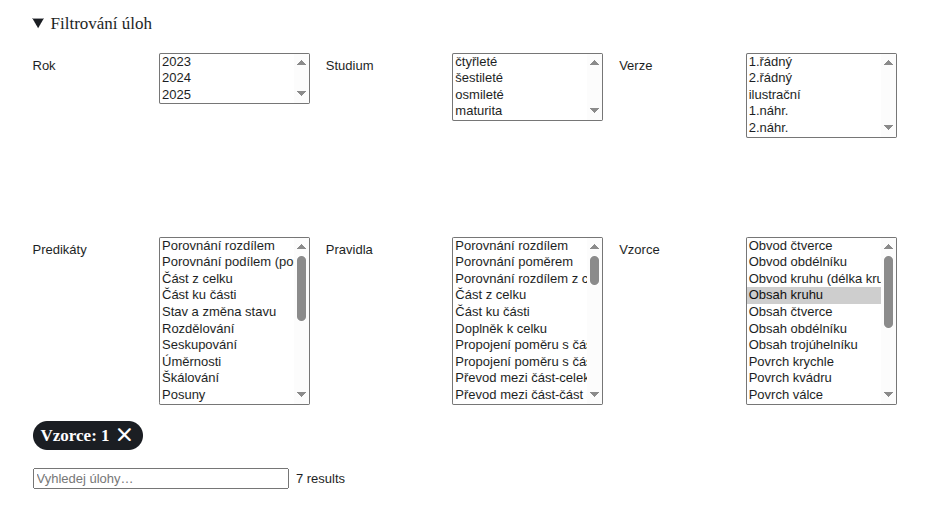
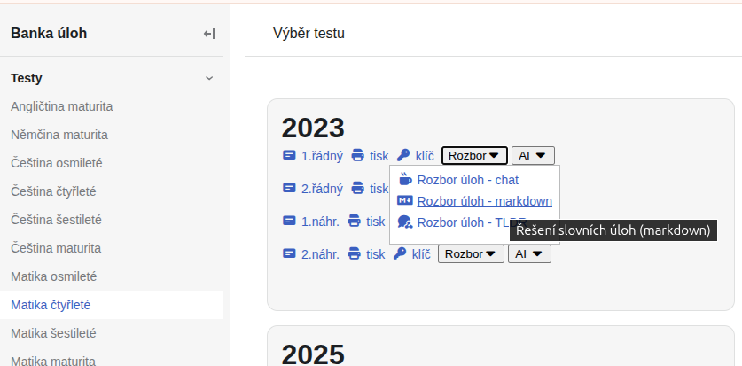
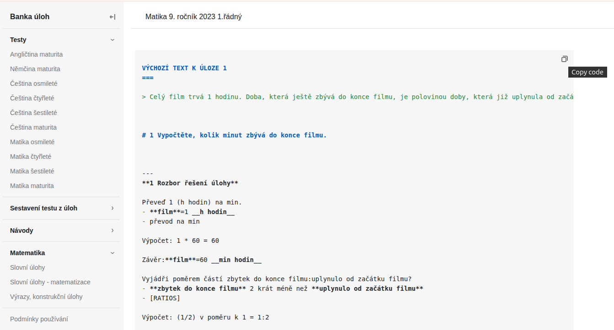
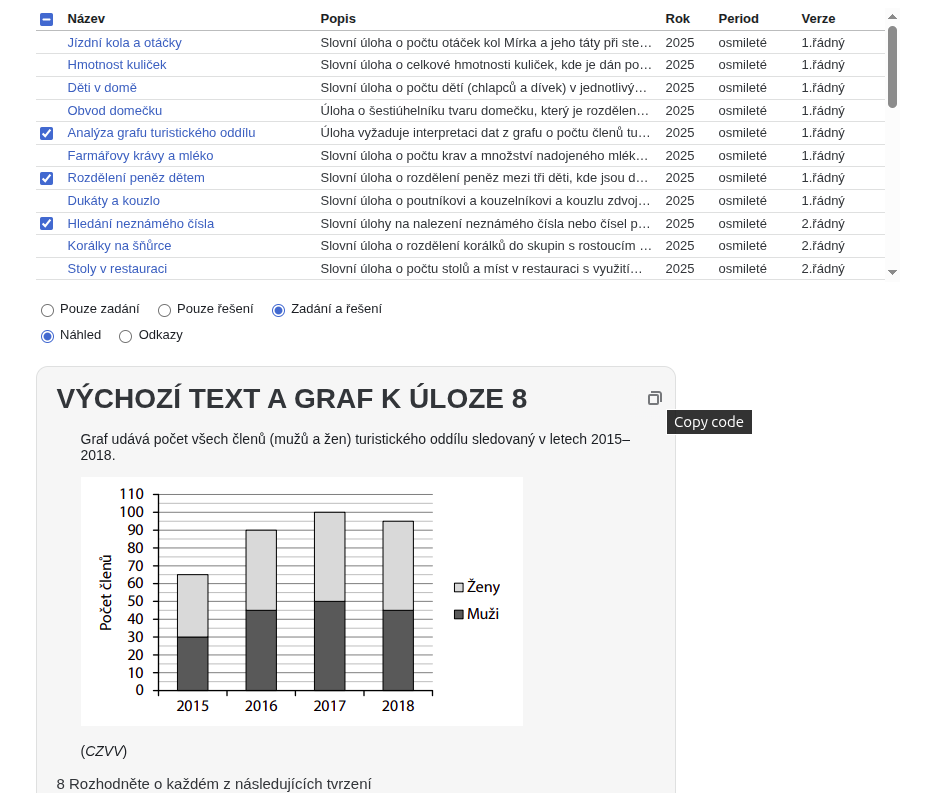
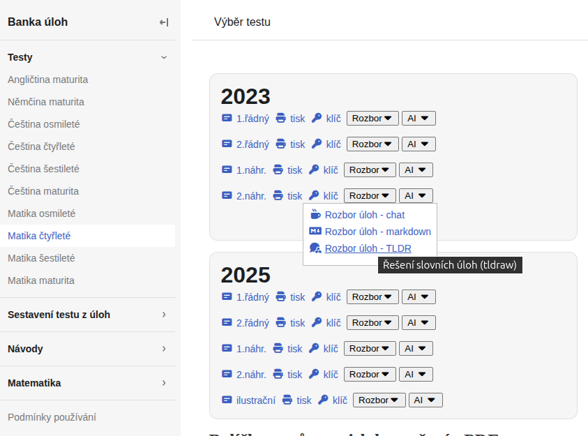

## Filtrování úloh

Vedle standardního filtrování dle **roku, typu studia či termínu testu**, lze navíc filtrovat úlohy až **na úroveň matematických konceptů** obsažaných v postupech řešení.

 - predikáty
 - odvozovací pravidla
 - běžné vzorce

## Zvýrazňování matematických konceptů

V postupech řešení se používají matematické koncepty - možnost zvýraznění matematického konceptu na úrovni
 - predikátů
 - odvozovacích pravidel
 - běžných vzorců

<video src="/assets/filtering.mp4" playsinline muted controls preload="metadata"></video>

## Využití v Notebook LM

  Markdown formát je vhodný pro LLM modely. Jednoduchá integrace s AI nástroji.

1. Klikněte na tlačítko Rozbor - Otevřít Rozbor úloh - markdown

2. Klikněte na Copy tlačítko a stáhnout soubor *.md

2. Otevři [Notebook LM](https://notebooklm.google.com/)
3. Vložit jako source

  Vložení jednotlivých úloh jako samostatné zdroje v Notebook LM

1. Otevřete [slovní úlohy](/word-problems-summary).

2. Zaškrtněte požadované úlohy a použite tlačítko **Copy**.

## Využití v TLDR canvasu

K zobrazení strukturovaného řešení slovních úloh si stáhněte *.tldr soubor a nahrajte do canvasu. 

1. Stáhnout soubor *.tldr - klikněte na tlačítko Rozbor - Otevřít Rozbor úloh - tldr 

2. Otevři [tldraw.com](https://www.tldraw.com)
3. Přetáhni stažený soubor na stránku

Více informací [https://tldraw.dev/](https://tldraw.dev/).

