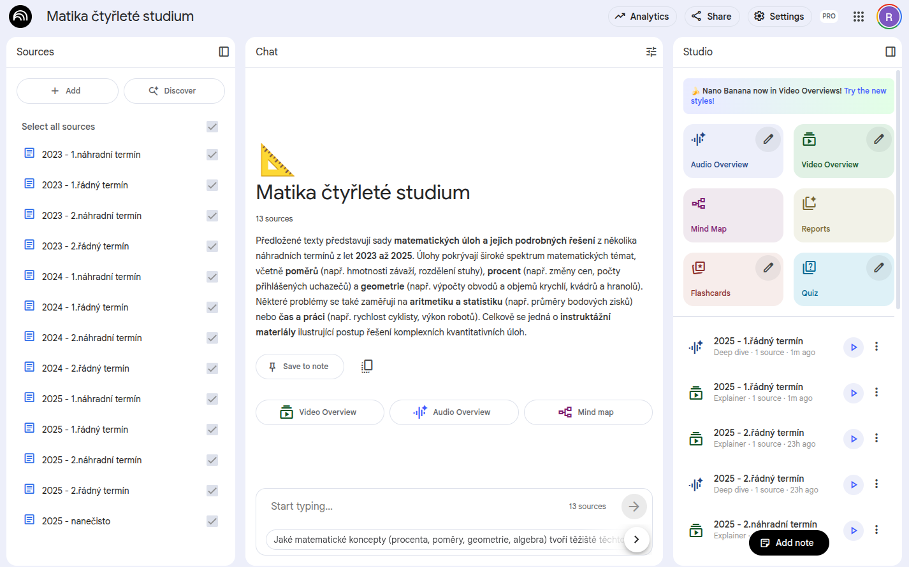
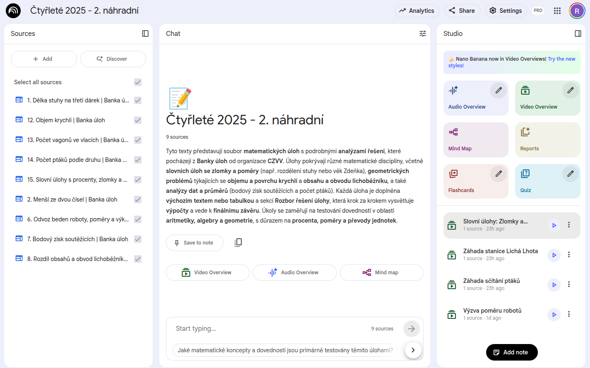
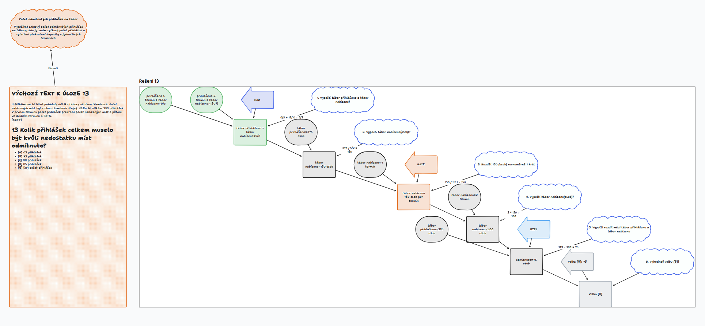
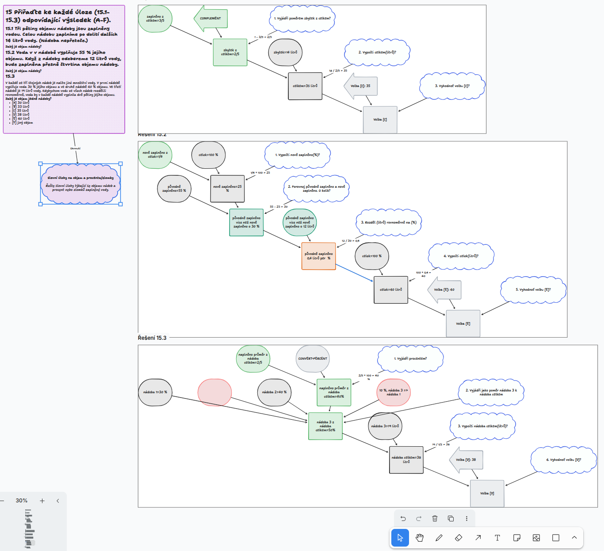
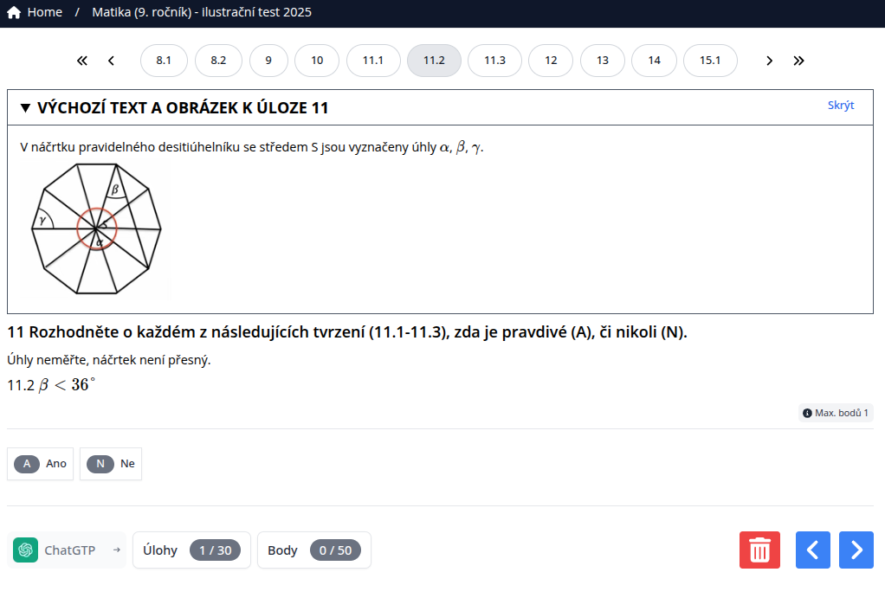

## Integrace na úrovni dat

Příklady aplikací, která využívají data z banky úloh
- [Notebook LM](https://notebooklm.google.com/) - vytvaření výukových video, audio a textových materiálů - [více informací](/derived-data/#vyuziti-v-notebook-lm)

Zdroje vloženy jako celé testy

Zdroje vloženy za jednotlivé úlohy


- interaktivní plocha [TLDR Canvas](https://www.tldraw.com/) - umožnuje práci více uživatelů najednou - [více informací](/derived-data/#vyuziti-v-tldr-canvasu)




---

Příklady aplikace, která využívají přímo [surová data](/inputs) z banky úloh.

- trénovací PWA aplikace [eforms](https://www.eforms.cz)



- playground [ObservableHQ](https://observablehq.com)

<iframe width="100%" height="300" frameborder="0"
  src="https://observablehq.com/embed/@rsamec/c9a-2024@428?cells=q6%2Cq15%2Cq18%2Cq25%2Cstyles"></iframe>

<iframe width="100%" height="300" frameborder="0"
  src="https://observablehq.com/embed/@rsamec/m9c-2024?cells=q9%2Csteps9%2Cq10%2Csteps10"></iframe>

---

## iframe vložení

vložit do www stránek lze pomocí elementu iframe.

<iframe width="100%" height="200" frameborder="0" src="https://www.cermatdata.cz/form-M9A-2024"></iframe>

```html run=false
<iframe width="100%" height="200" frameborder="0" src="https://www.cermatdata.cz/form-M9A-2024"></iframe>
```
---
## javascript module

vložit do www stránek pomocí javascript module a renderování jednotlivých úloh

- vratí html celého testu (metoda **renderQuiz**)
- umožňuje vracet základní informace o úlohách a vracet html pro jednotlivé úlohy (metody **loadQuiz**, **parseQuiz**)

<div class="tip" label="Přístupnost">

  Výsledné html je **„čisté HTML“**, resp. používá pouze HTML, bez přímého vkládání CSS nebo JavaScriptu.

  Je **přehledné, validní se správnou sémantikou**, resp. používá vhodné HTML prvky podle jejich významu. 
</div>


### Html celého testu (renderQuiz metoda)

<script type="module">
import {renderQuiz} from "https://www.cermatdata.cz/components/quiz-html.js";
const fragment = await renderQuiz('M9A-2024',[1,2,7]);
document.querySelector("#quiz").append(fragment);
</script>


<div id="quiz" class="quiz-placeholder"></div>

```html run=false
<script type="module">
import {renderQuiz} from "https://www.cermatdata.cz/components/quiz-html.js";

//render elements
const fragment = await renderQuiz('M9A-2024',[1,2,7]);

//append elements to DOM
document.querySelector("#quiz").append(fragment);

</script>
<div id="quiz" class="quiz-placeholder"></div>
```
---

### Základní informace o úlohách a html jednotlivých úloh


```html run=false
<script type="module">
import {loadQuiz} from "https://www.cermatdata.cz/components/quiz.js";

const quizProvider = await loadQuiz('C9I-2025'); //load and parse quiz
const questions = quizProvider.questions; //array of questions in quiz
const quizContent = quizProvider.content(questions.map(d => d.id)) // quiz content in markdown
const secondQuestionContent = quizProvider.content([2]) // second question content in markdown

</script>
```

<div class="tip">
Pokud je potřeba oddělit načtení a parsování dat, můžete použít metodu <b>parseQuiz</b>.
</div>

```html run=false
<script type="module">
import {parseQuiz} from "https://www.cermatdata.cz/components/quiz.js";

//fetch data
const response = await fetch('https://raw.githubusercontent.com/rsamec/cermat/refs/heads/main/public/cz/4/C9I-2025/index.md');
if (!response.ok) {
   throw new Error(`HTTP error! status: ${response.status}`);
}
const text = await response.text();

const quizProvider = parseQuiz(text); //parse quiz
const questions = quizProvider.questions; //array of questions in quiz
const quizContent = quizProvider.content(questions.map(d => d.id)) // quiz content in markdown
const secondQuestionContent = quizProvider.content([2]) // second question content in markdown

</script>
```
---

## vlastní styly

<div class="tip" label="Vlastní vzhled">
Výsledné html lze upravit pomocí vlastních stylů.
</div>

```js
const theme = view(Inputs.button([
  ["font", (value, item) => document.querySelector("#quiz-with-custom-style").classList.toggle(`quiz-with-custom-style--font`)],
  ["blockquote", (value,item) => document.querySelector("#quiz-with-custom-style").classList.toggle(`quiz-with-custom-style--blockquote`)],
  ["columns", (value,item) => document.querySelector("#quiz-with-custom-style").classList.toggle(`quiz-with-custom-style--blockquote-columns`)],
  ["hightlight", (value,item) => document.querySelector("#quiz-with-custom-style").classList.toggle(`quiz-with-custom-style--highlight`)],
], {value: 0, label: "Toggle styles"}));
```
<script type="module">
import {renderQuiz} from "https://www.cermatdata.cz/components/quiz-html.js";
const fragment = await renderQuiz('CMA-2024');
document.querySelector("#quiz-with-custom-style").append(fragment);
</script>

<link rel="preconnect" href="https://fonts.googleapis.com">
<link rel="preconnect" href="https://fonts.gstatic.com" crossorigin>
<link href="https://fonts.googleapis.com/css2?family=Atma:wght@300;400;500;600;700&family=Roboto+Mono:ital,wght@0,100..700;1,100..700&family=Roboto:ital,wght@0,100;0,300;0,400;0,500;0,700;0,900;1,100;1,300;1,400;1,500;1,700;1,900&display=swap" rel="stylesheet">

<div id="quiz-with-custom-style" class="quiz-placeholder quiz-with-custom-style"></div>

<style>
  .quiz-placeholder
  {
    max-height: 350px;
    overflow-y:scroll;
  }

  .quiz-with-custom-style--highlight
  {
    h2>span:first-of-type {
      float: left;
      margin-right: 4rem;
      font-size: 6rem;
    }
  }

  .quiz-with-custom-style--font
  {
    font-family: "Atma", system-ui;
    font-weight: 400;
    font-style: normal;
  }
  .quiz-with-custom-style--blockquote-columns
  {
    blockquote {
      columns: 16rem;
    }
  }
  .quiz-with-custom-style--blockquote
  {    

    p:has(+ blockquote),
    blockquote {
      margin: 0 auto;
      padding: 1em;
     
    }
    blockquote {
       border-left: 5px solid #999;
    }
    blockquote:before {
      display: none;
    }
    blockquote:not(:first-of-type) {
      margin-top: .5em;
    }
    blockquote p {
      color: #555;
      font-size: 12pt;
      line-height: 1.4;
    }
    blockquote footer {
      margin-top: .5em;
      padding: 0;
      color: #777;
      font-size: 12pt;
      text-align: left;
      font-style: italic;
    }
    blockquote footer:before {
      content: '— ';
    }
    p:has(+ blockquote):nth-of-type(even),
    blockquote:nth-of-type(even) {
      text-align: right;      
    }    
    blockquote:nth-of-type(even) {
      border-left: none;      
      border-right: 5px solid #999;
    }
    blockquote:nth-of-type(even) footer {
      text-align: right;
    }
    blockquote:nth-of-type(even) footer:before {
      content: '';
    }
    blockquote:nth-of-type(even) footer:after {
      content: ' —';
    }
    @element 'blockquote' and (min-width: 300px) {
      blockquote {
        padding: 1em 20% 1em 1em;
      }
      blockquote p {
        font-size: 14pt;
      }
      blockquote:nth-of-type(even) {
        padding: 1em 1em 1em 20%;
      }
    }
  }
</style>

```html run=false
<link href="https://fonts.googleapis.com/css2?family=Atma:wght@300;400;500;600;700&family=Roboto+Mono:ital,wght@0,100..700;1,100..700&family=Roboto:ital,wght@0,100;0,300;0,400;0,500;0,700;0,900;1,100;1,300;1,400;1,500;1,700;1,900&display=swap" rel="stylesheet">

<style>
.quiz-with-custom-style--highlight
  {
    h2>span:first-of-type {
      float: left;
      margin-right: 4rem;
      font-size: 6rem;
    }
  }

  .quiz-with-custom-style--font
  {
    font-family: "Atma", system-ui;
    font-weight: 400;
    font-style: normal;
  }
  .quiz-with-custom-style--blockquote-columns
  {
    blockquote {
      columns: 16rem;
    }
  }
  .quiz-with-custom-style--blockquote
  {    

    p:has(+ blockquote),
    blockquote {
      margin: 0 auto;
      padding: 1em;
     
    }
    blockquote {
       border-left: 5px solid #999;
    }
    blockquote:before {
      display: none;
    }
    blockquote:not(:first-of-type) {
      margin-top: .5em;
    }
    blockquote p {
      color: #555;
      font-size: 12pt;
      line-height: 1.4;
    }
    blockquote footer {
      margin-top: .5em;
      padding: 0;
      color: #777;
      font-size: 12pt;
      text-align: left;
      font-style: italic;
    }
    blockquote footer:before {
      content: '— ';
    }
    p:has(+ blockquote):nth-of-type(even),
    blockquote:nth-of-type(even) {
      text-align: right;      
    }    
    blockquote:nth-of-type(even) {
      border-left: none;      
      border-right: 5px solid #999;
    }
    blockquote:nth-of-type(even) footer {
      text-align: right;
    }
    blockquote:nth-of-type(even) footer:before {
      content: '';
    }
    blockquote:nth-of-type(even) footer:after {
      content: ' —';
    }
    @element 'blockquote' and (min-width: 300px) {
      blockquote {
        padding: 1em 20% 1em 1em;
      }
      blockquote p {
        font-size: 14pt;
      }
      blockquote:nth-of-type(even) {
        padding: 1em 1em 1em 20%;
      }
    }
  }
</style>
```