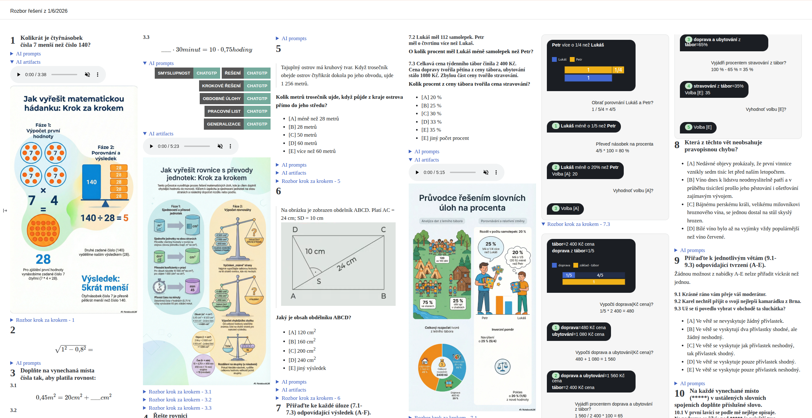

# Automatizace generování artifacts (audio, infografiky, ...) z aplikace NotebookLM z banky úloh



- stáhnout zip balíček <a download href="/ctedu/word-problem.zip">ČT EDU data</a>, případně <a download href="/data/word-problem.zip">cermat data</a>
- extrahovat soubory z balíčku/adresáře
- use [notebooklm-py](https://github.com/teng-lin/notebooklm-py) knihovnu 
  - vytvoření notebook
  - přidání zdrojů
  - generování artifacts
  - stažení vygenorovaných artifacts


```py
import asyncio
import os
from utils.notebook_lm_utils import read_zip_directory_contents_flat, createWithSources, generateArfifacts, downloadArtifacts

# Path to zip package with data
zip_path = os.path.join(os.getcwd(),"word-problem.zip")

# Extract data from file
files = read_zip_directory_contents_flat(zip_path, dir)


async def run_task(period:str):
    notebook_id = await createWithSources(period, files)
    artifact_source = await generateArfifacts(notebook_id, {"infographic":True, "audio": True}, True),
    result = await downloadArtifacts(notebook_id, period, artifact_source)
    return result

# Run tasks
asyncio.run(run_task(period))
```


## Vytvoření notebook a přidání zdrojů

```py
async def createWithSources(period:str, results: List[Tuple[str,str]]) -> str:    
    async with await NotebookLMClient.from_storage() as client:
        # List all notebooks
        notebooks = await client.notebooks.list()
        
        matched = next(filter((lambda x: period in x.title), notebooks), None)

        if matched is None:
            # Create a new notebook
            nb = await client.notebooks.create(period)            

            # Add sources
            for filename, content in results:
                await client.sources.add_text(nb.id, filename,  content)   
            return nb.id
           
        else:
            # raise ValueError(f"Already exists {matched.id}: {matched.title}")
            return matched.id                        

```

## Generování artifacts (audio, infographic)

```py
async def generateArfifacts(id:str, opt: dict[str, bool], waitForComplation: bool) -> dict[str,int]:
    async with await NotebookLMClient.from_storage() as client:
        # List and manage
        sources = await client.sources.list(id)
        result:dict[str, int] = {}
        for src in sources:
            # audio
            if opt["audio"]:
                status = await client.artifacts.generate_audio(id, [src.id], "cs", custom_prompt, AudioFormat.DEEP_DIVE, AudioLength.SHORT)
                if waitForComplation:
                    await client.artifacts.wait_for_completion(id, status.task_id, initial_interval, max_interval, timeout)
                else:
                    await asyncio.sleep(between_generation_delay)  # second(s) delay
                result[status.task_id] = int(src.title.split(".")[0])
            
            # infografics
            if opt["infographic"]:
                status = await client.artifacts.generate_infographic(id, [src.id], "cs", None, InfographicOrientation.PORTRAIT, InfographicDetail.STANDARD)
                if waitForComplation:
                    await client.artifacts.wait_for_completion(id, status.task_id, initial_interval, max_interval, timeout)
                else:
                    await asyncio.sleep(between_generation_delay)  # second(s) delay
                result[status.task_id] = int(src.title.split(".")[0])
        
        return result
```

## Stažení artifacts (audio, infographic) and převod png do webp formátu

```py
async def downloadArtifacts(id:str, dir_name:str, artifact_source :dict[str,int]) -> List[Any]:    
    async with await NotebookLMClient.from_storage() as client:    
        save_location_root_dir = "artifacts"
        dowloaded_artifacts:List[Tuple[Any,Any]] = []
        
        # List and manage audios
        artifacts = await client.artifacts.list_audio(id)
        for artifact in artifacts:
            source = artifact_source.get(artifact.id)
            if source is not None:
                # audios         
                saveLocation = f"{save_location_root_dir}/{dir_name}/{artifact.title}"
                await client.artifacts.download_audio(id,f"{saveLocation}.m4a" , artifact.id)
                dowloaded_artifacts.append((source, artifact))
            else:
                continue

        # List and manage infographics
        artifacts = await client.artifacts.list_infographics(id)
        for artifact in artifacts:
            source = artifact_source.get(artifact.id)
            if source is not None:
                # infografics         
                saveLocation = f"{save_location_root_dir}/{dir_name}/{artifact.title}"
                await client.artifacts.download_infographic(id,f"{saveLocation}.png" , artifact.id)
                img = Image.open(f"{saveLocation}.png")
                img.save(
                    f"{saveLocation}.webp",
                    format="WEBP",
                    quality=85,      # 0–100 (higher = better quality)
                    method=6         # best compression (0–6)
                )
                dowloaded_artifacts.append((source, artifact))
            else:
                continue

        return dowloaded_artifacts
```


